# Building generation, phase 5B (Chicagoland)

Owner: session P2. Inputs: `docs/proposals/regions-chicagoland-miami/` (spec v1 §2–§5, §12) and
`docs/proposals/visual-v2/` (§4, §8.1). Gate report: [gate-5b.md](gate-5b.md).

## What the generator does now

| Piece | File | Summary |
|---|---|---|
| Roof masses | `Sources/WorldGen/RoofPlanner.swift` | Footprint → up to six rectangular roof masses. The largest is the main roof; every other piece of an orthogonal footprint becomes a wing whose ridge runs away from its parent and reaches back to just short of the parent's ridge, so it meets the parent in valleys. Optional flush crossing gable on single-rectangle footprints for families that call for one (Tudor, Queen Anne, Shingle), kept inside the footprint and below the main ridge. |
| Sealed envelope | `Sources/WorldGen/RoofAssembly.swift` | Visible roof = upper envelope of all masses, computed by convex clipping (no interior faces, valleys and hip intersections exact). Walls rise exactly to the envelope along every footprint edge, which also produces gable-end triangles. Where one roof edge stands above a lower roof, a vertical face closes the step. Soffits are the undersides of the overhang fragments; fascia runs only along free edges. Footprints the rectangles can't cover (slants, chamfers) get one conservative mass cut to the footprint pushed out by the eave, flagged in `roofFallback`. |
| Families | `Sources/WorldGen/HouseFamilies.swift`, `Profiles/house-families.json` | Per-family grammar keyed by the profile's type IDs: preferred frontage aspect, roof recipe (ridge direction, crossing gable, dormers, chimney placement), facade kit. Data, not code: no place names in Swift. |
| Details | `Sources/WorldGen/BuildingDetails.swift` | Chimney (cuboid + cap), gable dormers, cornices and belt courses, Prairie bands, half-timber strips on street gables, attic windows, storefront band, entry pediment, stacked rear porches with stairs, skyline LOD mass. |
| Facades | `Sources/WorldGen/BuildingFacades.swift` | Facade pass (gate gaps 1 and 5): family window sizes, symmetric Colonial fronts, entry kits (portico, Tudor vestibule, arched surround), masonry sills and lintels, mapped street bays dressed, shallow inferred street bays where the space in front is clear, long side-wall window rhythm; side walls (gap 5): chimney breasts on open side walls, gangway window stacks, mapped side bays. All switched on per family in `house-families.json`. |
| Generator | `Sources/WorldGen/BuildingGenerator.swift` | Role (with alley-garage and large-house evidence), family, colors, heights, roof plan, walls, roof, openings, details, per LOD. |

### Levels of detail

`BuildingLOD` (`generate(_:palette:lod:)`); distances from spec §4: near 0–50 m, mid 50–150 m,
far 150–600 m, skyline beyond (`BuildingLOD.forDistance`). `DetailLevel.full` maps to near and
`.simple` to far, so the current renderer gets the new buildings with its old triangle load
(far ≈ old `.simple` per km²). Mid and skyline need the renderer to switch by distance (5A).

| LOD | Contents |
|---|---|
| near | Everything: banded walls with baked AO, roof assembly with soffits and fascia, chimney with cap, dormers, framed windows, porches, stoops, rear porches with rails and stairs, portico columns and steps, vestibule surround and roof undersides, masonry sills and lintels, bay fascia and window frames |
| mid | Masses and roof assembly with eaves, chimney body, unframed window rhythm, porch and rear-deck silhouettes, portico platform + beam + pediment, vestibule and bay masses with glass; no dormers, rails, steps, columns, sills, lintels or frames |
| far | Walls and roof outline only (eaves cut to ≤0.35 m, no soffits, openings or details) |
| skyline | One extruded mass per building at mid-roof height |

### Checks (tests)

- `BuildingGeometryTests`: 12 synthetic footprints (rectangle, narrow, L, T, U, front bay, steps,
  notched corner, trapezoid, chamfer, rotated L, jitter) × 4 profiles × 12 seeds × 4 LODs: no
  inverted triangles, finite positions, sealed shells (rays from inside never escape), stable output.
- `RoofEnvelopeTests`: fragments tile the union of roof outlines exactly once and always lie on the
  highest roof; wall profiles are continuous.
- `BuildingRoleTests`: alley garages, large suburban houses, block-role evidence, family stability.
- `BuildingAreaTests`: every building of `evanston-south`, `lakeview-sheil-park` and `sloans-lake`
  at every LOD, sealing on a sample, and budget limits; prints `BUDGET` lines.
- `BuildingViewBudgetTests`: triangles in view from fixed public-street cameras with LOD by
  distance; must stay within the buildings' 170k share and the 12k optional-roof cap.
- `FacadeKitTests`: porticos and vestibules stand only in front of the front wall, along it and at
  most 1.6 m out (+0.12 m rake), with no columns at mid; inferred bays project ≤0.6 m, are 2.4–3.2 m
  wide, are sealed (rays from inside the bay hit something), exist at near and mid only, and vanish
  when a neighbor stands 1.5 m in front; mapped bays are dressed and never doubled.
- `SideWallTests`: a long side wall facing open ground gets a breast (≤ 0.42 m out, ≤ 1.8 m wide, one chimney, no projection at mid); walls touching a neighbour get no breast and no windows; a 2 m gangway gets one window per floor in each of 1–2 stacks, at near and mid.
- `BuildingAreaTests` also holds the facade-pass budget against the pre-pass averages per house
  (near ≤ +45 %, mid ≤ +25 %, far and skyline unchanged) and prints bay and entry-kit counts.

### Tools

- `scripts/p2_gate_shots.sh <dir>`: engine captures (BuildingLab in its own simulator);
  `scripts/p2_compose_gate.py <captures> <out>` makes the side-by-side sheets.
- `scripts/building_shots.sh <out.png> [args]`: one BuildingLab capture (`-area`, `-profile`,
  `-date`, `-focus`, `-look LAT,LON,H,HEADING,PITCH,FOV`, `-overview LAT,LON,DIST,PITCH,YAW,FOV`, `-frame16x9`).
- `swift run -c release buildingviz …`: CPU debug renderer for building close-ups in under a second
  (`--area/--profile/--center/--radius/--lod/--yaw/--pitch/--dist`, or `--gallery --profile ID`;
  `--gallery … --local X,Y` aims at one cell: footprints start at x = 25 × column, y = −48 × row).

## Decisions (spec-covered, logged)

1. **Suburban test area is South Evanston, not Wilmette.** Wilmette's review window has 74 mapped
   buildings in OSM (Kenilworth 47, Winnetka 85); residential houses are essentially unmapped.
   Spec §11 (5B-1) names an inland Evanston block as the alternative. `Data/areas/evanston-south`
   (1 km², 899 buildings, public parks: Crown, Grey, Larimer) is inside the spec's
   `evanston-inland-review` window. Lakeview: `Data/areas/lakeview-sheil-park` (1 km² around Sheil
   Park, 2,861 buildings).
2. **Profiles adopted verbatim, not activated by location.** `wilmette`, `evanston` and
   `chicago-dense-north` are byte-identical copies of the proposal profiles in
   `Sources/WorldGen/Profiles/`. Per spec §16.1 the review rectangles stay out of `regions.json`;
   test areas pick the profile by explicit override (spec §2 precedence: test override first).
3. **Family grammar lives in data** (`house-families.json`), keyed by profile type IDs; families the
   file doesn't know get the plain default (old behavior).
4. **Roof = upper envelope of masses.** Wings reach back to the parent's ridge minus their overhang;
   all masses share one eave-edge height so eaves meet in clean valleys; subordinate ridges are kept
   ≥0.25 m below the main ridge by lowering wing pitch (minimum 12°). At most six masses; pieces
   under 6 m² get small hips (bay roofs). Spec §4.3: “a conservative sealed envelope is preferable
   … flag the fallback” — implemented as `roofFallback`.
5. **Flush crossing gable** (Tudor 85%, Queen Anne 90%, Shingle 35%) only on a single rectangle whose
   long side faces the street, inside the footprint (no added plan volume), width 35–60% of the
   facade (spec §3 table: “subordinate crossing gable 0.35–0.60 main width”).
6. **Turrets omitted** (spec §4.5: “for phase 5B, omit unsupported turret assets”).
7. **Dormers** only on the main roof's street slope, near LOD, 1–2 per family recipe, 0.9–2.4 m
   wide (bungalow/Shingle broad dormer), never over a wing.
8. **Optional roof detail cap 200 triangles per building** (spec §4 table), in priority order
   crossing gable → chimney → dormers; measured average is far lower (see gate report).
9. **Rear porches** (stacked wooden decks, posts, one stair run per level, solid rail bands) only on
   a rear wall that faces a mapped alley within 45 m and only if the porch rectangle is clear of
   other buildings, the alley and roads (spec §5.1, §5.6). Never on suburban families.
10. **Alley garages from evidence**: a `building=yes` of 14–75 m², at most one level, within 9 m of a
    mapped alley and not near a street, is a garage with its door on the alley (geometry + mapped
    access, not a regional expectation; spec §2). Tagged houses are never reclassified.
11. **Large `building=yes` houses** up to the profile's `hugeArea` (Evanston/Wilmette 420 m²,
    others 350 m²) and ≤3 levels stay houses instead of plain blocks (v2 §4.4 row 8). Above that,
    blocks pick a family only from tag evidence: `tall` (≥5 levels or ≥16 m), `court` (mapped inner
    ring), `commercial` (shop/amenity/commercial tags), `apartments` (apartment tags, or
    `yes` + 2–4 levels + ≥220 m²); otherwise the plain block (spec §2: unresolved roles stay simple).
12. **Greystone fronts**: street-facing walls use the profile's limestone tuple, other walls a brick
    from the family grammar (spec §5.2 “limestone facade band”).
13. **Family fit**: profile weights × soft fit of frontage aspect to the family's range (spec §3
    width/depth table); families without a range get a neutral 0.6, so narrow lots don't all
    become flat modern infill.
14. **Porch override per family**: Queen Anne (covered, 75%), Shingle (covered, 50%) and frame
    cottages (covered, 35%), because the profiles only carry one porch style (spec §3: “porch
    silhouette” is Queen Anne identity).
15. **Family window sizes are data** (`windowWidth`/`windowHeight`, own salt `window-size`, so the
    old openings stream is unchanged): Colonial 1.0–1.2 × 1.5–1.8 m; Tudor 0.65–0.8 × 1.3–1.5 m
    casements in mullioned pairs on street walls ≥ 5 m; Prairie 0.8–0.95 × 1.0–1.25 m in ribbons of
    three (`windowGroup`), as many ribbons as fit with ≥ 1.2 m of wall between; Queen Anne
    0.9–1.05 × 1.5–1.75; Shingle 0.95–1.15 × 1.35–1.6; frame cottage 0.85–1.0 × 1.4–1.65; Victorian
    row 0.85–1.0 × 1.7–1.95; stacked, greystone and six-flat 0.95–1.1 × 1.75–2.0 (clamped by the
    story to about 1.9). v2 §4.2 spacing still rules: 0.45 m corners, 0.35 m between, fewer
    windows before smaller ones. These exceed v2's ordinary 0.8–1.2 × 1.1–1.5 m on purpose: the
    concepts (01, 03, 05) show tall revival and city windows; requested in the P2 facade brief.
16. **Symmetric fronts** (Colonial, six-flat): window columns mirrored about the centered door, the
    same columns on every story, clear of the entry, spread evenly to 0.6 m from the corners, and
    one window over the door upstairs unless the portico pediment reaches its sill.
17. **Entry kits** (`entry`, `entryChance`; covered porches take precedence). *Portico* (Colonial,
    75 %): platform at foundation height with steps, two square 0.22 m posts (four on fronts
    ≥ 13 m, 35 %), entablature beam closed underneath, 24° pediment; 2.0–3.6 m wide, 1.3–1.55 m
    deep. Flat roof when the main eave leaves no room for the pediment; none below 2.3 m clear.
    *Vestibule* (Tudor, 70 %; chosen over an arched-entry surround because it carries the steep
    gable of concept 01/03): 1.7–2.3 m wide, 1.0–1.3 m deep, 48–54° gable with a stucco gable
    panel, arched (pointed) door in a stone surround; when its gable would reach the main eave the
    ridge runs back under the main roof inside the footprint, otherwise it ends at the wall.
    Both need the ground in front clear of the own footprint, other buildings, roads (+0.6 m) and
    mapped sidewalks; a portico that doesn't fit falls back to the old pediment, a vestibule to
    the arched surround alone. Mid keeps platform, beam and pediment (portico) or the vestibule
    mass and door; columns, steps and the surround are near only.
18. **Masonry sills and lintels** (`lintels`: brick bungalow, stacked brick, greystone, six-flat),
    near only, on street walls and bay faces: sill 0.13 m high projecting 0.10 m, lintel 0.28 m
    projecting 0.07 m, both in the trim (stone) color and 0.14–0.18 m wider than the opening each
    side; skipped on faces too narrow for them. Side walls keep the plain trim frame.
19. **Mapped street bays** (`mappedBays`): a street-parallel face 0.9–5 m long between two short
    (≤ 2.2 m) side or 45° faces, standing 0.25–1.8 m in front of the walls beside it, and not the
    front-door edge (that is an entry projection). Each narrow face gets one window per story
    (lintels where they fit) and the flat-roof cornice and belt course wrap the bay. Mapped bays
    are full height by construction (walls to the roof envelope; small bay masses get hips).
20. **Inferred street bays** (`bay`; a user-requested exception to spec §4.5/v2 "no unmapped
    volume", kept shallow and logged): only on the front edge, only when the footprint has no
    mapped street bay, in the larger room beside the entry, 2.4–3.2 m wide and ≤ 0.6 m deep
    (three-sided 45° or box), and only where 2.5 m in front of it is clear of other footprints
    (`obstacles`), road surface + 3 m (sidewalk band) and mapped sidewalks. Stacked brick (70 %)
    and greystone (80 %, three-sided) run full height up to the cornice; Queen Anne (80 %,
    three-sided) one or two stories under the eave with a hip cap. Windows on every face, fascia
    band under the cap, foundation band; a closed shell against the wall. Recorded per building in
    `GeneratedBuilding.inferredBays` (plan outlines) and exported as `inferredFacade` in
    scene.json decisions. Measured: 78 in South Evanston, 141 in Lakeview (most narrow city fronts
    lack the room beside the stoop or the 2.5 m clear space).
21. **Long side walls** (`sideRhythm`, all Chicagoland house families): non-street walls ≥ 12 m get
    groups of one to three windows (mostly pairs, 0.4 m apart) at the same positions on every
    story, one group per ~6.5 m with a seeded chance of a longer blank stretch, windows 0.85× the
    front width; no openings where another building touches the wall (v2 §4.2: suppress openings
    on shared walls). Shorter side walls keep the old sparse rhythm.

## Facade pass (gaps 1 and 5), measured

Average triangles per house (`BuildingAreaTests`, all buildings of each 1 km² area):

| Area | Near before → after | Mid | Far | Skyline | Near tris/km² (all buildings) |
|---|---|---|---|---|---|
| South Evanston | 401 → 416 (+4 %) | 142 → 143 | 45 → 45 | 11 → 11 | 318k → 328k |
| Lakeview (Sheil Park) | 511 → 542 (+6 %) | 167 → 168 | 53 → 53 | 14 → 14 | 1.08M → 1.16M |
| Sloan's Lake (Denver) | 429 → 429 | 191 → 191 | 91 → 91 | 19 → 19 | unchanged |

Limits held by the test: near ≤ +45 %, mid ≤ +25 %, far and skyline unchanged. Lakeview W Roscoe St
view: 48.5k → 49.8k building triangles. Largest house near 1,630. Release generation time per km²
unchanged within noise.

Before / after (`buildingviz`, same camera):

| View | Sheet |
|---|---|
| South Evanston, Wesley Ave (gate camera) | 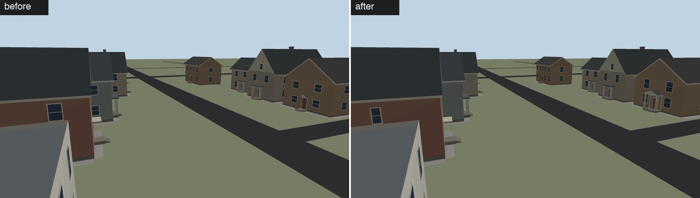 |
| Colonial fronts: portico, 5-bay symmetric windows | 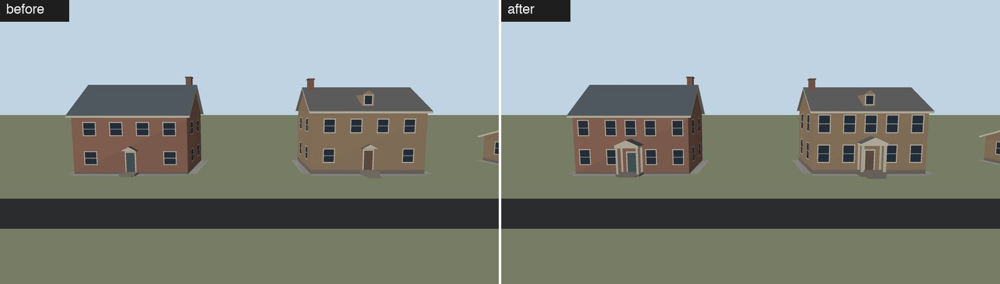 |
| Tudor: vestibule with arched door, paired casements | 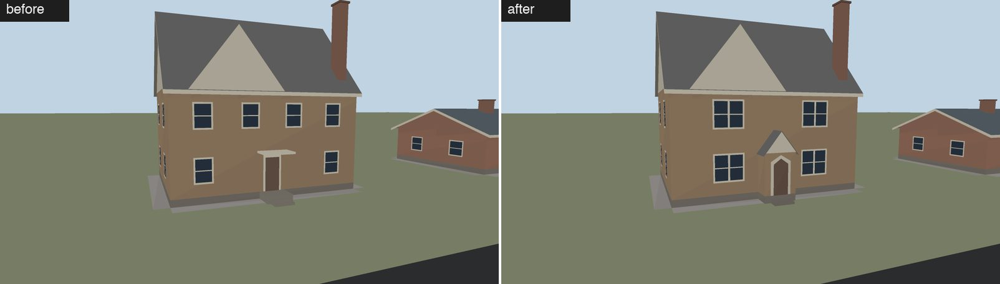 |
| Lakeview three-flats: box and three-sided bays, stone lintels and sills, larger windows | 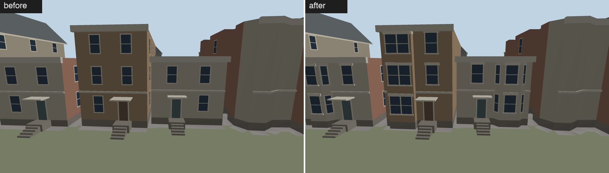 |

## Side walls (gap 5)

Three family switches in `house-families.json` (decision 34), all evidence-driven by the gap
between the side wall and the next mapped building (median of three probes straight out from the
wall at 20/50/80 % of its length):

| Gap | Side wall gets |
|---|---|
| touching (< 0.9 m) | nothing new (party walls keep no openings) |
| 0.9–3.1 m (gangway) | `gangwayWindows`: 1–2 stacks of smaller windows (0.65× width, ≤ 1.1 m tall, heads level with the other windows), one per story, instead of the long-wall rhythm |
| ≥ 3 m clear, wall ≥ 12 m | `chimneyBreast`: the family's chimney (when it rolls one) as a 0.25–0.4 m deep, 1.2–1.8 m wide masonry breast rising through the eave, instead of on the roof |
| any | `sideBays`: mapped side-wall protrusions dressed with windows on each face |

Measured (`BuildingAreaTests` and a same-run before/after with the three switches off):

| Area | Near tris/km² before → after | Mid | Far / skyline | Avg house near | Breasts | Gangway stacks | Side bays |
|---|---|---|---|---|---:|---:|---:|
| South Evanston | 335k → 327k (−2.5 %) | 119k → 118k | unchanged | 427 → 415 | 70 of 406 chimneys | 213 | 1 |
| Lakeview (Sheil Park) | 1.176M → 1.107M (−5.9 %) | 368k → 356k | unchanged | 554 → 511 | 18 of 164 chimneys | 1,833 | 227 |

Triangles go down: most deep-lot side walls in Lakeview face a 1–3 m gangway, and there one or two
window stacks replace the long-wall rhythm (decision 21), which drew a window group every ~6.5 m.
A breast costs about 10 triangles more than the roof chimney it replaces. Far and skyline are
untouched; mid keeps the window stacks (flat quads) and the chimney stack, not the breast.

Before / after (`buildingviz`, same camera, top before):

| View | Sheet |
|---|---|
| South Evanston: chimney breasts on open side walls | 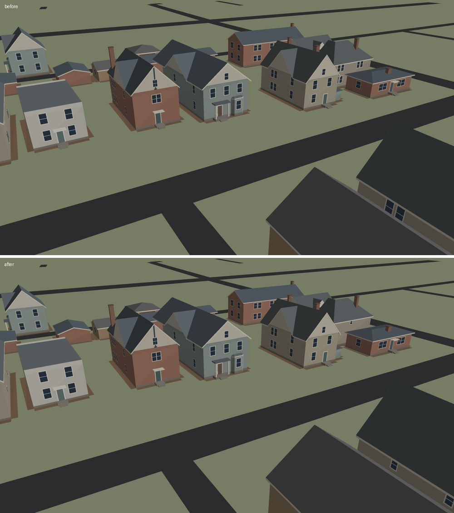 |
| Lakeview: gangway window stacks, side-wall chimney through the eave | 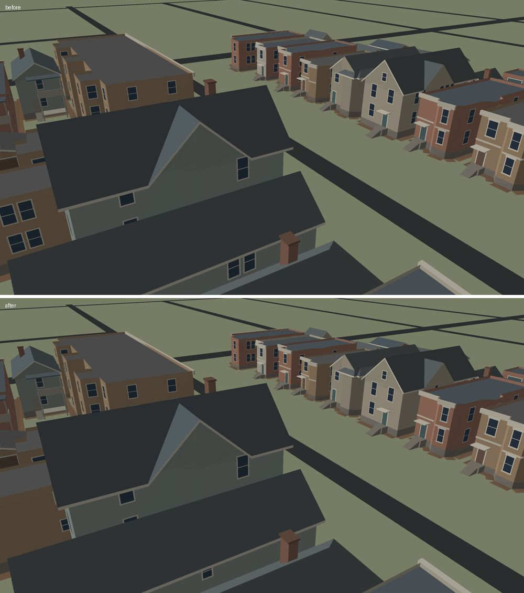 |

## House details (house-details-v1)

Input: `docs/proposals/house-details-v1/` (family recipes, 10/25/50 m model/paint/drop table, bevel
table, `house-details-colours.json`). Code: `Sources/WorldGen/HouseDetails.swift` (porch, stairs,
post styles, corners and frieze, shutters, cornice bevel), hooks in `BuildingGenerator` (trim colour,
eave, foundation, relief casings, door head, porch/stoop choice), `RoofAssembly` (fascia chamfer),
`BuildingFacades` (portico column caps). Data: `details` per family in `house-families.json`
(decision 37). Families without `details` are generated exactly as before. Tests: `HouseDetailTests`
(entry stays open, steps reach the ground in risers ≤ 0.4 m, skyline unchanged and far within 5 %,
per-LOD caps, street corners softened at near only, trim colours ≤ 3 steps per family) plus the
existing geometry, facade-kit, side-wall, area and view-budget suites.

**Distance tiers.** Pack 10 m and 25 m → `near` (0–50 m); pack 50 m → `mid` (50–150 m); `far` and
`skyline` are outside the pack's range and unchanged.

| Part | near | mid |
|---|---|---|
| Covered porch | platform, posts by family style (square; turned = rail-height block + slim shaft + capital; masonry pier with cap; brick pier + tapered post), bracket wedges, top rail with a few stout uprights (front both sides of the steps and the porch ends), beam and ceiling, hip / shed / gable / flat roof kept 0.25 m under the main roof, steps | platform, plain posts and piers (gaps kept), beam, roof, front top rail only |
| Stoop and steps | stoop sized to the stair; one block per riser (0.3 m treads, no hidden back faces), solid cheek walls where the family has them | stair wedge when ≥ 3 risers |
| Trim | family trim colour on casings, door surround, fascia, rakes, soffits, posts; relief casings (projecting sill and head) on street windows; door head cap; frieze board under street eaves; paired shutters on symmetric fronts | trim colour only |
| Eaves | family overhang range and fascia depth; one 2.5 cm chamfer on the fascia's lower outer edge of street-facing eaves and rakes | family overhang, plain fascia |
| Corners | street corners: corner boards (siding: 14 cm, 3 cm proud, 2 cm chamfer) or a 4 cm chamfer strip (masonry) | none |

### Group 1: North Shore suburban (Tudor, Colonial, Prairie, Queen Anne, Shingle, mid-century)

| Family | Pack recipe | What it gets |
|---|---|---|
| Tudor | tudor | dark timber trim (#573326–#88502D) on casings, half-timber and fascia; eave 0.2–0.4 m; masonry chamfers; broad 1.6–2.0 m stoop; vestibule kept |
| Colonial | colonial | cream trim; eave 0.3–0.5 m; frieze; portico columns with base and capital; shutters (55 %, pack shutter greens) |
| Prairie | prairie | brown trim; eave 0.8–1.2 m; covered terrace porch (55 %) on 0.45–0.6 m masonry piers with a flat slab roof; broad steps |
| Queen Anne | queen_anne | warm cream trim; eave 0.3–0.6 m; corner boards, frieze; porch (75 %) with turned posts, brackets, rails, hip roof |
| Shingle | (none; QA porch, Colonial trim) | square-post porch with rails and hip roof; corner boards |
| Mid-century | denver_ranch (nearest) | ranch trim; eave 0.45–0.8 m; chamfers; wider stoop |

Measured (`BuildingAreaTests`, all buildings of each 1 km² area; before = origin/main 8f90162):

| Area | Near tris/km² | Mid | Far | Skyline | Avg house near | Inferred bays |
|---|---|---|---|---|---|---|
| South Evanston | 325.8k → 366.8k (+12.6 %) | 117.7k → 121.0k (+2.8 %) | 41.2k → 41.5k (+0.7 %) | unchanged | 413 → 471 | 78 → 65 |
| Wilmette (Vattmann Park) | 425.6k → 473.7k (+11.3 %) | 156.8k → 161.1k (+2.8 %) | 57.5k → 58.1k (+1.1 %) | unchanged | 412 → 466 | 80 → 66 |

Per family, Evanston near (before → after): Tudor 403 → 423, Colonial 473 → 565, Prairie 445 → 491,
Queen Anne 493 → 639, Shingle 381 → 450, mid-century 262 → 273. Lakeview and Sloan's Lake houses
have no details yet; they lose 2 triangles per riser (near 1.112M → 1.096M, 211.9k → 209.0k per km²).
Views (building triangles, all LODs): evanston-street 19.4k → 20.1k, wilmette-street 28.1k → 28.7k.
No new materials (draws): every new part uses existing palette slots plus ≤ 3 trim and 3 shutter
colours per family. Facade budget test (near ≤ +45 % vs the pre-facade baseline) holds: Evanston
average house 471 vs the 401 baseline (+17 %).

| View | Sheet (top before, bottom after; `buildingviz`, 1005×565) |
|---|---|
| South Evanston, gate camera | 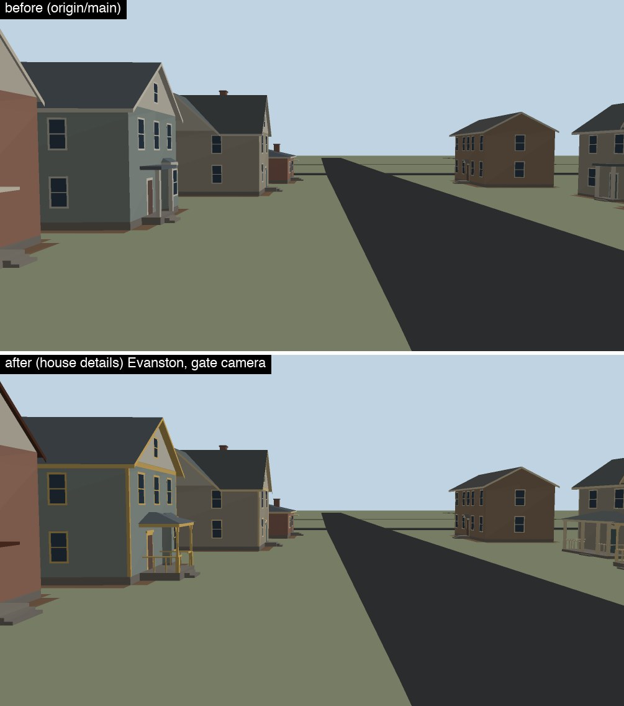 |
| Queen Anne porch, Tudor, corner boards and frieze | 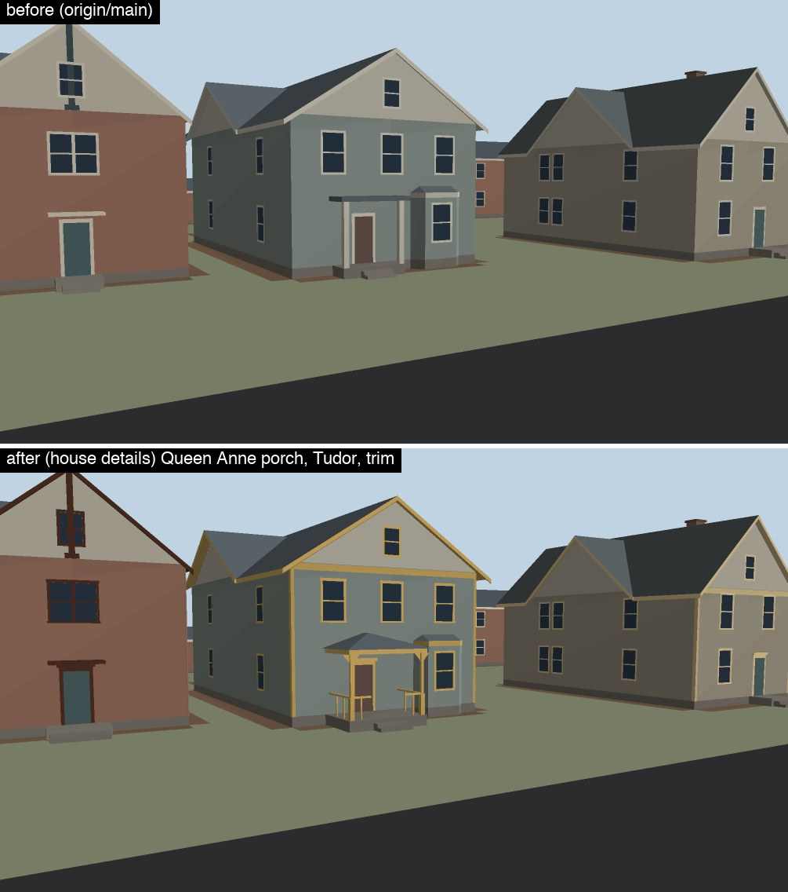 |
| Wilmette street: Tudor timber trim, Colonial portico and shutters | 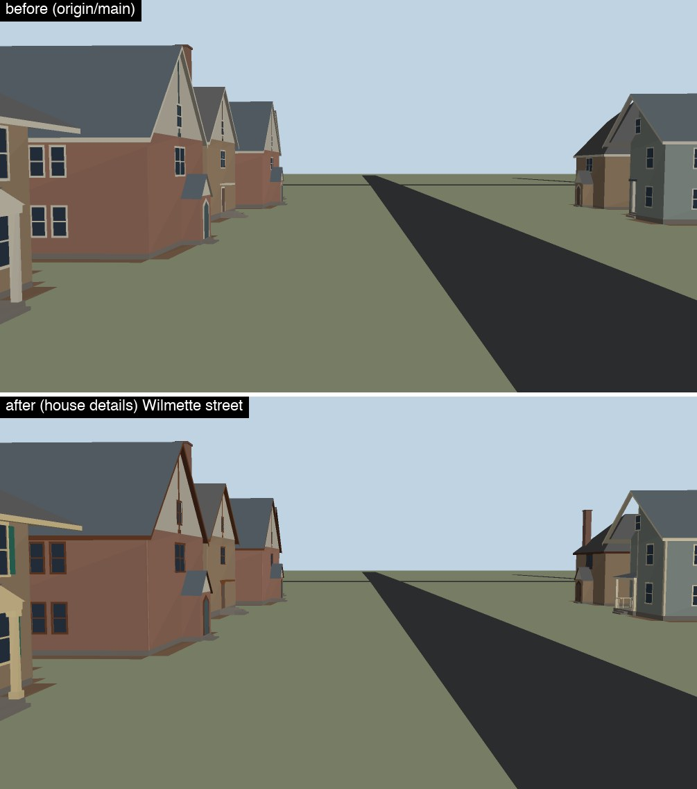 |

### Group 2: Chicago city (bungalow, two/three-flat, greystone, frame cottage, Victorian row, six-flat, courtyard, corner mixed-use)

| Family | Pack recipe | What it gets |
|---|---|---|
| Brick bungalow | bungalow | cream trim; eave 0.4–0.7 m; raised floor 0.8–1.2 m (4–6 risers); stone steps with brick cheek walls; chamfers |
| Two/three-flat (brick stacked) | two_flat | cream trim; stone steps with brick cheek walls; chamfered cornice cap; chamfers |
| Greystone | greystone | limestone trim; broad 1.5–1.9 m stone steps with stone cheek walls; heavy door surround (jambs + head block); chamfered cornice cap |
| Six-flat | courtyard_building (portals) | stone portal (jambs + head), cheek-walled stoop, chamfered cornice cap |
| Courtyard mass, corner mixed-use | courtyard_building | trim, portal (courtyard), chamfered cornice cap, chamfers |
| Frame cottage | (none; denver_victorian nearest) | covered porch (35 %) with square posts, rails and shed roof; corner boards; relief casings |
| Victorian row | (none; queen_anne trim) | warm cream trim; eave 0.3–0.5 m; corner boards; relief casings |

Courtyard voids are untouched (the court is a footprint hole; nothing is added inside it).

| Area | Near tris/km² | Mid | Far | Skyline | Avg house near |
|---|---|---|---|---|---|
| Lakeview (Sheil Park), origin/main → group 2 | 1.112M → 1.164M (+4.7 %) | 358.0k → 372.5k (+4.0 %) | 129.8k → 131.0k (+0.9 %) | unchanged | 509 → 540 |

Per family, Lakeview near (before → after): bungalow 258 → 283, stacked brick 532 → 552, greystone
555 → 598, frame cottage 364 → 397, Victorian row 566 → 598, six-flat 1419 → 1466, courtyard
1373 → 1417, corner mixed-use 695 → 705. Views: lakeview-street 50.5k → 51.3k, lakeview-alley
48.4k → 48.9k, lakeview-block-center 54.4k → 55.5k building triangles (≤ 170k share).

| View | Sheet |
|---|---|
| Lakeview, W Roscoe St | 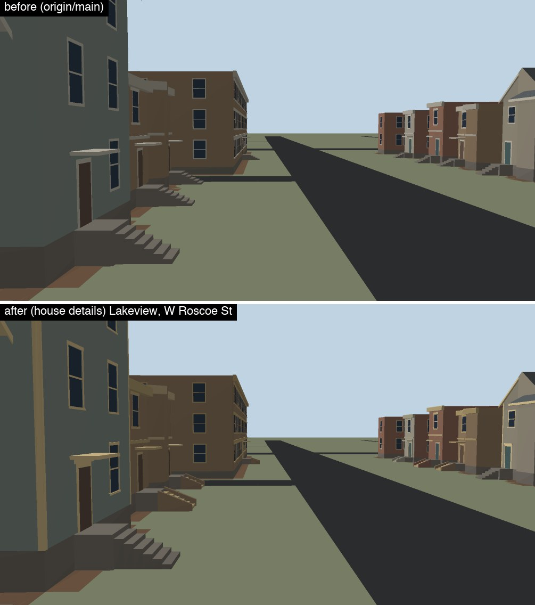 |
| Two-flat stoops with cheek walls, cornice caps | 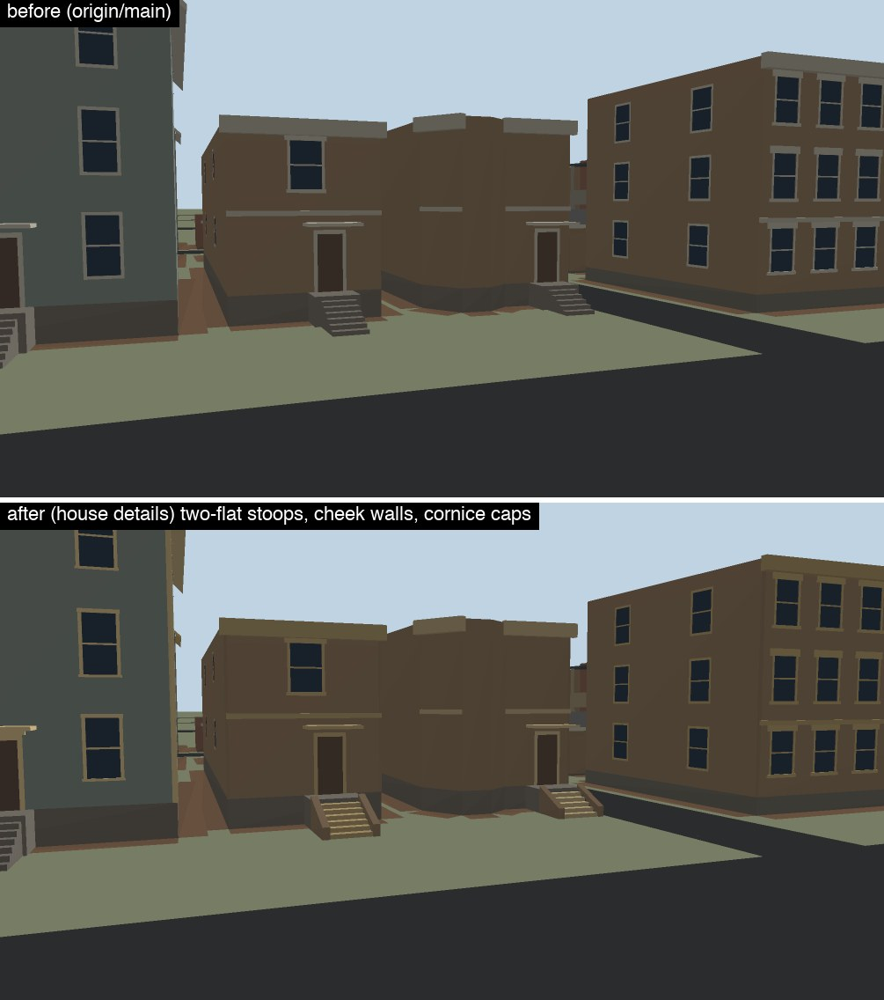 |

## Decisions: zones and yards (round 2)

22. **Per-building zone profiles.** Without a forced profile, each building takes the `regions.json`
    zone profile at its centroid (`ZoneProfiles`, one generator per profile); the area profile still
    drives season and mapped trees. A forced `WorldRecipe.profileID` remains the test override.
23. **Yards are inferred lots** ([yards.md](yards.md)): nearest-building yard cells that never cross
    roads, walkways or blocked land; dressing only, marked `origin: inferred`.
24. **Driveways only from mapped garages**; walks only from the door to the first sidewalk/street.
25. **Hedges along inferred lot lines** at owner request (spec allows boundaries only on evidence):
    profile-driven likelihood, low, one row per shared line.
26. **Parkway trees by zone spacing** in the curb–sidewalk strip; mapped trees count first.
27. **Yard ground 2 cm over the base lawn** (5A: no z-fighting at 2.5x); new palette names `yardBed`,
    `driveway`.
28. **Relative size thresholds** (P1 fields `*AreaPercentile`): with ≥30 house candidates of a zone
    profile in the area, small/large/huge for the situation keys are those percentiles of the local
    house footprints; the house-vs-block role keeps the profile's absolute `hugeArea` (percentiles of
    houses under the 250 m² rule can't decide whether a larger building is a house).
29. **Canopy calibration** (`yards.json` `canopyFill`, `maxTreesPerKm2`): with a measured
    `trees.canopyShare`, extra yard trees are planted (back yards, one per lot per round, ≥8 m apart,
    ≥4 m from walls) until crown cover reaches target × `canopyFill` or the per-km² tree ceiling.
    Today: Wilmette 0.18 achieved vs 0.58 measured, stopped by the 2,600 trees/km² ceiling, which
    protects the in-view budget until cheaper far/mid tree LODs (5A) land; then raise the ceiling.
30. **Complex-roof rate from P1's lidar pilot** (South Evanston, ~45 % of houses complex vs 29 % drawn):
    new family field `sideCrossGable` (a flush crossing gable on a side wall when the gable end faces
    the street; Tudor 0.5, Queen Anne 0.6, Shingle 0.4, Victorian row 0.35, cottage 0.15) plus Colonial
    0.15 and mid-century 0.2 street-side crossing gables → 47 % complex. Far LOD +6 tris per house.
    Pitch (lidar median 35° vs drawn 43°) and the gable/hip mix are profile values: left to P1/owner.
31. **scene.json decisions** now carry `family`, `profile`, `roofMasses`, `crossGable`, `dormers`,
    `roofFallback`.
32. **Look-fix §1 densities and lawn colour** per region ([yards.md](yards.md#look-fix-v1-1-2--round-3)):
    lawn endpoint pairs as seasonal palette keys `lawnA`/`lawnB`, per-lot tone in `extra.y` (renderer
    mixes), neighbour-aware value steps, bed areas, shrub counts, yard-tree means and caps, street-tree
    spacing, fall litter patches.
33. **Tone guard, not lift**: roofs ≥ #303942, walls ≥ Y8 80 (5A's `tone-targets.md`); no palette
    hex changed, because the profiles already comply and lifting would wash out after 5A's fill fix.
34. **Side walls (gap 5)** ([section](#side-walls-gap-5)): *Chimney breasts* (`chimneyBreast`:
    Tudor 0.3, Colonial/Queen Anne/frame cottage/Victorian row 0.5, Shingle 0.4, brick bungalow 0.6;
    Prairie and mid-century keep their central broad chimney on the roof) reuse the roof chimney's
    own roll, so a house never gets two; the breast goes on a side wall ≥ 12 m at the depth the
    family's chimney placement implies (front 25–40 %, rear 60–75 %, else 40–60 %), only where 3 m
    in front of it is clear of buildings, roads (+0.6 m) and sidewalks; the stack clears the roof
    within 3 m inward by 0.7 m (Tudor 1.2 m). It is an inferred projection like the street bays and
    is exported as `inferredFacade: chimneyBreast`. *Gangway stacks* (`gangwayWindows`, every family
    with `sideRhythm`) replace the rhythm on side walls ≥ 8 m facing a 0.9–3.1 m gap: one stack at
    40–60 % of the wall, or on walls ≥ 14 m (half of them) two at 25–35 % and 60–72 %; this makes
    gangway walls sparser than decision 21 did (v2 §4.2 keeps side walls sparse; real Chicago
    gangway walls carry stair and bath windows). *Side bays* (`sideBays`) dress only mapped
    protrusions (the street-bay test applied to side walls): one window per story on each face
    (two on faces ≥ 2 windows + 1.3 m), none when a neighbour stands within 0.6 m. Walls with a
    0.4–0.9 m gap keep their previous behaviour.
35. **Carriageway width includes parked cars** (`RoadRules`, `Sources/WorldMap/Rules.swift`). A tagged
    `width` wins untouched. Otherwise `lanes` × 3.3 m (at least 4.5 m of travel width on these
    street classes, so `lanes=1` streets are not 3.3 m) plus 2.3 m per side with parking for residential,
    tertiary, unclassified and secondary ways; untagged sides count as parked, `parking:*` /
    `parking:lane:*` values `no`, `no_parking`, `no_stopping`, `separate`, `street_side`, `on_kerb`
    etc. remove a side. Without `lanes` the class default applies (residential 6 → 8 m, parking on both
    sides included; each no-parking side takes 2.3 m off, floor 4.5 m). Then untagged
    roads are clamped so the curb stays 0.3 m clear of the near edge of a mapped `footway=sidewalk`
    line running alongside (within 25° of parallel, 15 m; never below 3 m). Tagged widths are not
    clamped. All constants are `RoadRules` fields. Lakeview: W Roscoe St 3.3 → 9.1 m.
36. **Trees built to vegetation-v1** ([Trees](#trees)): crown shapes, species colours per region,
    trunk-base contact, weeping willow, and leaf-card crowns behind a switch; numbers and gaps there.
37. **House details (house-details-v1)** ([section](#house-details-house-details-v1)): per-family `details` in
    `house-families.json` (porch, stoop, trim colour, eave, fascia, corners, casings, frieze, shutters,
    foundation, cornice bevel, column caps). Choices outside the pack, logged: (a) the pack's 10 m and
    25 m tiers both map to `near` (0–50 m) and its 50 m tier to `mid`; far/skyline unchanged; (b) trim
    colour is one of three linear-light steps of the pack range per house (palette stays ≤ 3 slots per
    family), and the profile's old light trim stays the gable/stucco panel colour; (c) Shingle Style
    (no pack family) uses the Queen Anne porch with square posts and Colonial trim; mid-century uses the
    Denver ranch recipe; (d) Prairie houses now roll the profile's 55 % porch as a covered terrace on
    masonry piers instead of a canopy; (e) a covered porch is built only where the ground in front
    (porch + steps) is clear of buildings, roads (+0.6 m) and sidewalks, else the stoop with a canopy
    (the old porch had no clearance test); (f) Queen Anne porches take 35–55 % of the front so the
    family's bay keeps its room; (g) fascia and rake chamfers only on street-facing edges, corner
    treatment only on street corners, relief casings only on street walls (budget); (h) steps lose
    their hidden back faces everywhere (−2 triangles per riser); (i) Tudor half-timber strips use the
    family trim (the pack's timber brown) instead of a darkened door colour.

## Trees

Inputs: `docs/proposals/vegetation-v1/` (crown construction, `vegetation-colours.json`, willow
addendum), look-fix-v1 §5, style target "rich stylized", owner decision for leaf cards. Code:
`Sources/WorldGen/Props.swift` (meshes), `Sources/WorldGen/LeafAtlas.swift` (procedural card atlas),
`Sources/WorldGen/Vegetation.swift` + `Profiles/vegetation.json` (species, regions, genus tags),
`Profiles/seasonal-palette.json` (chicago defaults), profile `trees.weeping` (willow prior). Tests:
`TreeLookTests`, `TreeColourTests`, `TreeAOTests`, `TreeWillowTests`, `LeafAtlasTests` (+ card switch),
`TreeSilhouetteTests`.

Commits (stack on main): crowns (b8ee81a, merged), colours/regions (d1bc7a7), trunk AO (ac9d639),
willow (17610fc), leaf cards behind `PropLibrary.leafCards`, default off (c48b8d6).

| Kind (family) | Solid crowns near / mid / far / skyline (old main → now) | Leaf cards near / mid (cards) | Sky holes, solid (pack) |
|---|---|---|---|
| treeBroad (maple) | 571 / 188 / 52 / 12 → 848 / 182 / 52 / 12 | 400 / 94 (56 / 20) | 8.6 % (6 %) |
| treeOval (linden) | 571 / 188 / 52 / 12 → 865 / 188 / 52 / 12 | 397 / 100 (56 / 20) | 6.3 % (5 %) |
| treeSpreading (oak, elm, honey locust) | 663 / 179 / 52 / 12 → 857 / 191 / 52 / 12 | 409 / 103 (56 / 20) | 9.9 % (10 %) |
| conifer (spruce) | 66 / 42 / 14 / 5 → 152 / 42 / 14 / 5 | 216 / 62 (32 / 10 needle cards) | – |
| treeWeeping (willow, new) | – → 887 / 203 / 64 / 12 | 369 / 111 (+10 / 4 strands) | 22.9 % (15–22 %) |

Cards are single quads (2 triangles; the card material draws both faces). Alpha-tested side-view
sky holes with cards: broad 23 %, oval 19 %, spreading 27 %, willow 35 % (above the pack's solid
targets; the near crowns are 56 cards, the card budget 40–60). Generated tree triangles in view
(YardTests VIEWYARDS; old main → solid now → cards): lakeview-street 34019 → 32402 → 24630,
lakeview-alley 27408 → 24742 → 20530, lakeview-block-center 26448 → 24282 → 20714,
evanston-street 40375 → 41955 → 34807, wilmette-street 43963 → 46052 → 39040. Tree draw groups
(kind × LOD × 400 m cell) in view: 38–64, unchanged by cards (one mesh per kind and LOD; the willow
adds groups only where willows stand).

Colours (autumn, Evanston): maple #CE763C, linden #C6B24E, spreading family oak #A55835 ×2 / elm
#BCAE4D / honey locust #D2B95C, spruce #4D6C53, willow #B3AD5C; Denver (front-range): ash/crabapple,
aspen/ash, cottonwood #C8AC46, blue spruce. Bark #796B57 (pack branch neutral; hue ~35°, saturation
0.28): trunk albedo is grey-brown in every season and region (tested), so orange trunks in golden
light are lighting (5A). Trunk AO 0.84 at the ground rising to 1 by 0.025 of the height (~0.4 m);
crown undersides ≤ 0.75. Leaf atlas: 1024² R8, FNV-1a 77c85192822aab84, mean coverage 0.31.

Evidence: phone-size (1005×565) buildingviz renders, solid and `--leaf-cards`, of lakeview-street,
sloans-lake and evanston (`--date 2026-10-22T20:00:00Z`; flat-shaded CPU renderer); not committed
here (see the P2 report).

Known gaps (logged, not built): elm (vase) and honey locust (umbrella) use the oak's spreading form;
one bark colour per scene (aspen's pale trunk not drawn); trees in a multi-slot colour family pick
their slot by position, so a tagged elm may show an oak colour; Miami families (no region profile
yet); generated yard and parkway trees never become willows (the prior covers mapped trees);
willow winter twig bundles; 3 skeletons × 2 envelopes per family (one mesh per kind; yaw and
per-tree stretch vary them); solid mid trees 182–203 triangles vs the pack's 80–180 at 50–150 m;
card crowns have more sky holes than the pack's solid-crown targets.

38. **House contrast (house-contrast-v1, R approved 2026-10-07)**: house-details families take their house
    type's trim, roof and daytime glass colours, soffit and porch-underside colours on every down-facing face, and
    an eave/cornice shadow band (near: the 0.7 m wall-top band fades to the type's eave_shadow relativeBrightness at
    the eave line or parapet top). Values are read by key from the bundled shared mock values
    (`Profiles/mock-values.json`, generated by Tools/lookloop/compile_mocks.py); look.json `houseContrast` holds only the
    P2 family → type mapping: brick flats → two-/three-flat by storeys (stacked brick), three-flat (greystone, six-flat,
    courtyard, corner mixed-use); bungalow (brick bungalow, Tudor, Prairie, mid-century: brick/stucco); workers cottage
    (frame cottage, Colonial, Queen Anne, Shingle: siding); two-flat (Victorian row). Walls stay observed/profile
    colours; mapped `roof:colour` wins. Zero geometry or draw change (same triangle counts). Comparison:
    [facades/house-contrast-lakeview.jpg](facades/house-contrast-lakeview.jpg) (pack source frame, paint-over, ours
    before/after in buildingviz).
