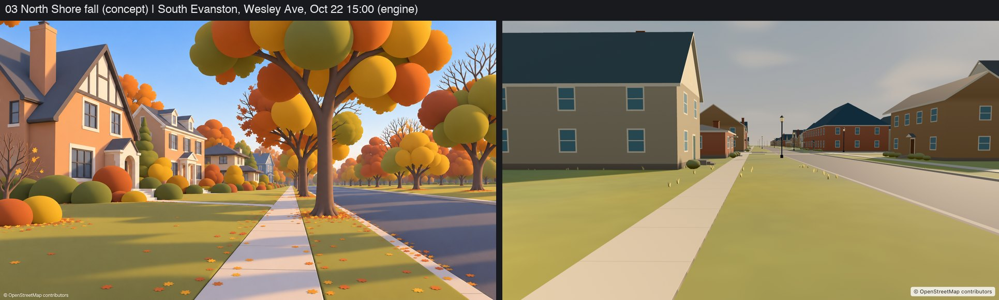
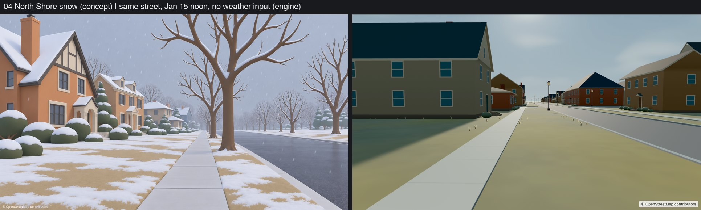
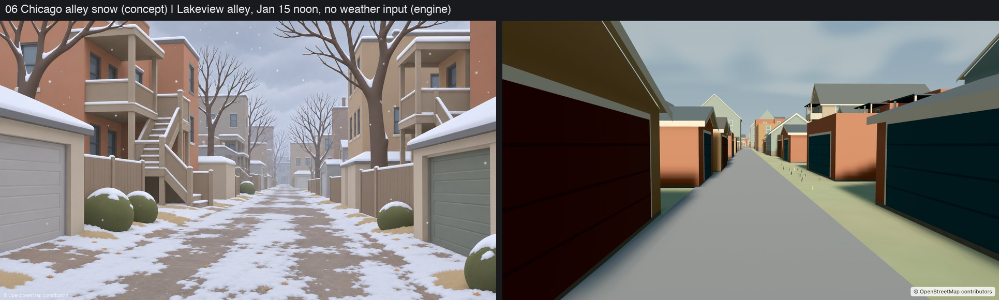
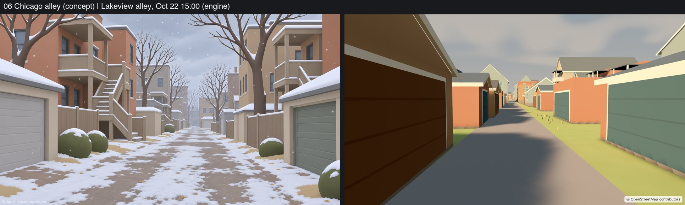
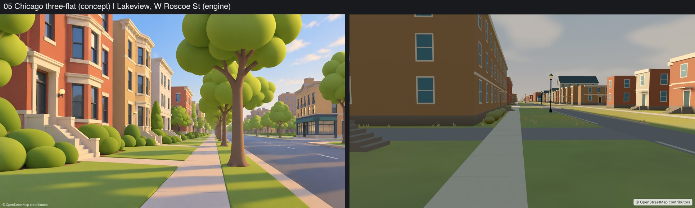
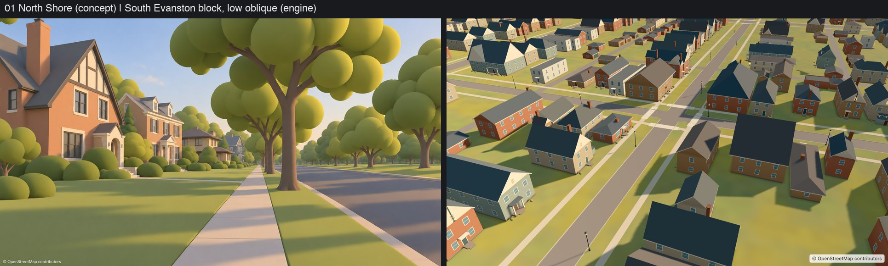
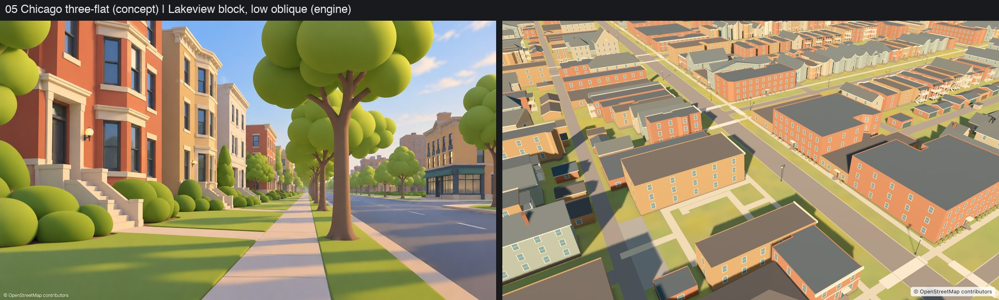

# Phase 5B building gate (P2): Chicagoland houses and roofs

Captured 2026-10-06 with `scripts/p2_gate_shots.sh` (BuildingLab, iPad Pro 13" simulator, main's
RealityKit renderer as of the P1 audit merge, no character), composed with `scripts/p2_compose_gate.py`.
BuildingLab sets date and profile only: it does not drive 5A's environment (sky, weather, snow), so
winter frames show winter light, not snow. Concept images are
`docs/proposals/regions-chicagoland-miami/images/` 03, 04, 06 (the requested set; manifest checked)
plus 01 and 05, the street-level building references. P3's look loop is not merged yet, so these
are plain captures. Buildings only are scored; trees, ground, sky and weather belong to other lanes.

## Captures

| Pair | Sheet |
|---|---|
| 03 North Shore fall ↔ South Evanston, Wesley Ave (public street), Oct 22 15:00 |  |
| 04 North Shore snow ↔ same street, Jan 15 noon (no weather input: winter light only) |  |
| 06 Chicago alley snow ↔ Lakeview public alley, Jan 15 noon (no weather input) |  |
| 06 ↔ Lakeview alley, Oct 22 |  |
| 05 three-flat ↔ Lakeview, W Roscoe St (public street) |  |
| 01 ↔ South Evanston block, low oblique |  |
| 05 ↔ Lakeview block, low oblique |  |

Full-resolution engine frames: `gate/engine-*.jpg`. Wilmette could not be captured: its residential
houses are not in OSM (see README decision 1).

## Score: buildings only, v2 §8.3 rubric

| Criterion | Score | Evidence |
|---|---:|---|
| 1. Silhouettes | 3 | Sealed cross-gables, L/T wings with valleys, hips, flush Tudor/Queen Anne front gables, dormers, chimneys and porches read from the oblique views; Lakeview's flat stacked flats vs front-gabled frame cottages vs alley garages is clearly legible. At street level the families are less distinct than the concepts: no bays unless mapped, small entries, no turrets. |
| 2. Palette (buildings) | 3 | One coherent tuple per house, no candy noise. Roofs render near-black navy on shaded slopes (darker than v2's #303942 floor), walls go muddy brown in shade; concept walls are warmer and lighter. Part renderer exposure/tone, part profile roof colors. |
| 4. Softness / AO | 3 | Baked base and eave occlusion, soffit shade, porch-ceiling shade, contact skirt. No bevels on buildings; a jagged dark strip shows at some wall bases (renderer shadow aliasing, not mesh). |
| 8. House variety / coherence | 3 | Stable family per building; Evanston mixes Colonial (pediment, dormers), Tudor (half-timber gable), Prairie (bands, broad eaves), Queen Anne (covered porch), mid-century; Lakeview gets stoops, cornices, greystone fronts, alley garages with doors on the alley, 450 rear porches. Long side walls and sparse windows still read plainer than the concepts. |
| 9. Geography correctness | 4 | Every mapped footprint, hole and height is kept; no stretched or invented buildings; garages only on mapped footprints (role from size + mapped alley), rear porches only toward mapped alleys and only in clear space; Wilmette not faked. Not verified against a map overlay in this pass. |
| 3, 5, 6, 7 | n/a | Lighting, ground, character and depth are outside the building lane. |
| 10. Motion | n/a | Needs video, and the renderer doesn't switch building LODs by distance yet. |

**Buildings subtotal: 16 / 25** (baseline-acceptable on every scored criterion, target on none).

## Top 5 gaps and next steps

1. **Street-level facade identity.** Concepts lean on big framed windows, entry porticos, bay
   windows and stone lintels. Next: larger near-LOD window frames with sills/lintels per family,
   a real portico kit (Colonial/Tudor), Queen Anne bay and supported turret (P1 in spec §12),
   Chicago stone lintel bands and paired six-flat entries.
2. **Roof and wall tone.** Roofs read near-black on shaded slopes and brick goes muddy. Next: check
   profile roof hexes against v2's #303942 floor after the renderer's exposure (5A), consider a
   lighter slate variant per family; review with P3's look loop once merged.
3. **Distance LODs not wired.** The renderer still uses near for the focus box and `.simple` (now
   the far LOD) elsewhere. With per-building LOD by distance a dense Lakeview view is 46–54k
   building triangles; without it a 400 m focus box alone is ~170k. Needs 5A (see below).
4. **Prior-driven choices where OSM is silent.** Evanston has 1 building with levels; 4% of Lakeview
   buildings (115) fall back to a conservative clipped roof; courtyard buildings only show their
   court when it is a mapped hole. Next: per-feature profile selection, a courtyard/U-shape role,
   and P1's audit data to tune family weights.
5. **Long side walls and gangways.** Deep city lots show long side walls; v2 keeps them sparse, but
   the concepts break them with bays, chimneys and setbacks. Next: side-wall chimney breasts and
   bay pops only where the footprint has them; gangway-facing window stacks.

## Budget and performance

Measured by `BuildingAreaTests` / `BuildingViewBudgetTests` (all buildings of each 1 km² area, every LOD).

| Area | Buildings | Near tris/km² | Mid | Far | Skyline | Avg house near / mid / far |
|---|---:|---:|---:|---:|---:|---|
| South Evanston | 887 | 318k | 112k | 37k | 10k | 401 / 142 / 45 |
| Lakeview (Sheil Park) | 2,800 | 1.08M | 356k | 126k | 39k | 511 / 167 / 53 |
| Sloan's Lake (Denver) | 1,399 | 212k | 94k | 46k | 11k | 429 / 191 / 91 |

Largest house near 1,316 triangles; largest block 7,722 (a big window grid). Optional roof detail
(crossing gable + chimney + dormers): average 15 triangles per Evanston house, cap 200 per building,
never exceeded.

**In view, with LOD by distance (16:9, 50° vertical FOV):**

| Camera | Near | Mid | Far | Skyline | Total building tris | Optional roof in view |
|---|---|---|---|---|---:|---:|
| Lakeview W Roscoe St | 9 / 4.7k | 55 / 6.6k | 774 / 30.6k | 464 / 6.5k | **48.5k** | 22 |
| Lakeview alley | 18 / 4.4k | 39 / 6.5k | 649 / 29.0k | 449 / 6.4k | **46.4k** | 0 |
| Lakeview block center | 13 / 4.6k | 73 / 11.3k | 677 / 38.0k | 28 / 0.5k | **54.4k** | 0 |
| Evanston Wesley Ave | 9 / 2.4k | 38 / 4.5k | 279 / 10.5k | 34 / 0.4k | **17.7k** | 110 |

Budget: v2 §8.1 main ceiling 400k (buildings' share 170k per spec §5.5); optional roof detail ≤12k.

**Generation time (release, same machine, this session):**

| Area | Old generator full / simple | New near / mid |
|---|---|---|
| South Evanston (1 km²) | 0.04 s / 0.02 s | 0.13 s / 0.12 s |
| Lakeview (1 km²) | 0.18 s / 0.09 s | 0.58 s / 0.29 s |
| Sloan's Lake (1.92 km²) | 0.07 s / 0.04 s | 0.59 s / 0.45 s |

About 3× slower than before and still well under a second per km² (bake/load time, not per frame).
Debug-build timings are 10× higher and were taken under heavy machine load.
