# WorldEngine experience — proposal v1

**5 October 2026 · Renderer-neutral · No-character cameras and weather showcase · No implementation changes**

## 0. Intent, evidence and deliverables

[A — product direction supplied by owner] **The world is the experience.** WorldEngine should be compelling as an empty landscape and should reflect its actual place, light, weather and season. A host can add a character; none of the modes here needs one. Camera targets are positions, paths or geographic extents. Character bounds, character tracking and app-specific activity data are optional host concerns.

**Evidence convention:** **[V, source]** means a source requirement or inspected fact, checked **2026-10-05**. **[A]** means a proposed rule, assumed input, calculated reference or unmeasured performance target. A heading or table label applies to its entire scope until another label appears. An inspected proposal is verified as a document, not as implemented behavior. All source IDs resolve in §9. Generated imagery is [A], never evidence of the current renderer or of historical weather.

[V, L1–L6] Read the repository rules, visual v2 spec and its nine images, weather v1, sky/seasons v1, visual direction, and current M2 street/aerial captures. The M2 images show a simpler world with repeated building forms and relatively basic tree/ground treatment. Those captures are the current-output reference; the pictures below are proposed art targets. Work was confined to this proposal folder; no git commands or engine edits were used.

[A] Deliverables in this folder:

- This spec, including the eleven-image gallery and acceptance notes.
- [showcase-presets.json](showcase-presets.json): camera poses and explicit synthetic weather/surface states.
- [night-sky-reference.json](night-sky-reference.json): calculated sun, Moon and projected real-star reference, with model/catalog provenance.
- [image-manifest.json](image-manifest.json): selected PNG dimensions, hashes and generation counts.
- [IMAGE-PROMPTS.md](IMAGE-PROMPTS.md): verbatim fresh-generation and single-edit prompts.
- Eleven selected PNGs in `images/`.

[A] Each picture was generated fresh and received exactly **one** edit pass. The same street-camera numbers were supplied for all nine street scenes. **The images do not reproduce that pose or geometry pixel-exactly.** Houses, tree spacing, shoreline dressing and the aerial outline drift between images. The night image also misses exact projected Moon/star positions. These are retained, explicitly limited concept targets; they do not pass a renderer geography/astronomy comparison. Implement the numeric contract and actual OSM geometry, not the incidental geometry in the pictures. No second edit or unreported retouch was used.

## 1. One reproducible postcard

### 1.1 Geographic anchor [V, L7; camera selection A]

The chosen postcard stands on **Sloan’s Lake Trail on the north shore**, looking east-southeast along the empty path: lake on the right, lawn and neighborhood on the left. The local extract contains trail way **357015944**, concrete cycleway, and anchor node **2395479422** at **39.7528379, −105.0467978**. Sloan’s Lake is relation **4049789**, outer way **25673621**, island way **93544950**. The extract timestamp is **2026-10-05T17:39:35Z**; its SHA-256 is in the fixture JSON. This is a public test-area fixture, not an engine special case or a survey of individual trees and facades.

[A] This view makes water, atmosphere, tree silhouettes and ground condition readable without a subject. The camera deliberately looks away from the western sunset: golden hour lights the scene from behind/right. Do not put a sunset disk or western mountains in the east-facing frame. Prompts used inferred small neighborhood houses and tree groups; their exact placement is not supported by the map and must not be copied into the package. Retain actual footprints, water polygons and mapped paths; inferred detail follows stable profile/OSM seeds.

### 1.2 Exact comparison controls [A]

Scene axes are **east +X, up +Y, north −Z**, metres. Heading is clockwise from true north; pitch is positive downward; camera is perspective. Height is above local ground, not absolute altitude. Terrain is flat in this comparison; production samples available terrain. Both views have no character, camera roll, motion blur or tilt-shift.

| Parameter | Street: images 01–09 | Aerial: images 10–11 |
|---|---|---|
| Ground origin latitude, longitude | 39.7528379, −105.0467978 | 39.7494000, −105.0445000 |
| Local camera XYZ m | (0, 1.650000, 0) | (0, 1474.47367972, 1032.43758543) |
| Local look-at XYZ m | (29.50374325, 0.07992131, 5.20230597) | (0, 0, 0) |
| Heading / downward pitch / roll | 100° / 3° / 0° | 0° / 55° / 0° |
| Vertical field of view | 50° | 50° |
| Aspect | Target 16:9; generated 01 is 1673×940, 02–09 are 1672×941 | Target 16:9; generated 10–11 are 1672×941 |
| Near / far planes | 0.1 / 3000 m | 1 / 5000 m |
| Look-at slant distance | 30 m | 1800 m |
| Ideal horizon | About 44.38% from image top | Outside frame; top ray is 30° below horizontal |
| Composition anchor | Path leading into distance, lake right | Actual lake and surrounding mapped street ring |

[A] The 30 m look-at is a direction marker, not a thing to instantiate or a mandatory route look-ahead. Preserve the camera and geometry when toggling comparison states; weather may obscure them but never move them. The aerial repeats v2 §6.2’s numeric pose. Far planes do not authorize fabricated backdrop. For portrait and widgets, retain pose and use a separately selected/cropped field of view with safe attribution space; do not claim the resulting frame is the 16:9 comparison.

### 1.3 Scenario controls [A; adopted weather rules L3]

All weather below is **synthetic override data**, including future October dates, not a forecast, observation or WeatherKit retrieval. W is normalized wetness. S is snow-water equivalent in mm, not snow depth. Coverage is `1−exp(−S/6)` of eligible exposed surface. Checkpoints are explicit assumed states, not inferred from instantaneous rain. The January scenes illustrate different conditions; they are not an asserted continuous historical storm/recovery sequence.

| Image | Local time, America/Denver | Atmosphere / intensity / cloud fraction | W / S / snow coverage | Resolved fog start–end m |
|---|---|---|---|---|
| 01 golden | Oct 15 17:44:01 MDT | clear / 1 / 0 | 0 / 0 / 0 | 350–1100 |
| 02 overcast | Oct 15 12:45:54 MDT | cloudy / 1 / 1 | 0 / 0 / 0 | 425–1190 |
| 03 light rain | Oct 15 12:45:54 MDT | rain / .16909 / .8; .5 mm/h | .65 / 0 / 0 | 449.27–1281.64 |
| 04 thunderstorm | Oct 15 12:45:54 MDT | thunderstorm / 1 / 1; 8 mm/h | .90 / 0 / 0 | 175–630 |
| 05 fog | Oct 15 12:45:54 MDT | fog / 1 / .8 | 0 / 0 / 0 | 25–220 |
| 06 smoke | Oct 15 12:45:54 MDT | smoke / .8 / .15; visibility 1200 m | 0 / 0 / 0 | 120–896 |
| 07 falling snow | Jan 2 12:04:21 MST | snow / 1 / 1; 2 mm/h liquid equivalent | .15 / 6 / .63212 | 175–630 |
| 08 after snow | Jan 3 08:15:00 MST | clear / 1 / 0; no precipitation | .45 / 3 / .39347 | 336.12–1053.21 |
| 09 night | Jan 3 19:00:00 MST | clear / 1 / 0 | 0 / 0 / 0 | 140–600 |
| 10 aerial rain | Same as 03 | Same as 03 | Same as 03 | 808.69–2288.63 |
| 11 aerial snow cover | Same as 08 | Same as 08 | Same as 08 | 900–2500 |

[A] All dates are **2026**; UTC instants and precise numeric values are in the JSON. October noon is an independent ephemeris transit reference, close to the daily maximum; do not redefine the general weather anchor from a fixed wall-clock hour. Sun direction comes from `SolarPosition.swift`. At the street observer its formula gives golden elevation/azimuth **6.0018° / 253.2824°**, January morning **7.6980° / 128.3598°**, and night **−24.5701° / 260.0739°**. The independent ephemeris references differ by less than .01° here. Aerial adapters recompute at their own origin. Shadow bearing is sun azimuth +180°: golden shadows point **73.2824°**, morning shadows **308.3598°**. Positive direct light is disabled when the sun is below the geometric horizon.

[A] Use the entire v2 palette and weather §5 resolver: chronological solar-key interpolation, then **one** intensity blend, then visibility caps. For example rain intensity is `ln(1+.5)/ln(11)=.16909`; direct multiplier is the minimum of cloud and weather factors, not their product. The resulting noon direct strengths are .40 cloudy, .52 light rain, .12 storm, .12 fog and .52 smoke. Golden strength is .78; snow noon .30; snow morning .5103; night zero. The morning fog numbers use chronological dawn/morning crossings, not a linear interpolation in elevation.

[A] Fog tint/weight: cloudy `#BEC8D0/.15`; rain `#8F9FAA/.03720`; storm `#8F9FAA/.22`; fog `#C1CACD/.30`; smoke `#AAA59C/.144`; snow `#CDD6DF/.20`. Convert sRGB swatches to linear light before blending. Smoke’s intensity-adjusted start would be 280 m; the measured-visibility-style override caps it at 120 m. These are stylized fog distances, not a physical visibility simulation.

[A] Wet ground darkens by at most 12%, roughness around .45–.60, with no mirror lake/path reflections. Use at most six bounded light-streak fields, two per local region, only where a real scene emitter and wetness justify them. Snow is an area mask with stable .4–1.2 m and 2–5 m variation, respecting exposure/upward normals. It masks wet streaks, joints and leaves. Keep tan dormant lawn exposed between patches. Do not infer plowing, snowbanks, footprints, lake ice, nearby fire, ash particles or health/AQI values. Fall colors and winter dormancy here are assumed regional phenology states; production uses the sky/seasons resolver rather than changing vegetation because it rains or snows.

### 1.4 Night reference [A, calculated using S5/S6 and L4]

At **2026-01-04T02:00:00Z** the reference Moon is at geometric topocentric altitude **17.2290°**, azimuth **71.9539°**, illumination **.991584**, phase angle **10.5272°**, just past full and waning. Physical diameter is **.5493°**; this postcard adopts the sky proposal’s optional **1.5×** display diameter, preserving position. The bright limb is **135.4573° clockwise from local zenith** in the stated reference convention. Render a procedural disk using the light vector, with no crater image texture; do not infer lighting orientation from a waxing/waning icon alone.

[A] For the exact street camera the Moon center projects to **(.172204, .058929)** in image coordinates from top-left. Eleven of the selected bright-star records project into the frustum before tree/building occlusion; e.g. Sirius **(.64717, .40836)** and Procyon **(.37356, .32822)**. Their directions and catalog IDs are in the reference JSON. That illustration subset uses J2000-to-date rotation but omits proper motion and component merging; it is not the production catalog. The production implementation must follow the full sky/seasons catalog/frame rules and validate against an independent reference.

[V, S5] HYG’s repository licenses the database under **CC BY-SA 4.0**. [A] The adapted projected records retain HYG attribution, source hash, changes and that license in the reference JSON. Credit: **HYG Database v4.1, David Nash / Astronomy Nexus**. Keep this derived data’s attribution/license with its distribution; do not imply that a star-data license automatically licenses the whole application.

[A] Replace the weather phase proxy with computed illumination k. Use `B=k²(1−C)² smoothstep(0°,3°,moonAltitude)`, subject to the sky proposal’s visibility rules. Adopt sky fill .28 plus at most `.03B`, clamped to .20–.35; ground fill .09 here. Stars retain weather strength `nightFactor(1−C)³(1−obscuration)(1−.3B)` and the **≤128 visible** cap; force off during active rain/snow/storm. Use actual Moon horizon/obscuration gates. No moon shadow map, invented nocturnal sun, random star field or twinkle particles.

## 2. Showcase gallery [A]

The captions distinguish what to use from what still needs renderer validation. None of these images is a measured GPU result or an exact geography fixture. Visible OSM credit is included; the synthetic weather is deliberately not branded Apple Weather.

### 01 — Clear golden hour

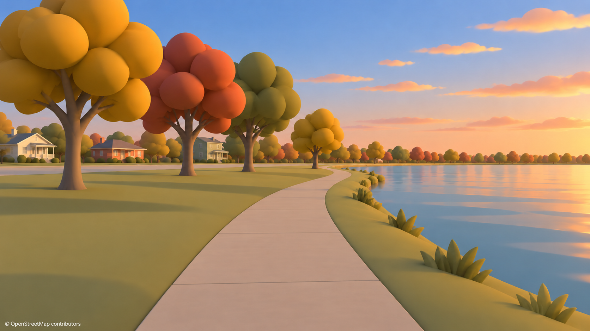

Use the empty path, warm architectural planes, smooth organic crowns and lake/sky separation. Do not reproduce exaggerated foliage saturation or infer sun/shadow vectors from pixels; the numeric west-southwest sun is authoritative.

### 02 — Overcast

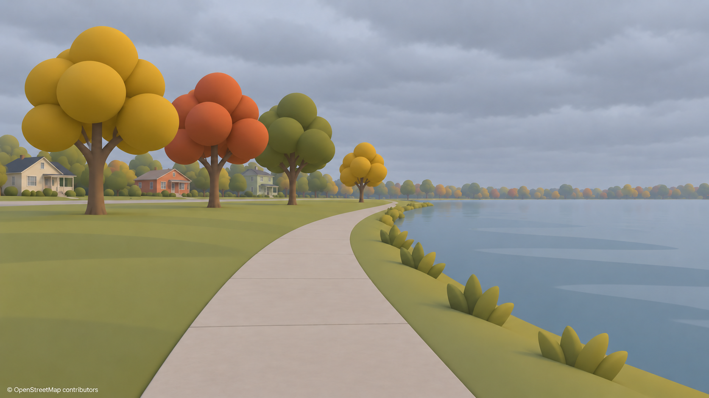

Use soft cool fill and readable dry surfaces. Cloudy weather does not itself wet the path. Tree sizes and camera framing drift relative to 01; hold both fixed in the renderer.

### 03 — Light rain

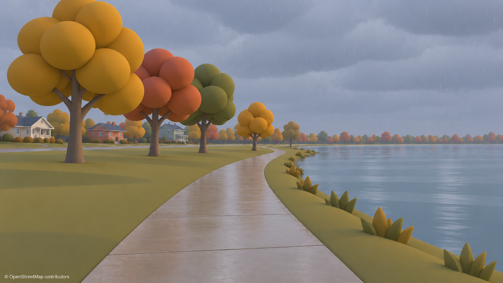

Use restrained rain, subdued contrast and persistent dampness. Simplify residual water/path microdetail into broad procedural response; do not buy this look with textures or reflection passes.

### 04 — Thunderstorm

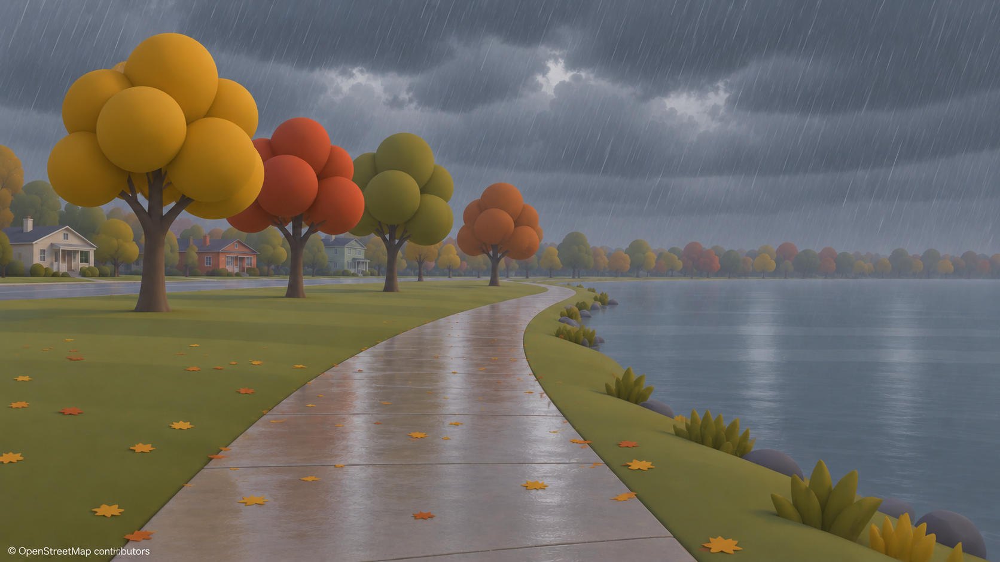

Use dark cloud mass and shorter visibility while retaining readable midtones. No lightning is needed. The picture’s fine wet highlights, loose leaves and rain density are not permission to exceed the material/particle caps.

### 05 — Fog

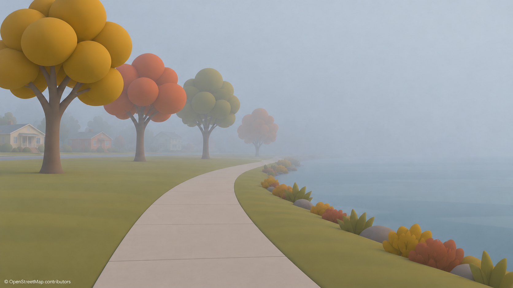

Use progressive loss of far-shore and house contrast. Fog creates neither rain nor wetness automatically. Replace decorative shoreline blobs with only supported geometry and bounded inferred vegetation.

### 06 — Wildfire haze / smoke

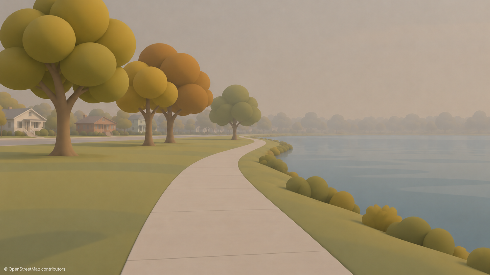

Use muted beige-gray obscuration and dry ground. No local flame, red apocalypse sky or invented air-quality reading. The actual fog curve and .144 tint blend govern the renderer.

### 07 — Falling snow

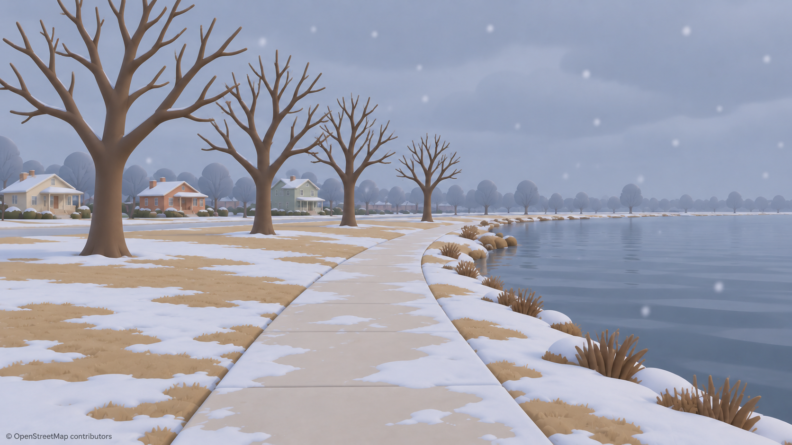

Use bare near trees, soft snowfall and discontinuous cover. Preserve liquid water. Snow coverage is .63212 of eligible area, not a measured fraction of this picture. Distant rounded crowns must become bare deciduous silhouettes unless evergreen classification supports foliage.

### 08 — Morning after snow

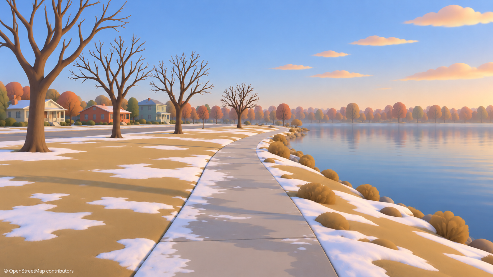

Use substantial tan grass between snow patches and low morning light. Do not copy distant autumn-colored leafy crowns, small cloud additions under the prescribed C=0 state, or an apparently cleared path. The numeric morning fog range supersedes the earlier approximate prompt range.

### 09 — Clear night

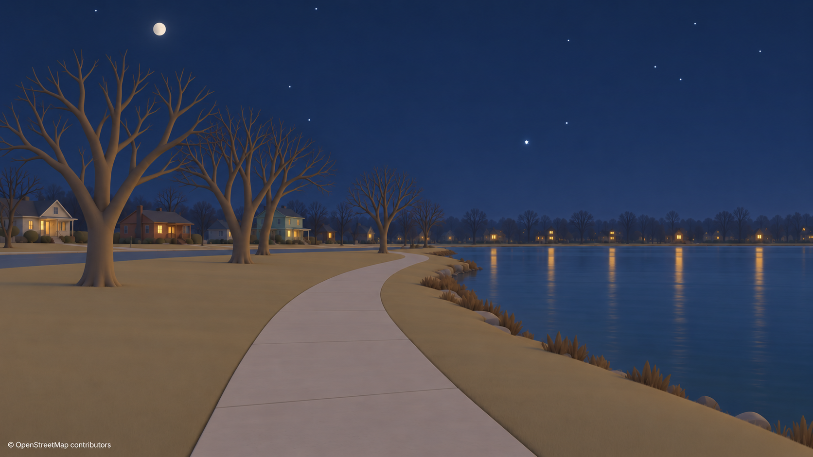

Use a readable navy world, restrained windows, bare trees and a nearly full Moon. **This image fails exact sky placement:** the generator kept the Moon near x≈.196 instead of .1722 and placed the brightest star too high; the disk also remains larger than intended. Use §1.4 and the JSON for actual Moon size, limb and catalog stars. The single permitted edit was used; no further image correction is claimed. Restrict glowing households to the weather proposal’s stable 20–30% selection and avoid widespread mirror reflections.

### 10 — Aerial rain

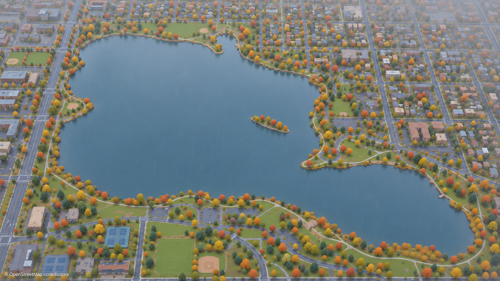

Use coherent lake/park/neighborhood massing and gentle distance loss. The lake outline and invented minor objects are illustrative; load the real OSM rings and buildings. Remove giant screen-spanning rain streaks at this altitude: the wetness/cloud/visibility response can convey rain without airborne particles.

### 11 — Aerial snow cover

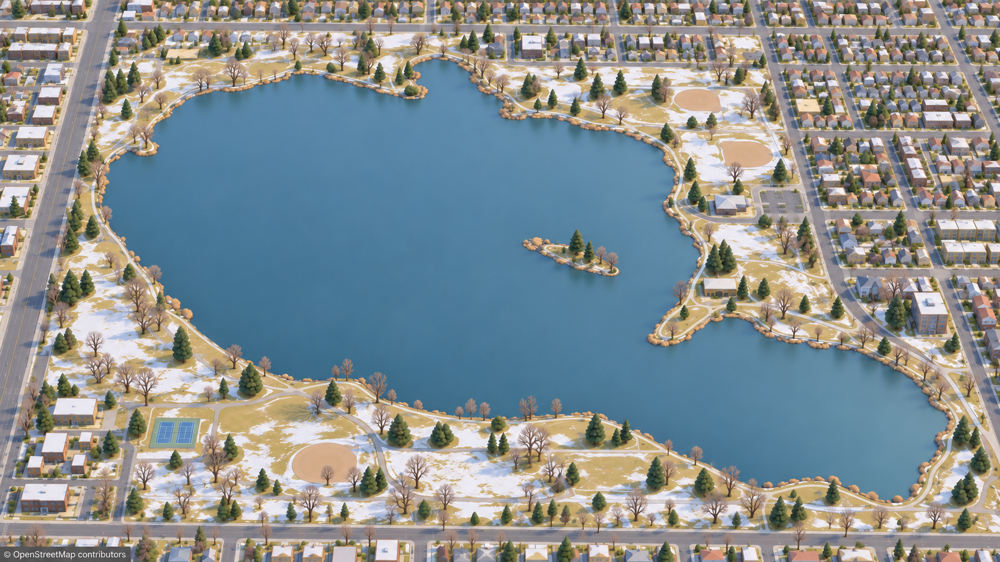

Use patchy tan/white land and an unfrozen lake, with bare deciduous trees. Match the mapped aerial pose and shoreline rather than copying the generated island/park proportions or decorative shoreline edging. Disable comparative tilt-shift so geometry remains inspectable.

## 3. Camera modes without a character [A]

| Mode | Starting behavior | Interaction and constraints |
|---|---|---|
| Aerial diorama | Fit mapped bounds plus a 10% framing margin; pitch 45–65°, FOV 50°. True metre scale; no raised platform or enlarged buildings | One-finger pan across ground; pinch changes camera distance; two-finger rotation changes heading; explicit tilt control avoids gesture ambiguity. Clamp against terrain and available coverage. Reset restores a saved pose |
| Free street exploring | Eye 1.65 m above supported ground, FOV 50°, initial heading along a useful sightline | Left thumb pad moves on horizontal plane; drag elsewhere looks; accessible move/turn buttons and keyboard equivalents. Nominal 1.4 m/s, selectable .7–3 m/s, acceleration ≤1.5 m/s², turn limit 60°/s. Pitch −45° to +60° downward convention; no roll/head bob. Stop at solid geometry or unavailable ground; public-path guidance optional |
| Route flythrough | A camera follows a recorded geographic polyline, with no entity on it | Start eye 2 m above terrain; replay controls, seek, original-time or scenic-speed selection. Preserve path geography; corner treatment below |
| Postcard | Saved geographic pose, stable time/environment binding and viewport policy | Static by default. Weather/light can evolve while camera stays still. Optional move to next postcard uses a user-triggered transition; no unexplained perpetual orbit |

[A] Free exploring is a view control, not navigation assurance. Collision uses supplied geometry and land/water masks; absent building/access tags do not prove safe or public passage. Do not invent a walkable connection through private land. If available data ends, constrain movement and show an unobtrusive coverage edge message; never hide missing geography with fake fog. Water crossing can be an explicit aerial action, not a silent street teleport.

### Route motion [A]

Treat the path as distance parameter s with optional source UTC timestamps. At **1× recorded mode**, interpolate its recorded time/distance relationship, retaining pauses; faster playback explicitly changes playback scale. **Scenic mode** uses 1.4 m/s walking or 3 m/s running as presentation defaults, not claims about the recorded activity. Cap scenic speed at 5 m/s near ground. Either mode may slow presentation at a turn; label that change or retain strict timed replay and use a gentler camera orientation instead. Never silently rewrite recorded duration.

Place the camera over the path, with no necessary trailing distance. Look toward a path point `clamp(2+2v,4,18)` metres ahead, where v is presentation m/s; eye height and aim height are separate. Start aim height at 1.2 m above future terrain. Bound angular velocity to 30°/s in scenic playback and acceleration/deceleration to 1 m/s². Stabilize orientation through tangent smoothing; pitch toward supported terrain, cap scenic downward pitch at 20°, avoid banking.

For corners, compute an optional 2–6 m fillet only when its entire swept camera clearance fits the supplied traversable corridor. If that would cut a building, water edge or unmapped parcel, stay on the polyline, decelerate, turn, then accelerate. At a hairpin or route end, reduce look-ahead; do not look through a distant opposite segment. Stationary intervals retain the last useful heading. GPS gaps, teleports and disconnected segments become explicit breaks with a brief fade/reposition, not invented straight-line traversal. A threshold such as a >50 m jump or physically implausible speed is a configurable flag for host review, not proof of a gap in all activity types.

Route data remains host-owned. WorldEngine receives a neutral sampled path and a clock mapping; it need not know whether someone walked, ran or added a character. Backward seeks resolve camera and environment directly from source time/checkpoints, independent of prior playback history. Pause freezes replay; live postcard pause freezes only camera motion unless the user explicitly freezes time. With Reduce Motion, use static postcards or discrete route stops with crossfades, no automatic pan/orbit.

### Renderer-neutral contract [A]

The world package’s `environment.json` retains weather, sky, phenology, source times, quality flags and attribution metadata from L3/L4. Add a versioned **experience defaults** group: geographic postcard candidates, scores/reasons, camera poses, coverage limits, permitted motion bounds and rendering-quality preferences. It contains ordinary numbers/strings/arrays, no RealityKit/three.js objects or UI callbacks. Runtime camera state carries mode, pose, optional path/time cursor and transition state; private routes and user location are not baked into public packages. The host owns controls, weather fetching, attribution links, widget scheduling and notifications. An adapter reports unsupported capabilities rather than silently changing physical scale or astronomical position.

## 4. Auto-composed postcards anywhere [A]

Do selection from map/terrain/coverage data on the CPU, preferably at package preparation or idle time. Start with this bounded heuristic, then evaluate its art quality in contrasting places:

1. Sample supplied public path/park edges at roughly 10 m intervals. Add open-space boundaries and accessible waterfront viewpoints; do not place an eye in water, buildings, private yards or an unsupported height. Keep at most 256 spatially distributed candidates per request.
2. At each candidate consider headings every 15°, a 50° FOV and eye heights 1.65 m plus an optional 4 m elevated-view mode. Elevated views are labeled viewpoints, not implied pedestrian positions. Use coarse spatial queries/rays against existing bounds; refine only the best 12 candidates. Budget at most 32 coarse rays per pose evaluation, processed off the render thread in slices.
3. Estimate normalized water/park area, open sightline depth, near occlusion, subject/sky balance and known-data coverage. Prefer a foreground edge/path, a middle-ground group and a distant layer. Start with water occupying 15–40% of the frame, clear sky 25–45% in street scenes, and no near trunk covering the center third. These are soft goals, never reasons to move a lake or tree.
4. Rank `0.25 openDepth + 0.20 geographicInterest + 0.20 composition + 0.15 lightFit + 0.10 weatherFit + 0.10 coverageConfidence`, with each score normalized to [0,1]. Geographic interest accepts water, park, actual architecture or a mapped intersection; lack of water is not failure. Penalize missing geometry, blocked eyes, foreground occlusion and repetition separately; reject invalid candidates before scoring.
5. Evaluate light from the real solar vector at the requested time. For golden light favor lit planes or side light; allow a real visible sunset only where its bearing enters the frustum. Overcast favors strong form/shoreline contrast; fog favors supported nearby layers within visibility; snow favors exposed ground mixed with bare branches. Smoke preserves the same geography without decorative fire. Never change weather/time to improve the score in live mode.
6. For a persistent living view, score several real times as well as current conditions so a sunset-only winner does not become an unreadable noon/night view. Keep the selected pose stable for at least ten minutes, and require a ≥.15 normalized improvement before suggesting another. Do not automatically jump the camera on weather updates. Stable OSM/profile seeds break ties.

Fallback order: a supported waterfront viewpoint; park/open-space edge; public street looking toward distinctive mapped architecture; then a bounds-fit aerial. If all candidates fail coverage checks, show the best honest aerial or a static last-supported view with its timestamp. Sparse data never licenses a fabricated landmark or uniformly spaced tree avenue. Save candidate origin, heading/FOV, input hashes, quality score, reasons and rejected constraints so either renderer can reproduce the decision.

## 5. On-screen layer and time [A unless marked V]

Use a compact **weather strip** along the top safe area: condition, temperature, optional precipitation/wind, location label, valid time and data age. “Live,” “Forecast,” “Recorded,” “Typical” and “Demo” are distinct labels. A synthetic showcase uses **Demo weather**. Missing values are omitted or shown unknown, never filled with plausible measurements. Weather meanings should remain legible through text/icons, not only color. Keep controls away from the postcard’s main sightline and support larger text with a two-row strip rather than hiding attribution.

The **time scrubber** sits above the bottom attribution area. Show local date/time with zone, sunrise/sunset markers from the astronomical API, and a clear **Return to live** action. Separate clock selection from weather availability: within supported historical/forecast coverage, use that source state; outside it, offer **Light and season preview — weather unavailable**. Do not replay today’s rain at an arbitrary historical date or imply climate normals are observed weather. Phenology inputs/uncertainty travel with the selected date. Preserve UTC instants through DST; repeated local hours display the offset. Recompute from checkpoints on seeks, not elapsed render frames.

[V, S1/L3] Apple’s attribution policy distinguishes ordinary displayed weather data from transformed value-added products and requires source credit; the latter also needs a modification notice. [A] When using Apple data, use the supplied current light/dark Apple Weather mark in the weather strip, with **Weather data sources** opening the supplied legal URL. Include **Weather visualization modified from Apple Weather data** beside the source information. Do not hand-draw a mark or bury the only credit in settings. These exact layout/wording choices are proposed, not Apple-specified pixel positions.

[V, S2/L1] OSM requires attribution and notice of its ODbL availability; the repo requires visible **© OpenStreetMap contributors** whenever the world is shown. [A] Keep that notice separately at bottom-left on a subtle contrast plate, linked to OSM’s copyright/license page. It remains visible when controls auto-hide, in full-screen, and in screenshots. Weather branding stays beside weather data, not merged into OSM credit. “Clean view” hides controls, not required attribution. Keep credits within safe areas and test at actual output size; neither lens blur nor dark weather may erase them.

[A] Shared stills/video include visible source/modified-data notice when applicable and a companion share page carrying provider legal links; metadata alone is not the proposed visible credit. A widget or noninteractive screensaver requires a legible attribution design and an accessible source/legal destination in its host. Confirm that treatment against the chosen distribution’s provider terms before release, as already noted in weather §10. No Apple branding belongs on these synthetic weather pictures. HYG attribution/license belongs with the adapted star data and credits view. Hosts retain source-specific requirements for other providers.

[A, L3] Follow weather v1’s freshness/retention policy: active refresh initially every 30 minutes, 15 during changing conditions; stop foreground polling when hidden. Mark stale cached weather, and after the proposed two-hour stale limit use explicitly labeled unavailable/typical fallback instead of unbounded “live” rain. Fetch permitted historical data for the active session; do not build an indefinite raw-provider archive merely to support scrubbing. These intervals are proposal policy, not a service-level promise.

## 6. Living-view uses

| Surface [A unless marked] | Engine output needed | Host behavior / limits |
|---|---|---|
| Desktop or web neighborhood view | Stable postcard, lightweight environment updates, optional slow water/tree motion, frame-on-demand support, safe-area metadata | Default 30 fps while visible; interactive exploration 60 fps. Pause when hidden/occluded. Retain world clock and resolve current state on return, rather than simulating every missed frame |
| Phone widget snapshot | Deterministic offscreen still at requested size/time, suitable crop, timestamp/quality and attribution metadata; cached image | Host prepares snapshots outside continuous rendering. Widget displays a cached image with a tap to open the live world. Show snapshot age and avoid claims of minute-perfect weather |
| Screensaver-style display | Stable low-power postcard, optional set of supported views, clock/weather updates, credits | 15–30 fps, conservative resolution, no forced display wake, no continuous camera motion by default. Periodic gentle view changes optional. Actual native screensaver integration remains platform-specific and unverified |

[V, S3] WidgetKit’s host renders widget content; the extension is not continuously active, and refresh opportunities are system-budgeted. [A] Therefore request a timeline of useful snapshots, but do not promise a fixed refresh interval or continuous 3D widget animation. If refresh is delayed, show the existing timestamped snapshot. A home-screen widget is a host integration, not a new WorldEngine renderer loop.

[V, S4] The web Page Visibility API exposes visible/hidden document changes. [A] Stop simulation, rendering and active polling explicitly on hidden state; do not rely solely on browser timer throttling. Embedded views also need host visibility signals when merely CSS-hidden. Native hosts forward scene lifecycle/occlusion and thermal signals. Cache decoded geometry only within a bounded memory policy; repeated visits should not create one retained world per postcard.

## 7. Performance and acceptance [A; inherited targets V, L2/L3]

The interactive target remains **60 fps and ≤10 ms GPU per frame on iPhone 13-class hardware**, iOS 26 minimum. Lower ambient frame rate saves duty cycle; it does **not** authorize a >10 ms frame. These allocations are inherited unmeasured targets, not benchmarks:

| Existing v2 bucket | Ceiling | Experience work charged here |
|---|---:|---|
| Base world / optional host content | 4.25 ms | Normal geometry, water, one fog term, sky/disk/stars, culling |
| Sun/contact shadows | 1.45 ms | Existing bounded sun solution; no absent-character contact cost |
| AO/fill | .15 ms | Existing cheap shaping and readable night fill |
| Surface patterns | .25 ms | Lawn/joints and snow masks |
| Near geometry | .35 ms | Existing bevel/leaf limits |
| Wet/local-light additions | .35 ms | Bounded wet response and local streaks |
| Weather particles | .20 ms | Rain ≤600, snow ≤300, airborne leaves ≤12; combined ≤600 |
| Shared post-processing | .90 ms | Existing grade/bloom/optional aerial blur, no extra fog pass |
| Reserved margin | 2.10 ms | Remains reserved; character-free savings enlarge margin |
| Total | **10.00 ms** | **7.90 planned + 2.10 reserved** |

Long-running defaults: 30 fps visible ambient, 60 while actively manipulating, 15 in low-power mode, zero hidden. Start with a **1920×1080-equivalent maximum (~2.1 megapixels)** for ambient renders; reduce scale under sustained load where the adapter supports it. UI/credits remain native-resolution and legible. Portrait uses equivalent area, not stretched landscape. One visible renderer per view; one bounded snapshot job at a time. Cap cached snapshots by count/bytes, initially 12 images/32 MiB, evict oldest unused. These values need device measurement and may differ by host.

Compute environment samples on CPU at roughly 1 Hz and interpolate vectors/scalars between them. Daily events/phenology resolve on time/input changes off the render thread; avoid per-tree hourly simulation. Postcard scoring never runs each frame. Camera motion samples per active frame but does no network work. Weather particles stay camera-local, depth-tested, with approximately 8% transparent screen-coverage starting cap. Omit aerial precipitation if it reads as giant streaks. Reuse instancing, LODs, stable vegetation seeds and bounded ground detail. No volumetric clouds, volumetric fog, full-scene reflections, star particles or moon shadow maps.

Degrade optional bloom/blur, particle count/coverage, snow cap geometry and local streaks before essential geometry/lighting. Reduce drawable size only through a declared adapter capability. Preserve actual light direction, surface-state provenance, attribution and readable ground. If the cap cannot be met, report the quality tier as unsupported; do not falsify weather to conceal the failure.

Acceptance before adopting the look:

- Render all eleven presets from the actual package with identical camera matrices per mode; compare mapped shoreline/path/building projections across weather states. Image generation is not this test.
- Check noon/overcast as strongly as golden hour: depth should survive without sunset color or a character. Compare at phone size, portrait, grayscale and with post-processing off.
- Validate the night disk center/size, limb orientation, star IDs/occlusion and ≤128 cap numerically; keep the generated night image out of astronomy golden-image assertions.
- Check snow’s eligible-area coverage and exposed tan grass; snow must not create ice or inferred cleared routes. Wetness persists through rain ending and remains deterministic on seeking.
- Measure ten minutes of interactive worst-case weather plus a 30-minute living view on physical iPhone 13: max/p95 GPU, stalls, resolution, memory and thermal state. Worst sustained frames must respect the 10 ms ceiling; a favorable average does not pass. Test hidden/resume, stale data, reduced motion, attribution legibility and snapshot refresh delays. No timing result is claimed in this proposal.

## 8. Open questions [A]

| Decision | Recommended starting position |
|---|---|
| Which no-character view is the first product default? | Stable local postcard, with one-tap aerial and explore modes |
| Should free exploring constrain to paths? | Default gentle path guidance, explicit free mode with geometry/coverage limits |
| Route timestamps versus scenic slowdown? | Expose two named modes; never silently change recorded duration |
| Moon readability multiplier? | 1× scientific setting, optional 1.5× postcard setting; always retain true center |
| How much historical weather is available/permitted? | Enable only supported source intervals; separate astronomical preview from weather replay |
| Which regional phenology data and evergreen tags exist? | Carry quality/fallback flags; do not copy the concept’s distant winter foliage |
| Which renderer supports offscreen snapshots and adjustable drawable scale reliably? | Capability-test both adapters before promising widget generation or resolution control |
| How should provider attribution fit smallest widgets and noninteractive exports? | Resolve at host layout/distribution level before shipping; never silently remove it |
| Should postcards rotate automatically? | Off by default; user-selected slow slideshow for screensaver use |
| When do generated targets become acceptance references? | Only after mapped geometry, lighting and sky are recreated and measured in an actual renderer |

## 9. Source register

All sources below were checked **2026-10-05**. Local sources may change while other agents build; hashes for the map and inspected sun source are preserved in the reference JSON. No claim is made that this proposal freezes their later state.

| ID | Source | What was verified |
|---|---|---|
| L1 | [CLAUDE.md](../../../CLAUDE.md), user-provided AGENTS instructions | Generic engine, allowed proposal work, no git, iOS 26, stable seeds, visible OSM credit |
| L2 | [Visual v2](../visual-v2/WorldEngine-Visual-Spec-Proposal-v2.md), [visual direction](../../VISUAL_DIRECTION.md), [v2 image directory](../visual-v2/images/) | Palette/material rules, §6.2 camera conventions, §8.1 budgets; images inspected |
| L3 | [Weather v1](../weather-v1/WorldEngine-Weather-Spec-v1.md) | Surface reservoirs, fog/tint/direct resolution, night rules, particles, performance, attribution/retention proposal |
| L4 | [Sky/seasons v1](../sky-seasons-v1/WorldEngine-Sky-Seasons-Spec-v1.md), [fixtures](../sky-seasons-v1/sky-seasons-fixtures.json), [sun source](../../../Sources/WorldGeo/SolarPosition.swift) | Astronomy/phenology contract and current sun equations; prior proposal is not implementation status |
| L5 | [Current street/lake capture](../../screenshots/m2/look-after/lake-path.png), [comparison capture directory](../../screenshots/m2/compare/), [before/after](../../screenshots/m2/look-before-after.png) | Actual supplied engine output inspected, distinct from generated targets |
| L6 | [WorldLab view source](../../../Apps/WorldLab/Sources/ContentView.swift) | Existing demo-camera context; no-character modes here are proposals |
| L7 | [Local Sloan’s Lake OSM extract](../../../Data/areas/sloans-lake/osm.json) | Trail anchor and water ring IDs/coordinates; no survey of inferred details |
| S1 | [Apple WeatherKit attribution](https://developer.apple.com/weatherkit/), [WeatherAttribution](https://developer.apple.com/documentation/weatherkit/weatherattribution) | Branding/source/legal-link and modified-data requirements; provided attribution assets |
| S2 | [OpenStreetMap copyright and license](https://www.openstreetmap.org/copyright) | OSM credit and ODbL notice |
| S3 | [Keeping a widget up to date](https://developer.apple.com/documentation/widgetkit/keeping-a-widget-up-to-date) | System-managed widget rendering and refresh budget; documentation content read through Apple’s documentation JSON |
| S4 | [MDN Page Visibility API](https://developer.mozilla.org/en-US/docs/Web/API/Page_Visibility_API) | Visibility events and background behavior |
| S5 | [HYG database](https://github.com/astronexus/HYG-Database), [CC BY-SA 4.0](https://creativecommons.org/licenses/by-sa/4.0/) | Catalog identity and license; exact v4.1 source/hash in reference JSON |
| S6 | [Astronomy Engine pinned revision](https://github.com/cosinekitty/astronomy/tree/865d3da7d8112bbc7911238052c6af4aaf877181) | Independent reference model used for calculations; its output is labeled calculated, not observed |

[A] Priority recommendations: make no-character postcards the baseline; keep exact geometry/sky fixtures separate from generated art; share one renderer-neutral environment resolver; separate live/recorded/astronomical-preview time honestly; and build a bounded low-power snapshot/living-view path with visible attribution from the start.
