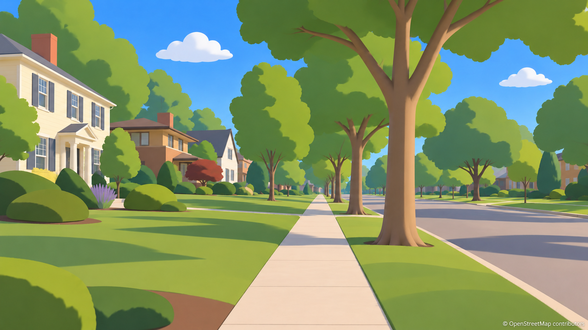
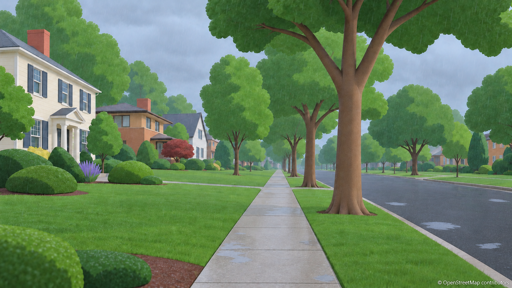
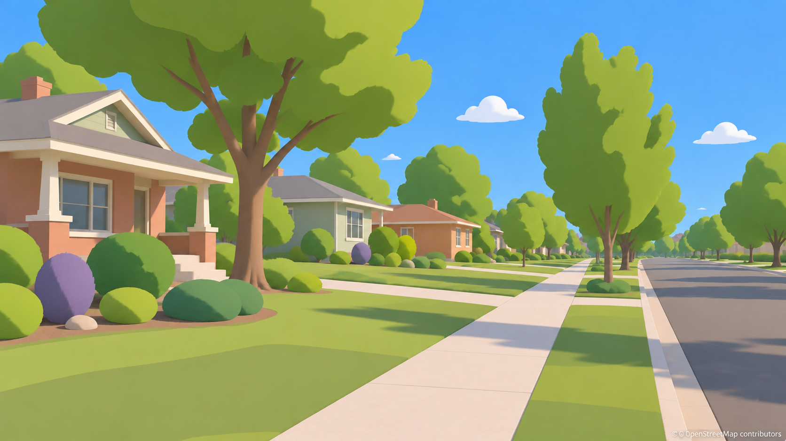
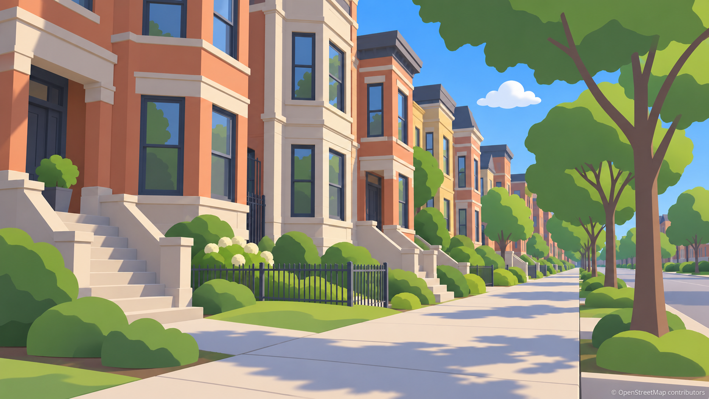

# WorldEngine Look Fix Pack v1

6 October 2026 · Proposal only · **21 reference images + 7 supporting files**

Start with [LOOK-FIX-SPEC.md](LOOK-FIX-SPEC.md). It gives numeric appearance targets, P2/5A ownership, GPU cost, per-section grader checks and the ranked work queue. [VALIDATION.md](VALIDATION.md) records what was checked and the remaining limitations.

**First five recommendations:** fix ordinary-day fill/exposure and dark roofs; verify real sun/shadow bearings; add broad lawn/bed/access layers; make rain readable without particles; couple fog/smoke extinction to sky and direct light. Improve crowns, seasons and aerial context next; sky polish follows.

The images are generated appearance studies. They are not surveyed OSM reconstructions, engine captures, historical weather observations or astrometric truth. Exact source directions and projected catalog positions are provided separately. Do not use a generated star, moon, shadow or fine texture as implementation ground truth. The supplied video frames were neither fed into generation nor saved here.

## Ground and yards

| Clear North Shore | Same street in light rain |
|---|---|
|  |  |

| Denver | Lakeview |
|---|---|
|  |  |

## Same-composition lighting set

The 12 frames share the north-shore ESE postcard composition. July states have green summer foliage; January snow and night states use bare deciduous trees. Generative variants retain the broad composition but cannot guarantee identical projected geometry.

| State | Image |
|---|---|
| morning | [lighting-01-morning.png](images/lighting-01-morning.png) |
| midday | [lighting-02-midday.png](images/lighting-02-midday.png) |
| ordinary 1530 | [lighting-03-ordinary-1530.png](images/lighting-03-ordinary-1530.png) |
| golden hour | [lighting-04-golden-hour.png](images/lighting-04-golden-hour.png) |
| blue hour | [lighting-05-blue-hour.png](images/lighting-05-blue-hour.png) |
| overcast | [lighting-06-overcast.png](images/lighting-06-overcast.png) |
| light rain | [lighting-07-light-rain.png](images/lighting-07-light-rain.png) |
| storm | [lighting-08-storm.png](images/lighting-08-storm.png) |
| fog | [lighting-09-fog.png](images/lighting-09-fog.png) |
| snow | [lighting-10-snow.png](images/lighting-10-snow.png) |
| moon night | [lighting-11-moon-night.png](images/lighting-11-moon-night.png) |
| moonless night | [lighting-12-moonless-night.png](images/lighting-12-moonless-night.png) |

[Calculated sun/moon fixtures](lighting-fixtures.json) · [Projected catalog star reference](sky-projection-reference.json)

## Aerial and sky references

| Study | Image |
|---|---|
| continuation clear | [aerial-01-continuation-clear.png](images/aerial-01-continuation-clear.png) |
| continuation snow | [aerial-02-continuation-snow.png](images/aerial-02-continuation-snow.png) |
| golden water | [sky-01-golden-water.png](images/sky-01-golden-water.png) |
| moon water | [sky-02-moon-water.png](images/sky-02-moon-water.png) |
| clear afternoon | [sky-03-clear-afternoon.png](images/sky-03-clear-afternoon.png) |

The aerials demonstrate continuous context rather than a floating green plane. The dedicated golden-water sky study looks toward WNW; it is **not** the ESE lighting camera. The moon-water sky study looks ENE toward the lunar source. Their stars/source sizes remain illustrative; use the spec and fixtures.

## Complete created-file inventory

All files below live only inside `docs/proposals/look-fix-v1/`. Original generated attempts remain in the image tool's default output folder under the user's explicit exception. No screenshot attachments were copied. No git commands or production changes were made.

- [README.md](README.md)
- [LOOK-FIX-SPEC.md](LOOK-FIX-SPEC.md)
- [image-manifest.json](image-manifest.json)
- [PROMPT-LOG.json](PROMPT-LOG.json)
- [VALIDATION.md](VALIDATION.md)
- [lighting-fixtures.json](lighting-fixtures.json)
- [sky-projection-reference.json](sky-projection-reference.json)
- [images/aerial-01-continuation-clear.png](images/aerial-01-continuation-clear.png)
- [images/aerial-02-continuation-snow.png](images/aerial-02-continuation-snow.png)
- [images/ground-01-north-shore-clear.png](images/ground-01-north-shore-clear.png)
- [images/ground-02-north-shore-rain.png](images/ground-02-north-shore-rain.png)
- [images/ground-03-denver-clear.png](images/ground-03-denver-clear.png)
- [images/ground-04-lakeview-clear.png](images/ground-04-lakeview-clear.png)
- [images/lighting-01-morning.png](images/lighting-01-morning.png)
- [images/lighting-02-midday.png](images/lighting-02-midday.png)
- [images/lighting-03-ordinary-1530.png](images/lighting-03-ordinary-1530.png)
- [images/lighting-04-golden-hour.png](images/lighting-04-golden-hour.png)
- [images/lighting-05-blue-hour.png](images/lighting-05-blue-hour.png)
- [images/lighting-06-overcast.png](images/lighting-06-overcast.png)
- [images/lighting-07-light-rain.png](images/lighting-07-light-rain.png)
- [images/lighting-08-storm.png](images/lighting-08-storm.png)
- [images/lighting-09-fog.png](images/lighting-09-fog.png)
- [images/lighting-10-snow.png](images/lighting-10-snow.png)
- [images/lighting-11-moon-night.png](images/lighting-11-moon-night.png)
- [images/lighting-12-moonless-night.png](images/lighting-12-moonless-night.png)
- [images/sky-01-golden-water.png](images/sky-01-golden-water.png)
- [images/sky-02-moon-water.png](images/sky-02-moon-water.png)
- [images/sky-03-clear-afternoon.png](images/sky-03-clear-afternoon.png)

The manifest includes image dimensions, hashes, bytes, source generation paths and read-only brightness statistics. The prompt log retains initial attempts and corrections; discarded generations are not included in images/.
