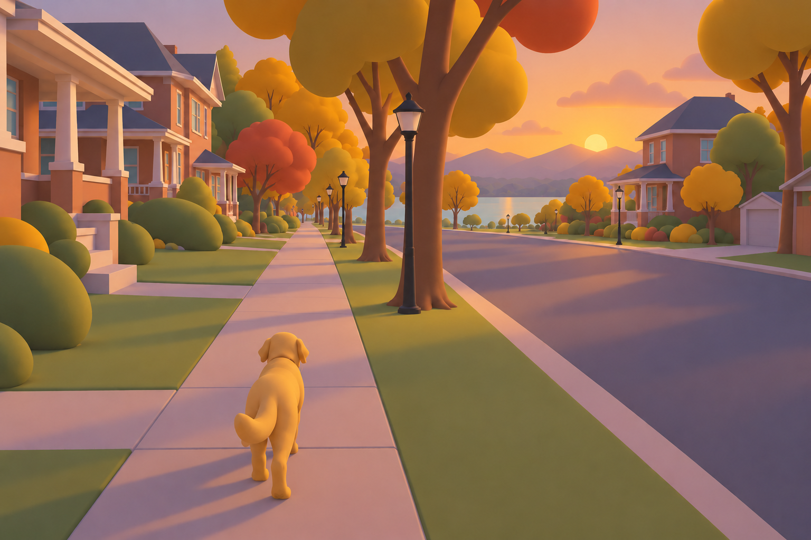
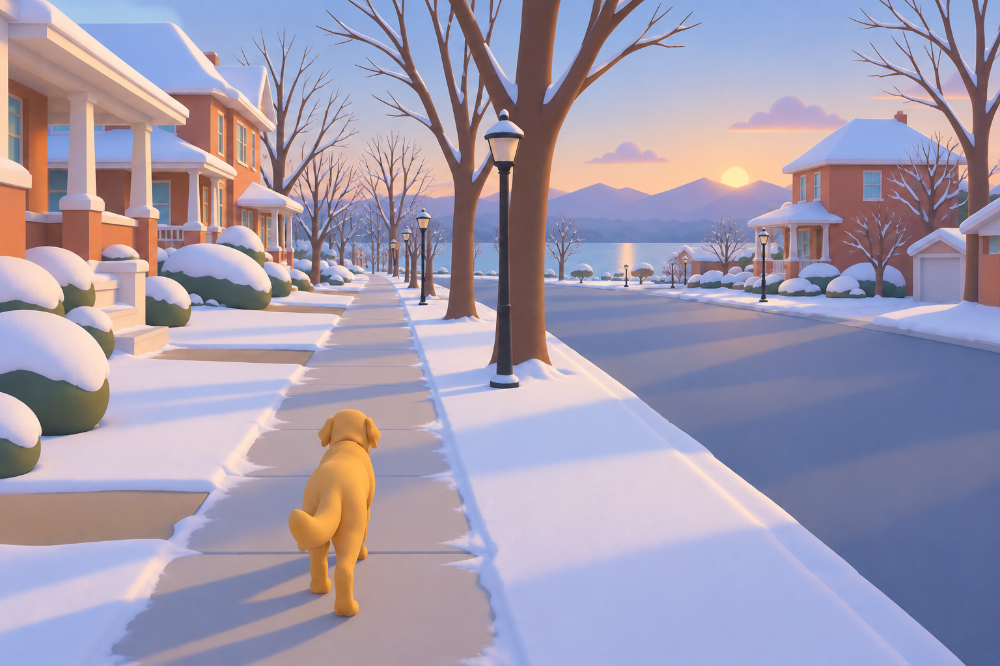
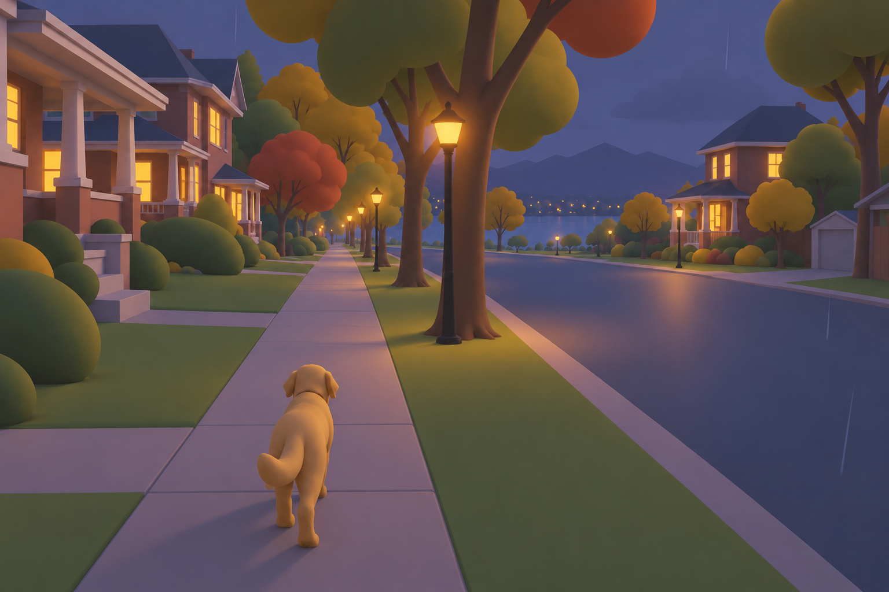
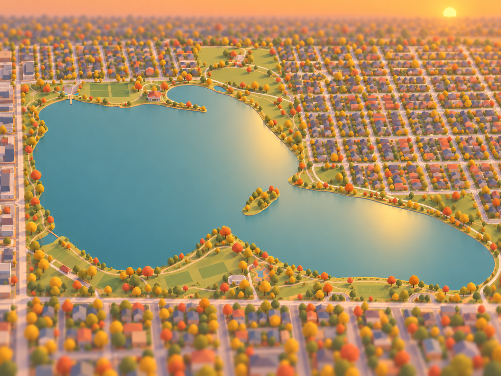
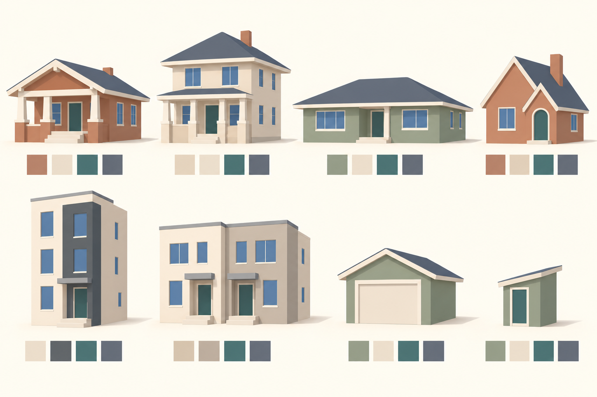

# WorldEngine Visual Spec — Proposal v1

**5 October 2026 · Art-direction proposal for review · Not the implementation specification**

The coding agent owns implementation, platform choices within RealityKit, and the final specification. This document proposes a visual system; it does not change the engine, the current plan, or the binding visual-direction document. No Swift or Metal code is included.

**Rating key.** Every recommendation below carries **Cost / Confidence**, either on its row or inherited from its labeled paragraph/subsection. Cost means expected runtime burden at the stated population and distance: **Low** = palette data, modest geometry or existing-pass work; **Medium** = substantial repeated geometry, shadow work or an extra effect; **High** = broad overdraw, multiple full-screen passes, many dynamic lights or difficult visibility work. These are relative estimates, not measured milliseconds. Confidence means confidence in the design recommendation, not proof of performance. Generation complexity is called out separately. Tables inherit no unstated performance guarantees.

## 1. North star

**Cost: Medium / Confidence: High.** A walk through a recognizable neighborhood should feel like stepping into a carefully made, sun-warmed model: real distances, familiar roof silhouettes, welcoming porches and generous tree shapes, with a small companion that stays easy to see. The painterly quality comes from large color relationships, soft illumination and selective detail. Golden hour is the hero presentation, but the same architecture must remain appealing at flat noon, in winter and at rainy dusk. The aerial view reveals the model; the street view makes it feel inhabited.

| Art-direction rule | Practical interpretation | Cost | Confidence |
|---|---|---|---|
| Distinguish made things from grown things | Flat-shaded architectural planes; smooth organic trees, shrubs and characters. Buildings get substantial eaves and posts, not rounded toy walls. | Low | High |
| Design silhouettes before decoration | Roof, porch recess, canopy and character proportions must read at thumbnail size. No simulated brick courses, shingles or wood grain. | Low | High |
| Keep the ground quiet | Large matte road/path/lawn fields; accents cluster at edges. Ground clutter never competes with paws or route visibility. | Low | High |
| Warm light, restrained cool shadow | Warm cream illumination against muted blue-lavender shade. Shadow tint is an appearance target achieved through fill/material response, not an assumed engine control. | Medium | High |
| Avoid pure black and pure white surfaces | Darkest common material `#303942`; snow `#E8EDF0`; trim `#E8D9BC`. Preserve headroom for illuminated windows and highlights. | Low | High |
| Coordinate variation | A house gets one coherent color tuple; nearby vegetation shares a limited family. Seed stable identity, not independent randomness on every part. | Low | High |
| Geography is the anchor | Preserve mapped positions, shorelines, footprints and path centerlines. Reduce detail rather than compress distances. Only horizon backdrops are exempt. | Low | High |

## 2. Evidence, assumptions and regional character

**Cost: Low / Confidence: High for inventory; Medium for interpretation.** The supplied inventory reports 1,399 buildings, 769 houses, 490 garages, 84 sheds, 130 floor counts, no heights or roof shapes, 5,400 trees without species, 56 benches, 55 lamps and 20.77 km of separately mapped sidewalks. It also records **62 roof colors and 16 building colors**, plus 32 picnic tables, 15 hydrants, fence and hedge lines. Use these existing facts before inventing replacements. Counts come from the project's [street-data inventory](../../data/sloans-lake-street-data.md); this review did not independently recount the extract.

**Cost: Low / Confidence: Medium.** Your neighborhood description is broadly right, but avoid making foursquares co-dominant by default. Local architectural commentary describes a wider mix, including cottages/Tudors, ranches and Mediterranean Revival, and notes that Denver Squares are less prevalent here than in several other Denver neighborhoods. It also describes modern homes with side-facing entrances. This is qualitative evidence, not a measured architectural census: [Sloan's Lake Architecture](https://sloanslakeagent.com/sloans-lake-architecture). The six proposed house families below are a deliberately limited first vocabulary; rare ornate Victorian and Mediterranean variants can wait for evidence or overrides.

**Cost: Low / Confidence: High.** A footprint cannot reveal an actual roof, porch, construction date or architectural style. Keep source facts, inferred dimensions and generated choices distinct. A future per-building override takes precedence over all inferred styling. Never describe a generated facade as an accurate reconstruction of a particular home.

## 3. Palette as data

### 3.1 Color interpretation and composition

**Cost: Low / Confidence: High.** Hex values are sRGB authoring colors, not pre-lit pixels. Interpolate colors in linear light. Apply regional base palette → seasonal vegetation/ground changes → time-of-day illumination → weather response → optional small final grade. Do not orange-tint the base materials and then orange-tint them again for sunset. House palettes remain stable across seasons. Profile identity and palette choices remain stable across visits.

**Cost: Low / Confidence: Medium.** For trees, pick one primary color per tree; use up to two close variants within its crown, with about ±5% value change. Do not randomly assign all palette entries to every lobe. The winter deciduous entries below are bark/retained-leaf accents: most crowns become bare, rather than turning into brown balls.

### 3.2 Seasonal material palettes

All rows are proposed neutral-light bases. Color lists are discrete alternatives, not textures.

| Surface | Spring | Summer | Autumn | Winter | Cost | Confidence |
|---|---|---|---|---|---|---|
| Ground / exposed soil | `#AFA184` | `#B3A080` | `#AC9677` | `#A5A092` | Low | High |
| Lawn | `#91AD79` | `#82986B` | `#9B9C6D` | `#A6A58F` | Low | High |
| Grass tufts | `#A5BA82` | `#96A572` | `#B8AA76` | `#B8AF95` | Low | High |
| Deciduous 1 | `#8DAA73` | `#718E65` | `#C4A15B` | `#786E66` | Low | High |
| Deciduous 2 | `#A7BE85` | `#849B6A` | `#B98251` | `#8A7B6C` | Low | High |
| Deciduous 3 | `#B9C997` | `#98AD78` | `#A9654C` | `#A08C74` | Low | High |
| Deciduous 4 | `#77966E` | `#658475` | `#A6A06B` | `#9E8D79` | Low | High |
| Conifer alternatives | `#577C70`, `#6B8B76` | `#527468`, `#65816D` | `#5F7768`, `#73806C` | `#627970`, `#758B80` | Low | High |
| Bushes | `#7F9C72` | `#738B66` | `#92916A` | `#7F897A` | Low | High |
| Road | `#85888B` | `#898A89` | `#898582` | `#878B90` | Low | High |
| Sidewalk | `#CDC7B7` | `#D0C8B6` | `#C9C0AE` | `#C5C9C7` | Low | High |
| Curb | `#BBB9AE` | `#C0BCAE` | `#BDB5A7` | `#B7BFC1` | Low | High |
| Water | `#6F9898` | `#638D91` | `#759491` | `#7E959E` | Low | Medium |
| Sand / dirt path | `#C3B18B` | `#C9B58F` | `#C5AA80` | `#B6AF9A` | Low | High |
| Tree bark | `#807465` | `#7C7263` | `#817362` | `#807973` | Low | High |
| Snow overlay | `#E8EDF0` | `#E8EDF0` | `#E8EDF0` | `#E8EDF0` | Low | High |

**Cost: Low / Confidence: Medium.** Suggested Denver deciduous/conifer fallback mix: 90/10, with broad rounded, upright oval and open spreading crown archetypes rather than species claims. Generic profile: 80/20 only as a temperate fallback, explicitly overridable. These proportions are art priors, not observations. Do not apply Denver autumn dates or winter leaf loss to every latitude; profiles need hemisphere and leaf-cycle policy. If regional season knowledge is absent, use the neutral summer state rather than inventing snow or deciduous loss.

### 3.3 Time-of-day lighting

**Cost: Medium / Confidence: Medium for exact values.** Sun intensity is normalized artistic direct-light strength, with noon = 1; it is not an exposure value or a physical lux conversion. Fog distances are street-mode starting values. Ambient colors describe desired sky/ground fill; they do not assume two independently exposed RealityKit light controls. Ambient strength must preserve readable shadow faces without flattening porches.

| Time | Sun color | Sun intensity 0–1 | Sky top | Sky horizon | Ambient sky | Ambient ground | Fog color | Fog start m | Fog end m | Shadow tint | Cost | Confidence |
|---|---|---:|---|---|---|---|---|---:|---:|---|---|---|
| Dawn | `#F3B58F` | 0.22 | `#889AB8` | `#EAC3B1` | `#A1AFC4` | `#A99A91` | `#C5B8BE` | 220 | 850 | `#777F9A` | Medium | Medium |
| Morning | `#FFE1B2` | 0.72 | `#86ABC9` | `#D8DEDA` | `#B3CBD9` | `#B4AD95` | `#C5D4D7` | 420 | 1200 | `#7B8C9B` | Medium | Medium |
| Noon | `#FFF0D7` | 1.00 | `#7DA9C8` | `#D0DFE1` | `#B6D0DF` | `#B9B19B` | `#C9D9DB` | 500 | 1400 | `#7D8B91` | Medium | Medium |
| Golden hour | `#FFC788` | 0.78 | `#91A9BE` | `#F0CAA3` | `#B6BED0` | `#C0A487` | `#CEC0B7` | 350 | 1100 | `#85829A` | Medium | High |
| Dusk | `#DE9C8D` | 0.12 | `#697D9B` | `#B8A3B2` | `#8998B6` | `#827B83` | `#9D9EAF` | 200 | 750 | `#626D89` | Medium | High |
| Night | `#879DBC` | 0.00 | `#303D58` | `#63738C` | `#7788A6` | `#625F70` | `#626E87` | 140 | 600 | `#485772` | Medium | Medium |

**Cost: Low / Confidence: High.** Drive these states by solar elevation and whether the sun is rising or setting; interpolate instead of switching at fixed clock times. Suggested anchors: dawn −4°, morning +15° rising, noon at daily maximum, golden hour +6° setting, dusk −4° setting, night below −12°. For overlapping anchors or low winter sun, interpolate along the day's available arc; do not force noon to a high sun position. The actual sun direction always comes from time/location. Night's listed sun color is a dormant key, not a light shining through the ground. A separate moon is optional and omitted initially.

**Cost: Low / Confidence: Medium.** Fog start/end mean clear to progressively obscured, reaching the chosen opaque horizon treatment at end. At the lake, long clear views require backdrop coverage beyond the main extract. Do not hide a missing shore with noon fog at 150 m. Aerial framing needs a separate distance policy: initially 900–2500 m, then limited by available backdrop; weather scales it separately. If that coverage is absent, constrain the aerial framing or openly show a soft world boundary.

### 3.4 Weather modifiers

Tint below means a linear-light blend toward the specified color at the stated weight on illumination/fog, not an unconditional recoloring of all objects. Clear baseline: sun ×1, distances ×1, wetness 0, snow 0.

| Weather | Tint and blend | Sun multiplier | Fog distance change | Wetness 0–1 | Snow coverage 0–1 | Cost | Confidence |
|---|---|---:|---|---:|---:|---|---|
| Cloudy | `#BEC8D0` at 0.15 | 0.40 | Start ×0.85; end ×0.85 | 0 | unchanged | Low | High |
| Rain | `#8F9FAA` at 0.22 | 0.18 | Start ×0.40; end ×0.50 | target 0.70 | preserve/melt from history | Medium | Medium |
| Snowfall | `#CDD6DF` at 0.20 | 0.30 | Start ×0.35; end ×0.45 | 0.15 on exposed paths | target 0.65 if accumulation supported | Medium | Medium |
| Fog | `#C1CACD` at 0.30 | 0.12 | Street start 25 m; end 220 m | 0.10 | unchanged | Low | Medium |

**Cost: Low / Confidence: High.** Choose one dominant atmospheric state; do not multiply cloudy, rain and fog reductions together. Blend transitions over 8–20 seconds. Wetness and snow persist separately from the current weather label. A clear winter morning can retain 0.65 snow coverage with clear-sky light. Missing weather history means snow amount is unknown, not automatically full coverage. A season alone never freezes the lake.

**Cost: Medium / Confidence: Medium.** Wetness darkens exposed road/stone colors by up to 12% and reduces roughness from roughly 0.85 dry to 0.50 wet; roofs respond less, foliage minimally. Keep water at approximately 0.40–0.60 roughness with broad highlights. No screen-space or planar reflections in the baseline. Snow primarily changes upward-facing material color; reserve actual cap geometry for a few near-camera roofs/shrubs. A normal-only mask cannot know whether a porch is sheltered: per-part exposure is needed to keep covered steps dry. Snow does not enlarge footprints or block paths.

## 4. House system

### 4.1 Shared architecture grammar

**Cost: Low / Confidence: High.** Preserve the footprint polygon. Use a frontage-aligned coordinate frame only to organize roofs and facades; never rotate or replace the footprint with its bounding rectangle. Read explicit type, levels, colors and future overrides first. Treat brick, siding and stucco as **color/massing families**, not textured materials.

**Cost: Medium / Confidence: Medium.** One house should read as body + roof + entry/porch + window rhythm. Use about 0.10–0.16 m trim bands, 0.18–0.28 m roof-edge thickness and 0.20–0.30 m square porch posts. Doors approximately 0.9 × 2.05 m; ordinary windows 0.8–1.2 × 1.1–1.5 m; larger ranch windows 1.6–2.2 m wide. These dimensions guide generated details, not footprint resizing. Keep windows opaque, offset slightly from the facade to avoid flicker. Only nearby windows need geometric frames; avoid transparent glass and interiors.

**Cost: Low / Confidence: Medium.** Infer frontage from the best accessible facade facing a non-alley street, considering facade length, orientation and clear approach as well as distance. Nearest street alone is insufficient on corners and narrow side-facing infill. If access remains ambiguous, use a restrained entry on the most plausible face and record low inference confidence; do not generate a walkway through a neighbor. House fronts prefer streets; garage doors prefer alleys. Connected entrance/path information, when present, overrides this heuristic.

### 4.2 Denver / Front Range archetypes

Dimensions are **eligibility and proportion guides**, never instructions to resize an observed building. Roof pitches are degrees above horizontal; wall height excludes roof. Porch likelihood is conditional on safe available space or a mapped recess. Where a porch would extend beyond known safe space, recess it within the existing mass or use a shallow canopy/door surround.

| Type | Proportions and wall height | Roof / pitch | Overhang m | Porch / likelihood | Windows by usable facade width | Door | Color set | Cost | Confidence |
|---|---|---|---:|---|---|---|---|---|---|
| Bungalow | Usually 1 floor; 7–12 m front, depth/front 1.1–1.9; eaves 3.0–3.5 m | Front/side gable 20–32°; occasional hip | 0.45–0.70 | Covered 50–90% frontage, 1.5–2.1 m deep; 80% | One bay each 2.6–3.2 m; often paired front windows beside entry | At 35% or 65% of frontage | B | Medium | High |
| Foursquare | Usually 2 floors; width/depth near 1; eaves 6.0–6.8 m | Hip 27–38°; one dormer only if justified | 0.45–0.65 | Full/three-quarter front, 1.6–2.2 m deep; 85% | 2 bays below 8 m, 3 at 8–11 m, 4 above; align upper floor | Center or one bay off center | F | Medium | High |
| Ranch | 1 floor; frontage/depth 1.6–2.8 when street-aligned; eaves 2.8–3.3 m | Hip or side gable 12–23° | 0.40–0.70 | Recessed stoop/canopy, 1.0–1.6 m deep; 35% | One group per 3–4 m; one broad living-room window, sparse bedroom pairs | Near one-third point | R | Low | High |
| Cottage / restrained Tudor | 1–2 floors; 6–10 m front; compact mass; 3.0–3.3 m/floor | Gable 35–48°; at most one entry cross-gable | 0.20–0.40 | Small sheltered entry, 0.8–1.3 m deep; 55% | 2 bays at 6–8 m, 3 above; mostly narrow paired windows | Offset beneath entry gable | C | Medium | Medium |
| Modern narrow infill / townhome | 2–3 floors; 4.5–8 m front, depth/front 1.4–3; 3.0–3.2 m/floor | Flat appearance, 0–5° concealed pitch, 0.25–0.45 m parapet | 0.05–0.15 | Recess or slab canopy, 0.6–1.2 m; 40% | 1 vertical stack per 2.5–3.2 m; 1–2 stacks on narrow faces | One edge bay; side entry if access supports it | M | Low | High |
| Modern duplex | Usually 2–3 floors; 9–15 m front; two readable entry zones; 3.0–3.2 m/floor | Flat/parapet 0–5° | 0.05–0.20 | Two small canopies/recesses; 60% | Repeat a 4–6 m unit rhythm; 1–2 windows per unit per floor | Two entrances only with duplex evidence; otherwise one | D | Medium | Medium |

**Cost: Low / Confidence: High.** Window counts exclude doors, corners and notches. Keep ≥0.45 m corner clearance and ≥0.35 m between openings. A facade under 3 m gets zero or one opening; a blank side wall is valid. Do not wrap a full front-window grid onto every face. Suppress visible openings on shared walls. Fit fewer windows before shrinking them unnaturally.

### 4.3 Coordinated color sets

Each row contains two complete alternatives in the order **wall / trim / door / roof**. Choose A or B as a tuple. Recorded valid OSM colors take precedence; optionally soften only extreme values through a documented global gamut rule, not arbitrary replacement.

| Set / type | Alternative A | Alternative B | Cost | Confidence |
|---|---|---|---|---|
| B — bungalow | `#B47760` / `#E8D9BC` / `#426A6A` / `#555A63` | `#9F7964` / `#DCCFB6` / `#775446` / `#65625D` | Low | High |
| F — foursquare | `#B18B6D` / `#E7DCC5` / `#4F6667` / `#60616A` | `#C2AE8B` / `#EFE2C8` / `#7D554C` / `#5D6368` | Low | High |
| R — ranch | `#8D9A87` / `#E2D8C1` / `#8A654E` / `#6B6C65` | `#C2AE95` / `#E9DFC9` / `#496E70` / `#626770` | Low | High |
| C — cottage | `#AC806D` / `#E3D6BA` / `#64746B` / `#64616A` | `#CBB99B` / `#EADFC8` / `#8B5D4C` / `#6E665F` | Low | High |
| M — modern | `#D2CFC1` / `#E8E3D5` / `#597678` / `#616972` | `#B5A799` / `#D8D6CA` / `#8B674F` / `#515D66` | Low | High |
| D — duplex | `#C6B69E` / `#E5DCC9` / `#546F72` / `#62656C` | `#A3AAA1` / `#DFDECF` / `#956B53` / `#58636C` | Low | High |
| G — garage | `#A69A84` / `#DCCFB6` / `#C7C1AF` / `#65676C` | `#8D9685` / `#DED5C1` / `#B9B6A9` / `#636A70` | Low | High |
| S — shed | `#8B967E` / `#D5CCB8` / `#6C7D70` / `#676C6A` | `#AB8E73` / `#DBCBB0` / `#7C6859` / `#686568` | Low | High |
| Shared window | Day `#6A8794`; shaded `#566D7A`; lit dusk `#E9BE7C`; lit night `#DCA967` | No pure-black glass; no interior images | Low | High |

**Cost: Low / Confidence: Medium.** A garage may inherit the probable parent house's wall/roof tuple only when association is clear from access/proximity without crossing a street or another building. Otherwise use G. Keep modern accent panels to one large secondary plane, ≤25% of visible facade; no random patchwork colors.

### 4.4 Footprint-to-type decisions

**Cost: Low / Confidence: Medium.** Define area A from the actual polygon; aspect ratio R = long/short side of its minimum-area bounding rectangle; rectangularity Q = polygon area / rectangle area. R alone does not tell whether a long house is a ranch or a narrow deep infill house: use the inferred frontage as well. Values below are initial hypotheses for review, not trained classifiers.

| Priority / evidence | Proposed decision | Cost | Confidence |
|---|---|---|---|
| 1. Override or explicit building type | Honor it. Garage, shed, apartments, retail, roof/canopy and public buildings never enter the random house lottery. `building=yes` stays unclassified unless other evidence is persuasive. | Low | High |
| 2. Valid floor count | Preserve it. Three floors rule out a one-story bungalow/ranch. One floor rules out a full two-story foursquare. A supplied half-level is an attic candidate, not automatically a full added wall story. | Low | High |
| 3. House, 1 floor, A 60–220 m² | If broad face fronts street and R ≥1.7: ranch/bungalow weights 75/25. Otherwise bungalow/cottage/ranch 65/20/15. | Low | Medium |
| 4. House, 2 floors, A 70–220 m² | If R ≤1.4 and Q ≥0.78: foursquare/cottage/modern 55/15/30. If narrow/deep R ≥1.7: modern/cottage 85/15. Between: foursquare/modern/cottage 40/45/15. | Low | Medium |
| 5. House, 3 floors | Modern infill mass; choose single or multiple frontage zones from access/unit evidence. Do not fabricate extra addresses or doors solely from area. | Low | Medium |
| 6. House with unknown floors, A 60–220 m² | Start Denver weights below, reject incompatible proportions, renormalize, select stably. Type determines only a proposed height, marked inferred. | Low | Low |
| 7. Very small house, A <60 m² | Compact cottage or narrow dwelling; never silently reclassify a tagged house as a shed. Below 25 m² suppress porch and most windows; flag unusual scale. | Low | Medium |
| 8. Large house, A 220–350 m² | Favor broad ranch when one floor or broad frontage; otherwise restrained multi-bay house. Unknown levels: conservative 1–2 floor mass with low inference confidence. | Low | Low |
| 9. A >350 m² or highly irregular | Preserve polygon and explicit type. Use restrained repeated bays and simple roof pieces; do not turn every large footprint into a mansion or apartment block. | Medium | Medium |

**Cost: Low / Confidence: Low for architectural frequency.** For eligible unknown-floor Denver houses, initial family weights are bungalow **45%**, ranch **20%**, foursquare **10%**, cottage **10%**, modern infill **15%**. Duplex is an evidence-driven variant of the modern family, not an extra blind probability. These weights deliberately avoid assuming every square footprint is a Denver Square. After eligibility filtering, realized percentages will differ. Do not use the 130 level-tagged buildings as an unbiased sample of the other buildings; tagging may favor modern construction.

**Cost: Low / Confidence: High.** Stable choices should use the existing OSM reference and independent semantic salts for type, palette, roof and openings. Include element kind as well as ID; use the existing stable random facility. Preserve profile version and overrides so adding a window option does not recolor a neighborhood. Neighbor coherence may bias colors slightly within a street block, but avoid traversal-order dependence or forced identical rows.

### 4.5 Generic default profile

**Cost: Low / Confidence: Medium.** The generic fallback is intentionally less region-specific: a compact gabled dwelling **50%**, broad low house **25%**, two-story hipped dwelling **15%**, restrained flat-roof dwelling **10%**, after explicit levels and geometry filtering. These are a temperate neutral vocabulary, not a claim of worldwide architectural accuracy. Unknown climate/region should reduce decorative inference. Regional profiles may replace the entire roof/type mix without engine changes.

| Generic family | Proportions / roof / overhang | Entry and window rule | Wall / trim / door / roof tuple | Cost | Confidence |
|---|---|---|---|---|---|
| Compact gabled | 1–2 supplied floors; R 1–2; pitch 20–35°; eave 0.3–0.5 m | Shallow entry canopy 30%; one bay per 2.8–3.3 m; center or offset door | `#B5A58E` / `#E1D8C6` / `#5A7373` / `#666B70` | Low | Medium |
| Broad low | 1 floor; street frontage/depth ≥1.6; hip/gable 12–25°; eave 0.3–0.6 m | Recessed entry 25%; one window group per 3.5 m; door near third point | `#9AA28E` / `#DDD9C8` / `#82634E` / `#686D68` | Low | Medium |
| Two-story hipped | 2 floors; R ≤1.5; hip 22–35°; eave 0.3–0.5 m | Small porch 35%; aligned 2–4 bays; central door | `#C1B298` / `#E4DCCB` / `#637479` / `#666973` | Medium | Medium |
| Flat-roof dwelling | 1–3 floors from evidence; concealed 0–5°; eave 0.05–0.15 m | Canopy 30%; one stack per 3 m; edge entry | `#C9C7BA` / `#E1DED3` / `#698080` / `#606A72` | Low | Medium |

**Cost: Low / Confidence: High.** Profile data should hold these weights, dimension/pitch ranges, color tuples, porch probabilities, vegetation archetypes, season policy and dressing densities. The default has no Denver coordinates, landmarks, assumptions about alleys, or fixed mountain backdrop. Explicit apartment/commercial/public tags keep separate simple facade grammars in both profiles; windows cannot make those buildings into houses.

### 4.6 Garages, sheds and irregular footprints

| Condition | Proposed treatment | Cost | Confidence |
|---|---|---|---|
| Detached garage | Keep mapped mass, usually 2.5–3.0 m wall height; gable 15–27° or simple flat roof where appropriate; eave 0.20–0.35 m. One 2.4–3.0 m door or one 4.8–5.5 m double door fits available wall. | Low | High |
| Garage orientation | Door on an alley-facing facade with clear approach; if no alley, prefer mapped service access, then a plausible clear driveway face. If none is credible, use a plain facade and flag uncertainty. Do not rotate the footprint or cut a new drive through another property. | Low | High |
| Shed | Usually 2.0–2.4 m walls, single-pitch 8–18° or gable 20–30°, eave 0.10–0.20 m; one 0.75–0.9 m door on an accessible face, zero or one small window. Keep tiny footprints tiny. Explicit levels override these defaults. | Low | High |
| L-shaped house | Keep both wings; dominant roof on main wing, lower secondary roof on subordinate wing. Align ridge directions; hide junctions with simple flashing-colored geometry if necessary. | Medium | Medium |
| Minor notches | Preserve wall notch. Carry a simple roof only where the overhang is geometrically plausible; no bridging large courtyards. Avoid treating each tiny polygon edge as an independent roof wing. | Medium | Medium |
| Complex concave footprint | Footprint-preserving wall extrusion with flat/parapet roof fallback, or a limited number of subordinate roof sections. Roof solving is a generator-complexity risk; avoid elaborate valley networks. | Medium | High |
| Tiny footprint | Preserve type and area; one entry, no porch columns or repeated grid. If feature is a canopy/roof, do not add walls. | Low | High |
| Very large footprint | Break the facade into 8–15 m visual groups using subtle wall colors and opening rhythm, without cutting or shifting the footprint. Roof remains broad and calm; do not multiply decorative chimneys. | Medium | Medium |
| Attached/touching buildings | Preserve shared edges; suppress shared-wall windows and colliding eaves. Continuous roofs only where supported, not merely because two houses are near. | Medium | High |

## 5. Street and park dressing

**Cost: Low / Confidence: High.** Mapped objects and mapped absence win. Synthesized objects are a fallback only inside plausible unoccupied space. Do not duplicate the 20.77 km of separately mapped sidewalks by blindly generating another sidewalk from each road. Use spatial overlap/continuity and side-of-road checks; `sidewalk=none` forbids fallback on that side. Missing width requires an inferred width, not moving the centerline.

| Element | Proposed rules and dimensions | Cost | Confidence |
|---|---|---|---|
| Street trees | Preserve every mapped position. Only fill genuine gaps with no nearby mapped equivalent, initially 10–16 m apart; deterministic ±15% spacing variation. Mature height 9–15 m, crown diameter 5–8 m; young trees 4–7 m / 2–4 m. Use 3–5 broad rounded lobes and a visible trunk. | Medium | Medium |
| Tree conflicts | Generated trees avoid drives, crossings, lamps and footways; permit crown overhang but keep trunk off walking space. For an implausibly mapped tree, reduce crown or flag it; never silently move the position. | Low | High |
| Lamps | Use mapped lamps first. Gap fallback: 30–45 m residential spacing, 25–40 m on a clearly lit park route. Residential fixture 5–7 m high; park fixture 3.5–4.5 m. Use a restrained simple head; ornamental lantern is a profile option, not universal Denver fact. | Low geometry; Medium lit | Medium |
| Road / sidewalk / curb | Honor mapped widths; unknown residential road width initial 8–10 m, sidewalk 1.5–2.0 m, curb top 0.12–0.18 m wide and rise 0.10–0.15 m. Inferred cross-section is not surveyed. No decorative curb across a mapped crossing. | Medium | Medium |
| Tree lawn | Where room exists, 1.2–2.5 m between curb and sidewalk; reduce or omit it when mapped alignment leaves less space. Never displace a sidewalk or narrow roadway to fit a boulevard template. | Low | High |
| Fences | Preserve mapped fences. Without parcels, avoid continuous invented property boundaries. Short decorative entry segments only where clearance is credible: front 0.75–1.05 m high, side/rear 1.5–1.8 m only with boundary evidence. Use broad opaque panels or sparse stout posts; avoid dense pickets. | Low | High |
| Hedges | Mapped lines first; otherwise short facade-adjacent clusters, 0.5–0.9 m high, 0.5–0.8 m deep. Keep entries and sightlines open. | Low | High |
| Yard items | At most one cluster on roughly 25% of eligible near-camera homes: 1–2 plain planters or a low shrub group. No personal possessions, signs, addresses, bins or arbitrary private paths. | Low | Medium |
| Park trees | Preserve mapped trees. Keep open meadows open; no automatic evenly spaced forest. Generated shrubs require land-cover/edge context and stay away from pitches and paths. | Medium | High |
| Park furniture | Use mapped benches and picnic tables. Suggested bench 1.6–1.9 m wide, seat 0.43–0.48 m high. Fill only obvious long gaps, conservatively 70–120 m along suitable park paths, with safe clearance and shoreline-facing orientation when sensible. | Low | Medium |
| Park surface edges | Calm water polygon, simple shoreline edge; subtle dirt/grass boundary. No invented beach around the whole lake. Follow actual mapped sand/path/grass areas. | Low | High |
| Near-camera richness | Within 0–20 m: a few grass clumps, 2–5 leaf shapes per cluster, bench feet, thick window frames and door recess. From 20–50 m sharply reduce density. Beyond 50 m remove clutter entirely. Target initially ≤200 visible clutter clusters total, not per chunk. | Medium | Medium |
| Local weather particles | A small camera-centered volume; initial caps 150 rain streaks or 100 snowflakes visible, depth-occluded and absent under roofs where shelter is known. No screen-covering veil. Falling leaves are rare accents. | Medium | Medium |

**Cost: Medium / Confidence: High.** Keep the path center and the character's immediate background visually quiet. Richness belongs at grass/path transitions and building thresholds. Fade or simplify clutter over 40–50 m without changing its deterministic placement; do not reroll it as the camera moves. Prefer small opaque meshes over transparent cards. Unknown property boundaries are a reason to place less dressing.

## 6. Character and cameras

**Cost: Low / Confidence: High.** DogWell owns the personalized dog. WorldEngine should accept character bounds and readability preferences without knowing breed, wellness state or app logic. The art reference uses a golden dog; the runtime must also work with black, white, brown and patterned characters.

| Parameter / behavior | Proposed starting point | Cost | Confidence |
|---|---|---|---|
| Street framing | Target character projected height 20–25% of usable screen height. For a roughly 0.55–0.65 m visible-height dog, start camera 2.4–2.8 m behind and 1.1–1.35 m above ground, aim near shoulder height with 0.5–0.9 m forward look-ahead. Tune to actual bounds. | Low | High |
| Lens | Vertical FOV 48–52°; start 50°. Account for phone aspect ratio and host UI safe area. Avoid ultra-wide lens distortion. | Low | High |
| Motion | Smooth follow, no head bob. Look-ahead eases with walking direction; recenter about 5 seconds after orbit release, matching existing direction. Collision overrides ideal framing. | Low | High |
| Golden dog separation | Keep route ground muted and cooler; reduce autumn orange immediately at ground level through the palette, not a moving recolor patch. A subtle broad cool sky fill prevents orange fur merging with sunset. | Low | High |
| Dark/white dog separation | Dark coats need a soft raised edge value; white coats retain colored midtones against snow. Preserve personalized albedo; adjust restrained lighting, not breed coloring. | Medium | High |
| Rim | Optional broad material-based rim, no added shadow-casting light; aim for ≤10–15% value lift at silhouette, matching the sky/light hue. Avoid a glowing ring or x-ray silhouette. | Low | Medium |
| Contact | Small soft grounding shadow at paws/body. A convincing footfall and contact shadow do more for attachment than glossy fur. | Medium | High |
| Outline | Off by default. If contrast tests fail, consider a subtle character-only 1–1.5 pixel outline at final resolution as an accessibility option; validate API/path and extra pass cost. No global edge detection. | Medium | Medium |
| Occlusion | First shorten/raise the camera safely. Near-camera tree canopy cutaway is a fallback; fade only the obstructing part with hysteresis. Buildings favor camera collision response over whole-building transparency. Never see through an entire block. | Medium | High |
| Aerial | Pitch 45–60° downward; initial 50° vertical FOV. Allow local diorama zoom before whole-area overview. Distance and clipping must accommodate the true 1.6 × 1.2 km area; do not shrink it to fit. | Medium | High |
| Mode transition | Smooth 0.8–1.4 second flight keeping the tracked location anchored; ramp detail and blur gradually. Reduced-motion option uses a brief dissolve or shorter move. | Medium | Medium |

**Cost: Low / Confidence: High.** Readability review should include golden/black/white dogs against lawn, dry sidewalk, wet sidewalk and snow, under all six light states. Check silhouettes at actual phone size and in grayscale, with bloom/blur disabled. Keep the dog identifiable during turns and tree occlusion; a beautiful still frame is insufficient.

## 7. Effects, ranked by expected visual return per millisecond

No effect has a measured cost yet. This is a priority order, with **budget allowances** for future testing at the chosen internal render resolution—not predictions or additive promises. Fog/material weather are included for comparison but are not post-processing.

| Rank | Effect | Suggested setting | Initial incremental allowance | Cost | Confidence |
|---:|---|---|---|---|---|
| 1 | Palette, exposure and gentle color grade | Fix materials/light first. Optional final saturation 0.95–1.00, contrast about 1.03; preserve highlights. Prefer scalar color operations to a LUT if textures are excluded. | ≤0.20 ms if fused; 0 extra pass preferred | Low | High |
| 2 | Distance fog / haze in shared shading | Use section 3 distances, smooth transition and color continuity with horizon. No volumetric shafts. | ≤0.25 ms incremental target | Low | High |
| 3 | Vignette, optional | 0–4% edge darkening; off at first. Apply only if it improves focus at phone size, not to hide rendering gaps. | ≤0.05 ms if fused | Low | Medium |
| 4 | Restrained bloom | Bright windows/lamps only, contribution roughly 3–6%; threshold above ordinary diffuse surfaces. Half/quarter-resolution chain if available. | ≤0.45 ms target | Medium | Medium |
| 5 | Aerial tilt-shift blur | Off in street mode. Keep central 55–65% image height sharp; outer blur roughly 2–4 final-resolution pixels, broad feather. Ramp off while navigating closely. | ≤0.60 ms aerial-only target | Medium | Medium |
| 6 | Full depth-of-field, SSAO, screen reflections | Cut from baseline. Blur halos, noisy contact effects and reflections can undermine the clean geometry style as well as cost time. | No allocation | High | High |

**Cost: Medium / Confidence: High for compatibility caution.** RealityKit has documented post-processing for ARView-era paths on iOS 15+, while Apple introduced additional RealityView post-processing support in its 2025 updates. An iOS 18 minimum means these paths must not be conflated. The coding agent should confirm which view/render path the app uses before promising bloom, blur or outlines. No engine switch is proposed. Material lighting, calm colors and silhouettes must carry the baseline if post-processing is unavailable. Sources: [Apple post-processing documentation](https://developer.apple.com/documentation/realitykit/postprocessing-effects), [What's new in RealityKit, WWDC25](https://developer.apple.com/videos/play/wwdc2025/287/).

**Cost: Low / Confidence: High.** The no-texture rule is interpreted as no authored surface imagery; render targets used internally by the requested bloom/blur are a separate mechanism. If the intent is literally no texture-backed GPU buffers, those effects are incompatible with that reading and should be removed. Snow caps and broad ambient/contact shading in the concepts are appearance targets, not evidence that one material parameter produces them.

## 8. Performance envelope and review gates

**Cost: Low / Confidence: High.** “60 fps, ≤10 ms GPU and no overheating for ten minutes” is an acceptance target, not something this proposal can guarantee. Thermal behavior depends on sustained CPU work, resolution, display brightness, device conditions and weather effects as well as triangles. Choose and report internal resolution before comparing timings; keep text/UI at native resolution.

| Distance / mode | Visual content | Cost | Confidence |
|---|---|---|---|
| 0–50 m street | Full architecture vocabulary; near-only trim/porch detail; bounded clutter; full nearby tree shapes | Medium | High |
| 50–150 m street | Full house type and roof/porch silhouette; remove subpixel trim, reduce foliage lobes, no ground clutter | Medium | High |
| 150–600 m street | Wall and roof masses, broad window color patches where resolvable; trees 1–3 smooth lobes; no independent small props | Low | High |
| Beyond 600 m | Roof/block silhouettes and sparse vegetation silhouettes; no facades; fog/backdrop continuity | Low | High |
| Aerial | Also use projected size; overview uses simplified houses/trees across nearly all the view. Never display all 5,400 trees at near-camera detail just because the mode changed. | Medium | High |

**Cost: Low / Confidence: Medium.** Initial visible-geometry targets for the coding agent to challenge: ≤300k triangles in the main view and ≤200 main-view draw calls, with shadow-pass work measured separately. Near house 500–1,500 triangles, near tree 250–600, mid tree 40–120, clutter cluster 8–24. These are tuning ceilings, not hardware guarantees. Repeated tiny entities and material changes can matter more than their triangles. Existing roughly 200 m chunking should be evaluated for culling and pop-in; do not merge the entire world into uncullable meshes. Avoid relying on newer instancing APIs without checking iOS 18 support.

| GPU allocation hypothesis | Allowance within 10 ms | Cost | Confidence |
|---|---:|---|---|
| Opaque world + character + ordinary material shading | 5.0 ms | Medium | Low until measured |
| Sun/contact shadows | 1.5 ms | Medium | Low until measured |
| Weather, water and exceptional transparency | 0.5 ms | Medium | Low until measured |
| All enabled post-processing combined | 1.0 ms | Medium | Low until measured |
| Safety margin | 2.0 ms | Low | High as a planning choice |

**Cost: Medium / Confidence: Medium.** Begin with one sun and a bounded near-camera shadow region, approximately 60–80 m; do not render every tree into large shadow maps. Lamps/windows can be emissive without being dynamic lights. Allow at most two nearby unshadowed lamp lights as an experiment; distant light pools may be modest vertex-color patches, not textured decals. No broad field of shadow-casting lights at rainy dusk. Check low-sun shadow artifacts and avoid promising the extremely soft shadows of an offline renderer.

**Cost: Low / Confidence: High.** Reduce cost in this order: particle count and clutter → extra lamp lights → bloom/blur → shadow resolution/range → distant geometry detail → internal render resolution within an agreed visual floor. Preserve dog readability, mapped geography and near-house roof identity. Use hysteresis so quality does not oscillate visibly.

**Cost: Medium / Confidence: High.** Suggested verification, to be performed by the implementation owner: a repeatable ten-minute physical-device walk alternating dense residential streets, tree-lined shore, lake view, rainy dusk and winter morning; record frame pacing, GPU time distribution including p95, CPU/generation spikes, memory and thermal state. Review both cold start and last two minutes. Also inspect transitions across 50/150/600 m and perform the existing dense-urban/hilly-area generalization checks. The art proposal includes no device benchmark results.

## 9. Critique

### 9.1 Five likely ways this looks generic or cheap

| Failure | Fix | Cost | Confidence |
|---|---|---|---|
| A row of interchangeable boxes | Spend detail on type-specific roof, entry depth and facade rhythm. Make bungalow, foursquare and modern infill recognizable in silhouette. | Medium | High |
| Candy-colored randomness | Coherent house tuples, restrained vegetation families and local color relationships. Keep accent doors rare and intentional. | Low | High |
| Trees look like identical broccoli | Three crown archetypes, stable trunk/crown proportions and meaningful winter silhouettes. Use a few large lobes instead of dozens of tiny balls. | Medium | High |
| Golden-hour prettiness collapses at noon/night | Evaluate neutral noon first; night uses readable ambient fill and sparse warm windows, not black streets or universal glowing houses. | Medium | High |
| A toy town with implausible gaps and floating props | Preserve mapped placement, credible story/door/curb dimensions and contact shadows; omit details where access/boundaries are uncertain. | Medium | High |

### 9.2 Five things that could make it best-in-class

| Opportunity | What makes it valuable | Cost | Confidence |
|---|---|---|---|
| Recognizable real routes | Accurate path continuity, corner geometry, lake silhouette and street/park transitions make the place matter. | Medium | High |
| Coherent procedural architecture | A limited grammar with good frontage, recesses and roofs is more convincing than hundreds of randomly varied facades. | Medium | High |
| A companion that belongs in the light | Stable screen size, colored fill, foot contact and strong animation make the character feel present. Host app owns character work. | Medium | High |
| A world that retains its identity through weather | Same houses and trees, accumulated snow/wetness and gradual changes; no seasonal rerolls. | Medium | High |
| Unobtrusive detail transitions | LOD preserves roof/crown silhouettes and palette identity; sustained smooth motion makes the diorama feel crafted. | Medium | High |

### 9.3 What to cut

| Cut or defer | Reason / replacement | Cost of omitted feature | Confidence |
|---|---|---|---|
| Surface texture substitutes made of thousands of bits | Brick courses, shingles, siding strips, grass carpets and picket forests recreate texture cost in geometry. Use broad planes. | High | High |
| Interiors, reflective window glass, planar/SSR water | Adds visual noise and render work. Opaque window colors and a calm water plane are sufficient. | High | High |
| Global outlines, SSAO, volumetric fog, street-mode blur | Weak return relative to architecture, lighting and character clarity. | High | High |
| Fully simulated snow drifts, plowed piles, footprints and frozen lake | Weather observations alone do not establish these states. Start with exposure-aware color accumulation. | High | High |
| Ornate historic variants and unconstrained complex roofs | Difficult to infer from footprints; add later through regional evidence or overrides. | Medium | High |
| Extra pedestrians, traffic and universal yard clutter | Competes with the companion and creates new behavioral scope. | High | High |

## 10. Concept images and how to read them

**Cost: Low to view / Confidence: High as mood references; Low as measurements.** Generated with the built-in image-generation tool, refined to remove most surface detail and expensive reflections. These are art studies, not engine screenshots, measured geometry, verified lighting simulations or an asset library. The numerical tables and geographic data take precedence over apparent dimensions in the images. The dog is a host-app reference only.

### 1 — Autumn, golden hour

**Cost: Medium target / Confidence: High for palette and silhouette.** Warm roof/porch masses, a quiet sidewalk and golden companion. The near porch, alley garage relationship and lake glimpse communicate the intended walk. The garage approach remains visually ambiguous; production must resolve it from the actual alley geometry. Trees and decorative lamps in this invented street are composition references, not placements to copy.

### 2 — Winter morning after snow

**Cost: Medium target / Confidence: Medium.** Same framing and major masses, bare crowns, cool shade and persistent snow. Snow cap depth, sidewalk clearing and small facade differences are illustrative; do not infer actual snow clearing or regenerate architectural details seasonally. Use the simpler material-first snow treatment before geometry caps.

### 3 — Rainy dusk

**Cost: Medium target / Confidence: High for mood, Medium for lighting feasibility.** Warm windows and sparse lamps against blue-violet dusk, with smooth broad wet highlights. Keep actual lamp spacing based on data: the composition is denser than the proposed residential fallback. The long highlight is a lighting target, not a requirement for reflections. Avoid treating every luminous window as a point light.

### 4 — Aerial diorama

**Cost: High target / Confidence: Medium.** Based on the project's map image, preserving the broad lake shape, island and street-grid relationship. Shoreline/footprint details and visual scales remain approximate; do not derive geometry from this painting. The map-oriented composition and stylized sun placement are not a validated solar azimuth. In the engine, actual sun direction wins, and mountain backdrops appear only in the correct geographic direction. Edge blur is optional.

Map-reference attribution: **© OpenStreetMap contributors**, [ODbL](https://www.openstreetmap.org/copyright). The concepts intentionally contain no text; the application must retain its visible map attribution outside the artwork.

### 5 — House style sheet

**Cost: Medium per nearby building / Confidence: High for shape vocabulary.** Read left-to-right: top row **bungalow, foursquare, ranch, cottage/Tudor**; bottom row **modern townhome, modern duplex, garage, shed**. Swatches show wall/trim/door/roof roles, not calibrated hex samples. The sheet omits fine texture intentionally. Use specified dimensions, since generated renderings can drift in relative scale or roof pitch.

## 11. Open questions for the owner and coding agent

These questions do not block this proposal. Defaults above remain reviewable starting points.

| Question | Proposed default until decided | Cost of default | Confidence |
|---|---|---|---|
| How much inferred architecture should users perceive as factual? | Label the world as stylized; preserve source/inference/override provenance internally. | Low | High |
| Should Denver styling prioritize bungalow identity or a broader modern mix? | Start the conservative 45/20/10/10/15 unknown-floor weights, review actual street screenshots before changing. | Low | Medium |
| Which RealityKit presentation path is committed on iOS 18? | Keep bloom, blur and outline optional until compatibility is confirmed. | Low | High |
| Is the no-texture rule about surface art or all GPU textures? | Interpret it as no authored surface textures; permit internal render buffers for optional post effects. | Low | Medium |
| What dog sizes, coat colors and phone orientations must work? | Bounds-driven 20–25% framing; test golden/black/white dogs in portrait and landscape. | Low | High |
| Is persistent weather history available? | Store visual accumulation separately; no automatic deep snow or frozen lake from a single condition report. | Medium | High |
| Is parcel or entrance/driveway data available later? | Conservative inferred frontage; omit uncertain fences and connecting walks. | Low | High |
| What is the intended maximum aerial extent? | Local diorama first; whole-area overview requires sufficient backdrop and separately tuned fog/LOD. | Medium | High |
| What internal resolution and thermal test conditions define success? | Establish them before accepting the 10 ms/ten-minute target; no art-based guarantee. | Low | High |
| Should visual identity remain stable across profile revisions? | Version profiles, keep semantic seeds and honor persistent overrides. | Low | High |

## Appendix — Image generation record

**Cost: Low to reuse prompts / Confidence: Medium for reproducibility.** Built-in image generation was used throughout. Final images were visually inspected; targeted edits removed texture-like grass, roof lines, detailed water ripples and excessive reflections. The five chosen PNGs are bundled beside this document. Intermediate attempts are not part of the proposal. Image generation is not deterministic; prompts establish intent, not compliance guarantees. Known remaining limitations are documented in section 10.

The following prompt record gives the actual prompts used, with their edit chains; later edits supersede earlier style details. Street variants reuse image references to retain layout. The aerial used the project's data-map screenshot as a geography reference and the clean autumn street as a style reference. The style sheet used the clean autumn street as a style reference.

### Generation step 1 — prompt1

Use case: stylized-concept. Create landscape 3:2 concept art for WorldEngine, a buildable mobile 3D world made ONLY of simple geometry and flat/vertex colors, no surface textures. Street level autumn golden hour in a Sloan's Lake Denver residential neighborhood. Camera behind and slightly above a small golden dog walking on a real 1.8 meter sidewalk, dog occupies 20 percent image height and is only slightly oversized. Camera roughly 1.25m high 2.6m behind dog with 50 degree vertical field of view. Real scale 9m wide roadway, 2m tree lawn, real 8-11m wide brick-colored bungalows and two-story Denver foursquares, porches made of simple square posts, sparse flat window rectangles, one restrained modern infill in distance, detached garage visible along an alley and a glimpse of lake at street end beyond park perimeter road. Not an exact surveyed location. Low angular flat-shaded architectural masses, roof eaves and porch shadows; smooth organic trees made of 3-5 rounded irregular lobes with sparse autumn foliage gold ochre rust sage. Warm muted terracotta walls, cream trim, slate roofs, cool lavender soft shadows, muted teal water. Matte colors, warm gentle sun, painterly through lighting only, no brush texture, no realistic brick or wood grain, no tiny ornate detail, no text logos labels watermark, no visible UI, no voxel blocks. Grounding shadows restrained enough for realtime rendering. No heavy depth blur at street level. Keep neighborhood scale expansive not compressed toy streets.

### Generation step 2 — prompt1refine

Edit the supplied street concept. Preserve exact camera, dog pose and size, buildings, roads and lake. Correct style only: dog MUST have smoothly shaded rounded simple volumes, no angular faceted fur. Trees and bushes MUST be smooth rounded organic lobes, 3-5 large irregular lobes per crown, no faceted triangles showing. Buildings stay flat shaded. Remove 85 percent of scattered leaves and grass tufts; retain a few low geometry patches near foreground edges only. Remove horizontal siding lines, all surface texture and tiny hand placed detail. Flatten street slope substantially. Remove distant city skyline; west-facing mountains may remain a low subdued backdrop. Make garage doorway visible down a short alley gap instead of a prominent front yard garage. Preserve golden hour autumn matte terracotta cream sage ochre palette, realistic scale, soft lighting. No text logos UI.

### Generation step 3 — prompt2

Use case: lighting-weather. Edit this autumn WorldEngine street concept into the SAME shot on a winter morning after snow. Preserve camera framing, dog identity pose and size, every house footprint roof porch window and door, every tree trunk position, sidewalk road alley lake positions and geography exactly. Change only season and light/weather: bare deciduous trees with sparse simple smooth tubular branching silhouettes, muted evergreen shrubs, thin rounded white snow caps on upward roof/porch/hedge/ground surfaces, patchy exposed muted tan grass; sidewalk partly cleared but not a new route, matte wet-gray roadway with snow at edges, lake remains subdued blue-gray open water. Low cool morning sun, pale apricot horizon, pale blue sky, soft lavender-blue shadows, warm golden dog clearly separated from snow. Geometry and flat colors ONLY, no fur grain grass texture brick texture or realistic detail. Smooth shaded dog and organic things, flat shaded buildings. Snow as simple smooth surfaces not powder texture. No text logos UI, no dense particles, no mirror reflections. Same restrained cozy tabletop style at real neighborhood scale. Keep mountains subtle.

### Generation step 4 — prompt3

Use case: lighting-weather. Edit the attached autumn street concept into the exact SAME shot at rainy autumn dusk. Lock camera, dog identity size pose, every tree trunk and canopy location, houses roofs porches, road sidewalk and garage, lake and geography. Only weather and lighting change. Muted blue-lavender overcast dusk, warm cream-amber flat emissive window rectangles on selected houses, modest simple street lamps in tree lawn with small amber light heads. Slightly dark wet road and pavement with BROAD soft specular highlights, absolutely no mirror reflections, puddle reflections or reflected geometry. A few fine geometric rain streaks near camera, haze in distance, ochre autumn crowns. Smooth shaded rounded dog and trees and bushes, flat shaded architecture. All surfaces uniform flat colors or simple vertex gradients, no grass textures, wood grain, brick textures, fur texture or grain. Sparse foreground low geometry grass/leaf clusters only. Cozy real-scale neighborhood, modest bloom only at lamps and windows, preserve dog visibility using soft sky fill and subtle warm rim. No text logos UI.

### Generation step 5 — prompt3refine

Simplify this image to a buildable FLAT COLOR mobile game concept. Preserve layout dog houses weather dusk composition. CRITICAL remove ALL textured surfaces: road becomes a single uniform muted blue-gray planar surface with only one very broad soft amber highlight underneath nearest lamp; sidewalk becomes smooth uniform mauve concrete polygons; lawns become solid smooth muted sage polygons, NO individual grass blades or grain anywhere. Remove every sharp reflected lamp image from road. Dog becomes smoothly shaded rounded volumes, no faceted planes on body. Tree canopies become 3-5 large smooth lobes each, no small lumpy detail. Reduce visible rain to a few near-camera straight lines. Keep warm flat glowing windows, lamps and soft shadows. No text. Make it clean and simple like colored sculpted geometry, absolutely no photograph-like roughness texture.

### Generation step 6 — prompt1clean

Use case: lighting-weather. Change ONLY time and weather in this reference image to clear autumn golden hour. Preserve exact simplified geometry style, camera composition, golden dog smooth shape pose size, houses trees lamps sidewalk road lake. Warm low sunlight and soft lavender shadows, sage lawn, ochre gold rust rounded tree crowns, dusty terracotta walls cream trim slate roofs and muted teal distant lake. Switch lamps OFF and windows to muted opaque blue-gray. Remove rain streaks. Road and sidewalk dry matte. Keep completely uniform flat-color surfaces, absolutely NO grass texture, fur texture, grain, asphalt texture, brick or siding lines. Organic forms smooth; architecture flat shaded. No text logos or UI. Real scale, only dog slightly oversized. Keep same simple ground geometry, no new details.

### Generation step 7 — prompt2clean

Use case: lighting-weather. Transform this exact clean flat-color autumn scene into winter morning after snow. Preserve exact houses dog pose camera sidewalks lamps lake and tree trunk positions. Deciduous crowns disappear and reveal simple sparse smooth branches. Shrubs keep compact smooth mounds with thin snow caps. Add thin smooth solid-color off-white snow on upward roofs, lawns and shrubs, partly cleared sidewalk, road matte blue-gray. Snow is geometry with flat colors and soft light ONLY, no powder, grass, asphalt or surface texture whatsoever. Bare exposed lawn patches are smooth muted tan flat-color polygons. Cool pale blue morning sky, pale apricot horizon, blue lavender shadows, low sun. Warm golden dog unchanged and smooth shaded. No new conifers or buildings, no ice sheet across lake. Same simple cozy buildable mobile-game geometry, no text logos UI.

### Generation step 8 — prompt4

Use case: stylized-concept. Generate an angled aerial diorama concept of Sloan's Lake Denver at autumn golden hour. Input first image is a MAP used only as geography guide: preserve lake outline with broad western body, southeastern lobe, small island, north inlet with peninsula, surrounding park strip, paths, dense rectangular residential blocks especially north and east. Map is 1.6 x 1.2 km; houses 8-12m wide and roads 8-12m; do not shrink lake to a pond or enlarge houses. Second image is STYLE reference only: matching warm terracotta cream slate buildings, smooth rounded ochre/rust/sage tree lobes, muted teal lake, flat-color geometry and soft golden lighting. View from high above south looking north, pitched about 55 degrees down, enough surrounding blocks in view. True scale geography; no floating tabletop base or cutout island. Gentle tilt-shift blur only at near/far edges, middle lake shore and blocks clear. Full roofs and porches only in nearest block, small simple roof silhouettes far away. Flat-shaded buildings and smooth organic trees, uniform matte colors, no textures grass blades detailed roof tiles tiny objects labels text logos UI. Lake single calm colored plane with a broad gentle highlight only. All geometry buildable procedurally, no elaborate bridges invented landmarks or giant buildings. Image is illustrative rather than survey exact.

### Generation step 9 — prompt4refine

Edit this aerial concept keeping lake outline island north inlet park paths residential street grid and composition unchanged. Remove all ripple textures from water: lake is one smooth flat muted teal surface with a single broad soft golden lighting gradient. Simplify every distant house into clean flat-color roof/block silhouettes, no tiny windows or roof textures. Smooth rounded simple tree crowns. Remove entire distant mountain range and city skyline: replace with low hazy generic continuation of neighborhood silhouettes, because this view faces north and mountains should not be there. Keep soft golden hour lighting and subtle near/far tilt-shift blur, but no surface textures anywhere. No text labels logos or UI, no added landmarks. Real-scale neighborhood geometry.

### Generation step 10 — prompt5

Use case: stylized-concept. Create one clean HOUSE STYLE SHEET for WorldEngine, landscape 3:2, neutral warm ivory background. Eight separated objects in TWO rows of FOUR, all same physical scale and same front three-quarter view, soft lighting from upper left, no terrain lots or props. Top row left to right: 1 Denver Craftsman bungalow, one story 9m wide warm brick-color smooth walls low 25 degree gable roof deep front porch 3 square posts; 2 Denver foursquare, two stories 9m wide square cream body hipped slate roof full front porch symmetrical windows; 3 ranch, one story 13m wide long muted sage body low hipped roof small recessed entry; 4 modest cottage/Tudor, one story 7m wide dusty terracotta walls steep main gable and one small asymmetrical front entry gable. Bottom row left to right: 5 modern narrow townhome, three stories 6m wide flat parapet roof off-white block with one restrained dark inset volume and vertical aligned windows; 6 modern duplex, two stories 12m wide two readable entrances flat parapet roof two muted cream/taupe bays; 7 detached garage, one story 6m wide simple low gable one broad opaque garage door facing viewer; 8 shed 2.5m wide simple sage box with single pitch roof and one door. Show four small unlabeled solid color swatches beneath each object for wall trim door roof. Same style as attached street concept: FLAT color matte geometry, flat shaded architecture, simple thick roof edges, windows solid blue-gray rectangles, no textures brick courses roof tiles siding lines ornament tiny details or foliage. Not photoreal, not voxel. Consistent actual scale: shed visibly much smaller than houses. No text letters numbers labels or logos anywhere. Palette muted clay #B47760 cream #E8D9BC sage #8D9A87 slate #555A63 dark teal #426A6A. Preserve distinct proportions and roof silhouettes.

### Generation step 11 — prompt5refine

Simplify the attached house sheet. Preserve all eight house/garage/shed types, their layout, silhouettes, relative sizes and palette swatches exactly. Remove ALL roof shingle lines and grain: roofs must be single unbroken flat slate color polygons. Remove shed siding lines, garage door panel seams, tiny door knobs, all wood grain, masonry texture, tiny porch railing spindles and Tudor half timber lines. Retain only basic chunky porch posts, thick roof edge, 1 mullion per window maximum, simple flat opaque door rectangle and window rectangles. Flat shaded building geometry, matte uniform solid colors, gentle simple soft ground shadows on neutral ivory background. No text labels logos. This is a procedural geometry guide, all tiny texture detail prohibited.
