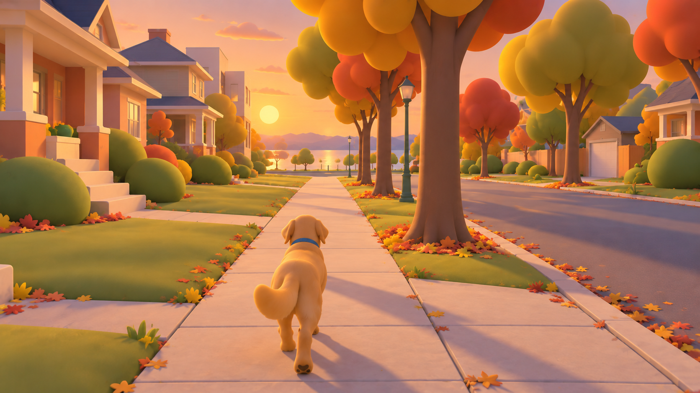
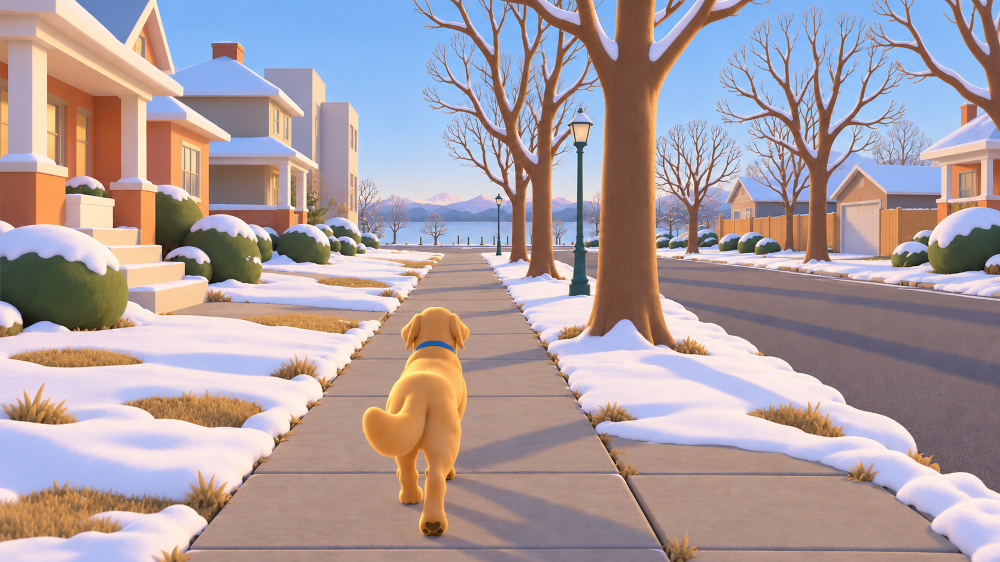
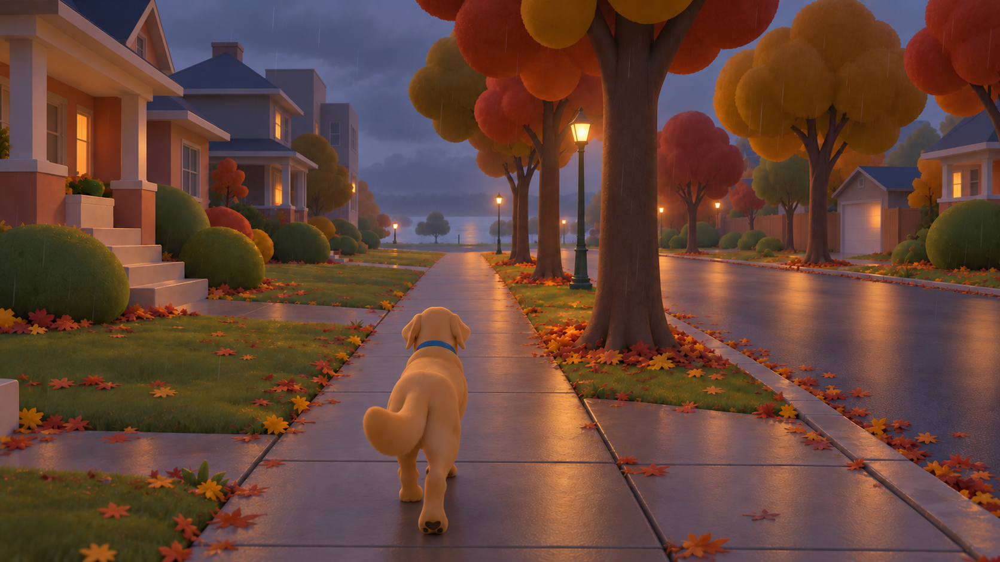
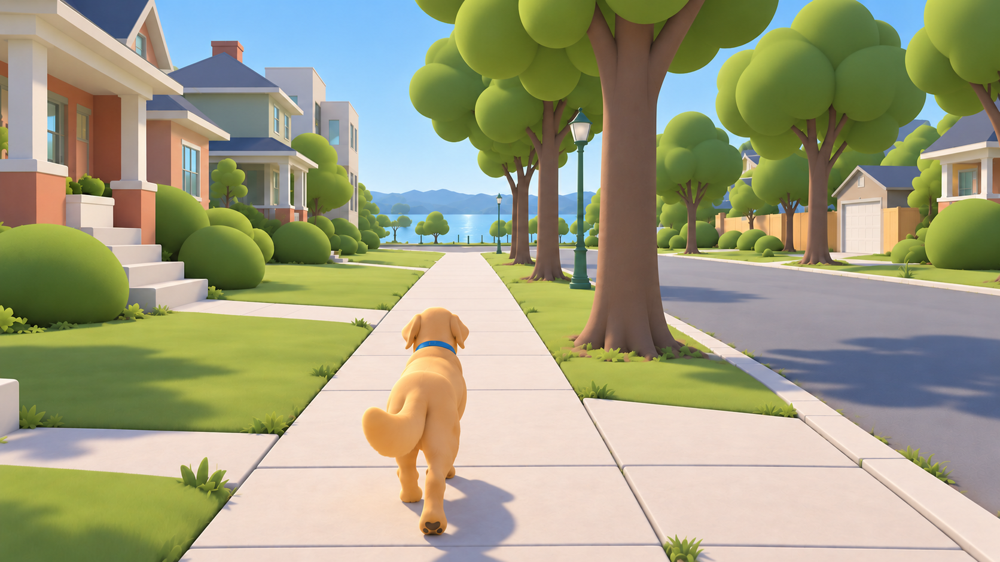
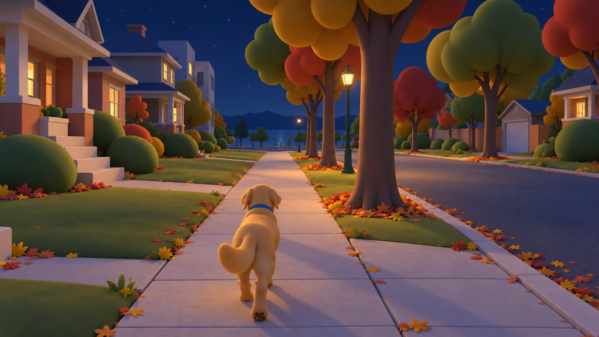
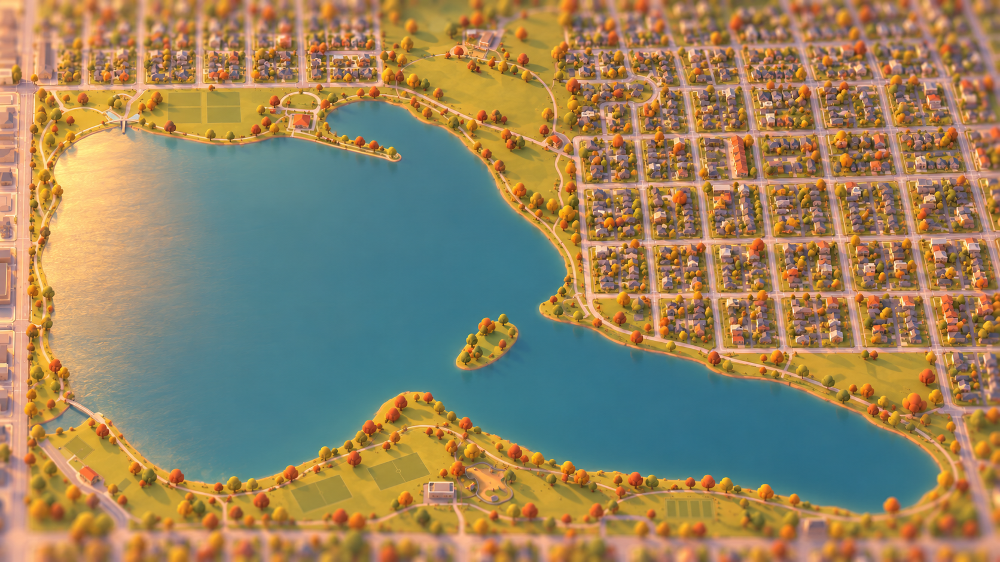
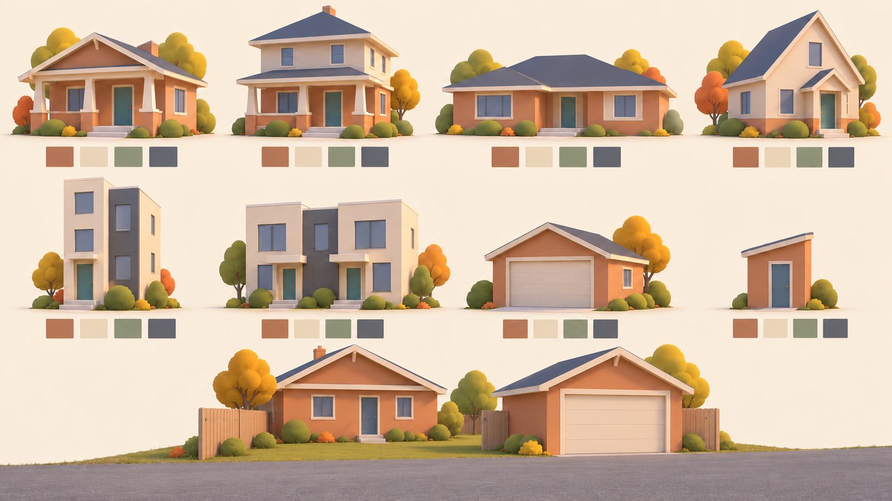
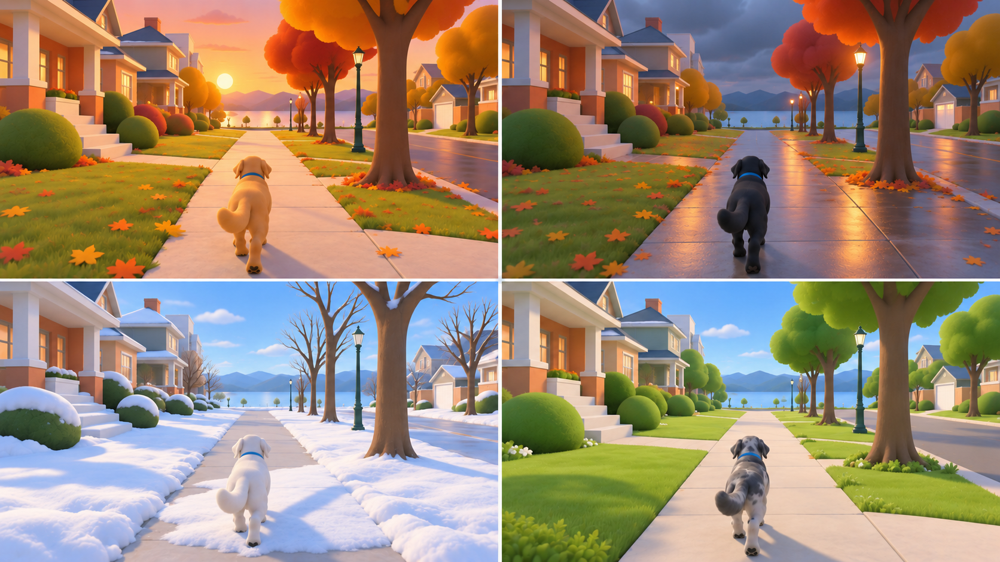
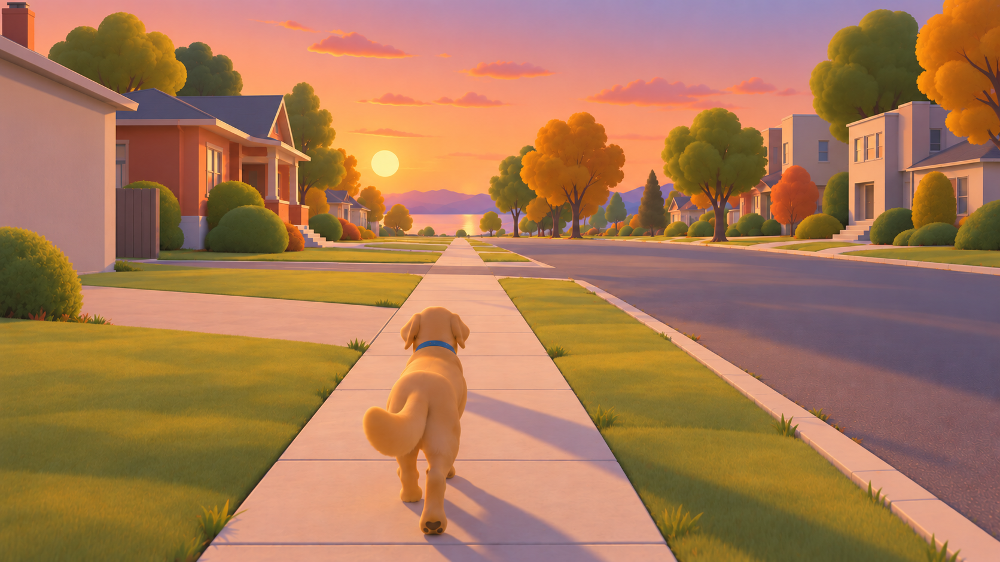

# WorldEngine Visual Spec — Proposal v2

**5 October 2026 · Current art-direction proposal · Target for the completed M1 visual pass**

This is a proposal for the coding agent, who owns implementation and the final specification. It preserves v1's structure and full palette/house grammar while raising the target from minimum buildable to the strongest look that can survive the device budget. No implementation, binding direction or plan files were changed.

## Changes from v1

- **iOS 26 is fixed.** RealityView post-processing and GPU instancing are part of the target; no older-OS split.
- **Procedural surface variation is allowed.** No authored photos, painted maps, brick/shingle/wood-grain images; noise, masks, seams and internal rendering buffers are permitted.
- **Richer surfaces with bounded cost:** generation-time vertex occlusion, near bevels, soft lawn variation, instanced autumn leaves, patchy snow, wet-light streaks and sidewalk joints.
- **Baseline / Target / Stretch** are explicit. v1 clean images remain the baseline; these v2 images illustrate M1 Target, subject to the exceptions in §10.
- **Geography and solar direction are testable.** Numeric comparison cameras, timestamped sun values and data provenance replace invented sunset placement.
- **Nine fresh target images**, each with no more than one edit pass; all six earlier original drafts preserved byte-for-byte separately.
- **Bounds-driven character framing and DogWell ownership are fixed**, as is the stylized-world label. These are no longer open questions.
- **A measured screenshot gate:** ten scored criteria plus hard geography, framing and performance requirements.

**Ratings.** Every recommendation inherits its paragraph/subsection rating or its table row. Cost = incremental expected runtime burden at the stated caps: **Low / Medium / High**. Confidence = confidence in the proposal, not measured speed. Milliseconds are planning allowances to test, not benchmarks; all precise timings have **Low confidence until measured**. Generation-time costs are separately described. This proposal makes no 60 fps or thermal claim from the concept images.

**Reading the evidence.** Source data and numeric parameters outrank image pixels. The new images are generated art studies, not surveyed reconstructions, engine screenshots or physically validated renders. The generator retained some errors even after its one permitted correction; §10 lists what to copy and what not to copy. All new PNGs are native **1672 × 941**, not 4K: the tool exposed no resolution selector and returned this size despite the highest-resolution/3840 × 2160 request. No upscaling was used.

## 1. North star

**Cost: Medium / Confidence: High.** A walk through a recognizable neighborhood should feel like stepping into a carefully made, sun-warmed model: real distances, familiar roof silhouettes, welcoming porches and generous tree shapes, with a small companion that stays easy to see. The painterly quality comes from large color relationships, soft illumination and selective detail. Golden hour is the hero presentation, but the same architecture must remain appealing at flat noon, in winter and at rainy dusk. The aerial view reveals the model; the street view makes it feel inhabited.

| Art-direction rule | Practical interpretation | Cost | Confidence |
|---|---|---|---|
| Distinguish made things from grown things | Flat-shaded architectural planes; smooth organic trees, shrubs and characters. Buildings get substantial eaves and posts, not rounded toy walls. | Low | High |
| Design silhouettes before decoration | Roof, porch recess, canopy and character proportions must read at thumbnail size. No simulated brick courses, shingles or wood grain. | Low | High |
| Keep the ground quiet | Large matte road/path/lawn fields; accents cluster at edges. Ground clutter never competes with paws or route visibility. | Low | High |
| Warm light, restrained cool shadow | Warm cream illumination against muted blue-lavender shade. Shadow tint is an appearance target achieved through fill/material response, not an independent tint applied to direct-light shadows. | Medium | High |
| Avoid pure black and pure white surfaces | Darkest common world material `#303942` (host character coats may be darker); snow `#E8EDF0`; trim `#E8D9BC`. Preserve headroom for illuminated windows and highlights. | Low | High |
| Coordinate variation | A house gets one coherent color tuple; nearby vegetation shares a limited family. Seed stable identity, not independent randomness on every part. | Low | High |
| Geography is the anchor | Preserve mapped positions, shorelines, footprints and path centerlines. Reduce detail rather than compress distances. Only horizon backdrops are exempt. | Low | High |

## 2. Evidence, assumptions and regional character

**Cost: Low / Confidence: High for inventory; Medium for interpretation.** The supplied inventory reports 1,399 buildings, 769 houses, 490 garages, 84 sheds, 130 floor counts, no heights or roof shapes, 5,400 trees without species, 56 benches, 55 lamps and 20.77 km of separately mapped sidewalks. It also records **62 roof colors and 16 building colors**, plus 32 picnic tables, 15 hydrants, fence and hedge lines. Use these existing facts before inventing replacements. Counts come from the project's [street-data inventory](../../data/sloans-lake-street-data.md); this review did not independently recount the extract.

**Cost: Low / Confidence: Medium.** Your neighborhood description is broadly right, but avoid making foursquares co-dominant by default. Local architectural commentary describes a wider mix, including cottages/Tudors, ranches and Mediterranean Revival, and notes that Denver Squares are less prevalent here than in several other Denver neighborhoods. It also describes modern homes with side-facing entrances. This is qualitative evidence, not a measured architectural census: [Sloan's Lake Architecture](https://sloanslakeagent.com/sloans-lake-architecture). The six proposed house families below are a deliberately limited first vocabulary; rare ornate Victorian and Mediterranean variants can wait for evidence or overrides.

**Cost: Low / Confidence: High.** A footprint cannot reveal an actual roof, porch, construction date or architectural style. Keep source facts, inferred dimensions and generated choices distinct. A future per-building override takes precedence over all inferred styling. Never describe a generated facade as an accurate reconstruction of a particular home.

## 3. Palette as data

### 3.1 Color interpretation and composition

**Cost: Low / Confidence: High.** Hex values are sRGB authoring colors, not pre-lit pixels. Interpolate colors in linear light. Apply regional base palette → seasonal vegetation/ground changes → time-of-day illumination → weather response → optional small final grade. Do not orange-tint the base materials and then orange-tint them again for sunset. House palettes remain stable across seasons. Profile identity and palette choices remain stable across visits.

**Cost: Low / Confidence: Medium.** For trees, pick one primary color per tree; use up to two close variants within its crown, with about ±5% value change. Do not randomly assign all palette entries to every lobe. The winter deciduous entries below are bark/retained-leaf accents: most crowns become bare, rather than turning into brown balls.

### 3.2 Seasonal material palettes

All rows are proposed neutral-light bases. Color lists are discrete base alternatives; procedural variations are bounded around them as specified in §5.1.

| Surface | Spring | Summer | Autumn | Winter | Cost | Confidence |
|---|---|---|---|---|---|---|
| Ground / exposed soil | `#AFA184` | `#B3A080` | `#AC9677` | `#A5A092` | Low | High |
| Lawn | `#91AD79` | `#82986B` | `#9B9C6D` | `#A6A58F` | Low | High |
| Grass tufts | `#A5BA82` | `#96A572` | `#B8AA76` | `#B8AF95` | Low | High |
| Deciduous 1 | `#8DAA73` | `#718E65` | `#C4A15B` | `#786E66` | Low | High |
| Deciduous 2 | `#A7BE85` | `#849B6A` | `#B98251` | `#8A7B6C` | Low | High |
| Deciduous 3 | `#B9C997` | `#98AD78` | `#A9654C` | `#A08C74` | Low | High |
| Deciduous 4 | `#77966E` | `#658475` | `#A6A06B` | `#9E8D79` | Low | High |
| Conifer alternatives | `#577C70`, `#6B8B76` | `#527468`, `#65816D` | `#5F7768`, `#73806C` | `#627970`, `#758B80` | Low | High |
| Bushes | `#7F9C72` | `#738B66` | `#92916A` | `#7F897A` | Low | High |
| Road | `#85888B` | `#898A89` | `#898582` | `#878B90` | Low | High |
| Sidewalk | `#CDC7B7` | `#D0C8B6` | `#C9C0AE` | `#C5C9C7` | Low | High |
| Curb | `#BBB9AE` | `#C0BCAE` | `#BDB5A7` | `#B7BFC1` | Low | High |
| Water | `#6F9898` | `#638D91` | `#759491` | `#7E959E` | Low | Medium |
| Sand / dirt path | `#C3B18B` | `#C9B58F` | `#C5AA80` | `#B6AF9A` | Low | High |
| Tree bark | `#807465` | `#7C7263` | `#817362` | `#807973` | Low | High |
| Snow overlay | `#E8EDF0` | `#E8EDF0` | `#E8EDF0` | `#E8EDF0` | Low | High |

**Cost: Low / Confidence: Medium.** Suggested Denver deciduous/conifer fallback mix: 90/10, with broad rounded, upright oval and open spreading crown archetypes rather than species claims. Generic profile: 80/20 only as a temperate fallback, explicitly overridable. These proportions are art priors, not observations. Do not apply Denver autumn dates or winter leaf loss to every latitude; profiles need hemisphere and leaf-cycle policy. If regional season knowledge is absent, use the neutral summer state rather than inventing snow or deciduous loss.

### 3.3 Time-of-day lighting

**Cost: Medium / Confidence: Medium for exact values.** Sun intensity is normalized artistic direct-light strength, with noon = 1; it is not an exposure value or a physical lux conversion. Fog distances are street-mode starting values. Ambient colors describe desired sky/ground fill; they do not assume two independently exposed RealityKit light controls. Ambient strength must preserve readable shadow faces without flattening porches.

| Time | Sun color | Sun intensity 0–1 | Sky top | Sky horizon | Ambient sky | Ambient ground | Fog color | Fog start m | Fog end m | Shadow tint | Cost | Confidence |
|---|---|---:|---|---|---|---|---|---:|---:|---|---|---|
| Dawn | `#F3B58F` | 0.22 | `#889AB8` | `#EAC3B1` | `#A1AFC4` | `#A99A91` | `#C5B8BE` | 220 | 850 | `#777F9A` | Medium | Medium |
| Morning | `#FFE1B2` | 0.72 | `#86ABC9` | `#D8DEDA` | `#B3CBD9` | `#B4AD95` | `#C5D4D7` | 420 | 1200 | `#7B8C9B` | Medium | Medium |
| Noon | `#FFF0D7` | 1.00 | `#7DA9C8` | `#D0DFE1` | `#B6D0DF` | `#B9B19B` | `#C9D9DB` | 500 | 1400 | `#7D8B91` | Medium | Medium |
| Golden hour | `#FFC788` | 0.78 | `#91A9BE` | `#F0CAA3` | `#B6BED0` | `#C0A487` | `#CEC0B7` | 350 | 1100 | `#85829A` | Medium | High |
| Dusk | `#DE9C8D` | 0.12 | `#697D9B` | `#B8A3B2` | `#8998B6` | `#827B83` | `#9D9EAF` | 200 | 750 | `#626D89` | Medium | High |
| Night | `#879DBC` | 0.00 | `#303D58` | `#63738C` | `#7788A6` | `#625F70` | `#626E87` | 140 | 600 | `#485772` | Medium | Medium |

**Cost: Low / Confidence: High.** Drive these states by solar elevation and whether the sun is rising or setting; interpolate instead of switching at fixed clock times. Suggested anchors: dawn −4°, morning +15° rising, noon at daily maximum, golden hour +6° setting, dusk −4° setting, night below −12°. For overlapping anchors or low winter sun, interpolate along the day's available arc; do not force noon to a high sun position. The actual sun direction always comes from time/location. Night's listed sun color is a dormant key, not a light shining through the ground. A separate moon is optional and omitted initially.

**Cost: Low / Confidence: Medium.** Fog start/end mean clear to progressively obscured, reaching the chosen opaque horizon treatment at end. At the lake, long clear views require backdrop coverage beyond the main extract. Do not hide a missing shore with noon fog at 150 m. Aerial framing needs a separate distance policy: initially 900–2500 m, then limited by available backdrop; weather scales it separately. If that coverage is absent, constrain the aerial framing or openly show a soft world boundary.

### 3.4 Weather modifiers

Tint below means a linear-light blend toward the specified color at the stated weight on illumination/fog, not an unconditional recoloring of all objects. Clear baseline: sun ×1, distances ×1, wetness 0, snow 0.

| Weather | Tint and blend | Sun multiplier | Fog distance change | Wetness 0–1 | Snow coverage 0–1 | Cost | Confidence |
|---|---|---:|---|---:|---:|---|---|
| Cloudy | `#BEC8D0` at 0.15 | 0.40 | Start ×0.85; end ×0.85 | 0 | unchanged | Low | High |
| Rain | `#8F9FAA` at 0.22 | 0.18 | Start ×0.40; end ×0.50 | target 0.70 | preserve/melt from history | Medium | Medium |
| Snowfall | `#CDD6DF` at 0.20 | 0.30 | Start ×0.35; end ×0.45 | 0.15 on exposed paths | target 0.65 if accumulation supported | Medium | Medium |
| Fog | `#C1CACD` at 0.30 | 0.12 | Street start 25 m; end 220 m | 0.10 | unchanged | Low | Medium |

**Cost: Low / Confidence: High.** Choose one dominant atmospheric state; do not multiply cloudy, rain and fog reductions together. Blend transitions over 8–20 seconds. Wetness and snow persist separately from the current weather label. A clear winter morning can retain 0.65 snow coverage with clear-sky light. Missing weather history means snow amount is unknown, not automatically full coverage. A season alone never freezes the lake.

**Cost: Medium / Confidence: Medium.** Wetness darkens exposed road/stone colors by up to 12% and reduces roughness from roughly 0.85 dry to 0.50 wet; roofs respond less, foliage minimally. Keep water at approximately 0.40–0.60 roughness with broad highlights. No screen-space or planar reflections in the baseline. Snow primarily changes upward-facing material color; reserve actual cap geometry for a few near-camera roofs/shrubs. A normal-only mask cannot know whether a porch is sheltered: per-part exposure is needed to keep covered steps dry. Snow does not enlarge footprints or block paths.

## 4. House system

### 4.1 Shared architecture grammar

**Cost: Low / Confidence: High.** Preserve the footprint polygon. Use a frontage-aligned coordinate frame only to organize roofs and facades; never rotate or replace the footprint with its bounding rectangle. Read explicit type, levels, colors and future overrides first. Treat brick, siding and stucco as **color/massing families**, not authored image-textured materials.

**Cost: Medium / Confidence: Medium.** One house should read as body + roof + entry/porch + window rhythm. Use about 0.10–0.16 m trim bands, 0.18–0.28 m roof-edge thickness and 0.20–0.30 m square porch posts. Doors approximately 0.9 × 2.05 m; ordinary windows 0.8–1.2 × 1.1–1.5 m; larger ranch windows 1.6–2.2 m wide. These dimensions guide generated details, not footprint resizing. Keep windows opaque, offset slightly from the facade to avoid flicker. Only nearby windows need geometric frames; avoid transparent glass and interiors. Target adds small bevels and generation-time occlusion as specified in §5.1.

**Cost: Low / Confidence: Medium.** Infer frontage from the best accessible facade facing a non-alley street, considering facade length, orientation and clear approach as well as distance. Nearest street alone is insufficient on corners and narrow side-facing infill. If access remains ambiguous, use a restrained entry on the most plausible face and record low inference confidence; do not generate a walkway through a neighbor. House fronts prefer streets; garage doors prefer alleys. Connected entrance/path information, when present, overrides this heuristic.

### 4.2 Denver / Front Range archetypes

Dimensions are **eligibility and proportion guides**, never instructions to resize an observed building. Roof pitches are degrees above horizontal; wall height excludes roof. Porch likelihood is conditional on safe available space or a mapped recess. Where a porch would extend beyond known safe space, recess it within the existing mass or use a shallow canopy/door surround.

| Type | Proportions and wall height | Roof / pitch | Overhang m | Porch / likelihood | Windows by usable facade width | Door | Color set | Cost | Confidence |
|---|---|---|---:|---|---|---|---|---|---|
| Bungalow | Usually 1 floor; 7–12 m front, depth/front 1.1–1.9; eaves 3.0–3.5 m | Front/side gable 20–32°; occasional hip | 0.45–0.70 | Covered 50–90% frontage, 1.5–2.1 m deep; 80% | One bay each 2.6–3.2 m; often paired front windows beside entry | At 35% or 65% of frontage | B | Medium | High |
| Foursquare | Usually 2 floors; width/depth near 1; eaves 6.0–6.8 m | Hip 27–38°; one dormer only if justified | 0.45–0.65 | Full/three-quarter front, 1.6–2.2 m deep; 85% | 2 bays below 8 m, 3 at 8–11 m, 4 above; align upper floor | Center or one bay off center | F | Medium | High |
| Ranch | 1 floor; frontage/depth 1.6–2.8 when street-aligned; eaves 2.8–3.3 m | Hip or side gable 12–23° | 0.40–0.70 | Recessed stoop/canopy, 1.0–1.6 m deep; 35% | One group per 3–4 m; one broad living-room window, sparse bedroom pairs | Near one-third point | R | Low | High |
| Cottage / restrained Tudor | 1–2 floors; 6–10 m front; compact mass; 3.0–3.3 m/floor | Gable 35–48°; at most one entry cross-gable | 0.20–0.40 | Small sheltered entry, 0.8–1.3 m deep; 55% | 2 bays at 6–8 m, 3 above; mostly narrow paired windows | Offset beneath entry gable | C | Medium | Medium |
| Modern narrow infill / townhome | 2–3 floors; 4.5–8 m front, depth/front 1.4–3; 3.0–3.2 m/floor | Flat appearance, 0–5° concealed pitch, 0.25–0.45 m parapet | 0.05–0.15 | Recess or slab canopy, 0.6–1.2 m; 40% | 1 vertical stack per 2.5–3.2 m; 1–2 stacks on narrow faces | One edge bay; side entry if access supports it | M | Low | High |
| Modern duplex | Usually 2–3 floors; 9–15 m front; two readable entry zones; 3.0–3.2 m/floor | Flat/parapet 0–5° | 0.05–0.20 | Two small canopies/recesses; 60% | Repeat a 4–6 m unit rhythm; 1–2 windows per unit per floor | Two entrances only with duplex evidence; otherwise one | D | Medium | Medium |

**Cost: Low / Confidence: High.** Window counts exclude doors, corners and notches. Keep ≥0.45 m corner clearance and ≥0.35 m between openings. A facade under 3 m gets zero or one opening; a blank side wall is valid. Do not wrap a full front-window grid onto every face. Suppress visible openings on shared walls. Fit fewer windows before shrinking them unnaturally.

### 4.3 Coordinated color sets

Each row contains two complete alternatives in the order **wall / trim / door / roof**. Choose A or B as a tuple. Recorded valid OSM colors take precedence; optionally soften only extreme values through a documented global gamut rule, not arbitrary replacement.

| Set / type | Alternative A | Alternative B | Cost | Confidence |
|---|---|---|---|---|
| B — bungalow | `#B47760` / `#E8D9BC` / `#426A6A` / `#555A63` | `#9F7964` / `#DCCFB6` / `#775446` / `#65625D` | Low | High |
| F — foursquare | `#B18B6D` / `#E7DCC5` / `#4F6667` / `#60616A` | `#C2AE8B` / `#EFE2C8` / `#7D554C` / `#5D6368` | Low | High |
| R — ranch | `#8D9A87` / `#E2D8C1` / `#8A654E` / `#6B6C65` | `#C2AE95` / `#E9DFC9` / `#496E70` / `#626770` | Low | High |
| C — cottage | `#AC806D` / `#E3D6BA` / `#64746B` / `#64616A` | `#CBB99B` / `#EADFC8` / `#8B5D4C` / `#6E665F` | Low | High |
| M — modern | `#D2CFC1` / `#E8E3D5` / `#597678` / `#616972` | `#B5A799` / `#D8D6CA` / `#8B674F` / `#515D66` | Low | High |
| D — duplex | `#C6B69E` / `#E5DCC9` / `#546F72` / `#62656C` | `#A3AAA1` / `#DFDECF` / `#956B53` / `#58636C` | Low | High |
| G — garage | `#A69A84` / `#DCCFB6` / `#C7C1AF` / `#65676C` | `#8D9685` / `#DED5C1` / `#B9B6A9` / `#636A70` | Low | High |
| S — shed | `#8B967E` / `#D5CCB8` / `#6C7D70` / `#676C6A` | `#AB8E73` / `#DBCBB0` / `#7C6859` / `#686568` | Low | High |
| Shared window | Day `#6A8794`; shaded `#566D7A`; lit dusk `#E9BE7C`; lit night `#DCA967` | No pure-black glass; no interior images | Low | High |

**Cost: Low / Confidence: Medium.** A garage may inherit the probable parent house's wall/roof tuple only when association is clear from access/proximity without crossing a street or another building. Otherwise use G. Keep modern accent panels to one large secondary plane, ≤25% of visible facade; no random patchwork colors.

### 4.4 Footprint-to-type decisions

**Cost: Low / Confidence: Medium.** Define area A from the actual polygon; aspect ratio R = long/short side of its minimum-area bounding rectangle; rectangularity Q = polygon area / rectangle area. R alone does not tell whether a long house is a ranch or a narrow deep infill house: use the inferred frontage as well. Values below are initial hypotheses for review, not trained classifiers.

| Priority / evidence | Proposed decision | Cost | Confidence |
|---|---|---|---|
| 1. Override or explicit building type | Honor it. Garage, shed, apartments, retail, roof/canopy and public buildings never enter the random house lottery. `building=yes` stays unclassified unless other evidence is persuasive. | Low | High |
| 2. Valid floor count | Preserve it. Three floors rule out a one-story bungalow/ranch. One floor rules out a full two-story foursquare. A supplied half-level is an attic candidate, not automatically a full added wall story. | Low | High |
| 3. House, 1 floor, A 60–220 m² | If broad face fronts street and R ≥1.7: ranch/bungalow weights 75/25. Otherwise bungalow/cottage/ranch 65/20/15. | Low | Medium |
| 4. House, 2 floors, A 70–220 m² | If R ≤1.4 and Q ≥0.78: foursquare/cottage/modern 55/15/30. If narrow/deep R ≥1.7: modern/cottage 85/15. Between: foursquare/modern/cottage 40/45/15. | Low | Medium |
| 5. House, 3 floors | Modern infill mass; choose single or multiple frontage zones from access/unit evidence. Do not fabricate extra addresses or doors solely from area. | Low | Medium |
| 6. House with unknown floors, A 60–220 m² | Start Denver weights below, reject incompatible proportions, renormalize, select stably. Type determines only a proposed height, marked inferred. | Low | Low |
| 7. Very small house, A <60 m² | Compact cottage or narrow dwelling; never silently reclassify a tagged house as a shed. Below 25 m² suppress porch and most windows; flag unusual scale. | Low | Medium |
| 8. Large house, A 220–350 m² | Favor broad ranch when one floor or broad frontage; otherwise restrained multi-bay house. Unknown levels: conservative 1–2 floor mass with low inference confidence. | Low | Low |
| 9. A >350 m² or highly irregular | Preserve polygon and explicit type. Use restrained repeated bays and simple roof pieces; do not turn every large footprint into a mansion or apartment block. | Medium | Medium |

**Cost: Low / Confidence: Low for architectural frequency.** For eligible unknown-floor Denver houses, initial family weights are bungalow **45%**, ranch **20%**, foursquare **10%**, cottage **10%**, modern infill **15%**. Duplex is an evidence-driven variant of the modern family, not an extra blind probability. These weights deliberately avoid assuming every square footprint is a Denver Square. After eligibility filtering, realized percentages will differ. Do not use the 130 level-tagged buildings as an unbiased sample of the other buildings; tagging may favor modern construction.

**Cost: Low / Confidence: High.** Stable choices should use the existing OSM reference and independent semantic salts for type, palette, roof and openings. Include element kind as well as ID; use the existing stable random facility. Preserve profile version and overrides so adding a window option does not recolor a neighborhood. Neighbor coherence may bias colors slightly within a street block, but avoid traversal-order dependence or forced identical rows.

### 4.5 Generic default profile

**Cost: Low / Confidence: Medium.** The generic fallback is intentionally less region-specific: a compact gabled dwelling **50%**, broad low house **25%**, two-story hipped dwelling **15%**, restrained flat-roof dwelling **10%**, after explicit levels and geometry filtering. These are a temperate neutral vocabulary, not a claim of worldwide architectural accuracy. Unknown climate/region should reduce decorative inference. Regional profiles may replace the entire roof/type mix without engine changes.

| Generic family | Proportions / roof / overhang | Entry and window rule | Wall / trim / door / roof tuple | Cost | Confidence |
|---|---|---|---|---|---|
| Compact gabled | 1–2 supplied floors; R 1–2; pitch 20–35°; eave 0.3–0.5 m | Shallow entry canopy 30%; one bay per 2.8–3.3 m; center or offset door | `#B5A58E` / `#E1D8C6` / `#5A7373` / `#666B70` | Low | Medium |
| Broad low | 1 floor; street frontage/depth ≥1.6; hip/gable 12–25°; eave 0.3–0.6 m | Recessed entry 25%; one window group per 3.5 m; door near third point | `#9AA28E` / `#DDD9C8` / `#82634E` / `#686D68` | Low | Medium |
| Two-story hipped | 2 floors; R ≤1.5; hip 22–35°; eave 0.3–0.5 m | Small porch 35%; aligned 2–4 bays; central door | `#C1B298` / `#E4DCCB` / `#637479` / `#666973` | Medium | Medium |
| Flat-roof dwelling | 1–3 floors from evidence; concealed 0–5°; eave 0.05–0.15 m | Canopy 30%; one stack per 3 m; edge entry | `#C9C7BA` / `#E1DED3` / `#698080` / `#606A72` | Low | Medium |

**Cost: Low / Confidence: High.** Profile data should hold these weights, dimension/pitch ranges, color tuples, porch probabilities, vegetation archetypes, season policy and dressing densities. The default has no Denver coordinates, landmarks, assumptions about alleys, or fixed mountain backdrop. Explicit apartment/commercial/public tags keep separate simple facade grammars in both profiles; windows cannot make those buildings into houses.

### 4.6 Garages, sheds and irregular footprints

| Condition | Proposed treatment | Cost | Confidence |
|---|---|---|---|
| Detached garage | Keep mapped mass, usually 2.5–3.0 m wall height; gable 15–27° or simple flat roof where appropriate; eave 0.20–0.35 m. One 2.4–3.0 m door or one 4.8–5.5 m double door fits available wall. | Low | High |
| Garage orientation | Door on an alley-facing facade with clear approach; if no alley, prefer mapped service access, then a plausible clear driveway face. If none is credible, use a plain facade and flag uncertainty. Do not rotate the footprint or cut a new drive through another property. | Low | High |
| Shed | Usually 2.0–2.4 m walls, single-pitch 8–18° or gable 20–30°, eave 0.10–0.20 m; one 0.75–0.9 m door on an accessible face, zero or one small window. Keep tiny footprints tiny. Explicit levels override these defaults. | Low | High |
| L-shaped house | Keep both wings; dominant roof on main wing, lower secondary roof on subordinate wing. Align ridge directions; hide junctions with simple flashing-colored geometry if necessary. | Medium | Medium |
| Minor notches | Preserve wall notch. Carry a simple roof only where the overhang is geometrically plausible; no bridging large courtyards. Avoid treating each tiny polygon edge as an independent roof wing. | Medium | Medium |
| Complex concave footprint | Footprint-preserving wall extrusion with flat/parapet roof fallback, or a limited number of subordinate roof sections. Roof solving is a generator-complexity risk; avoid elaborate valley networks. | Medium | High |
| Tiny footprint | Preserve type and area; one entry, no porch columns or repeated grid. If feature is a canopy/roof, do not add walls. | Low | High |
| Very large footprint | Break the facade into 8–15 m visual groups using subtle wall colors and opening rhythm, without cutting or shifting the footprint. Roof remains broad and calm; do not multiply decorative chimneys. | Medium | Medium |
| Attached/touching buildings | Preserve shared edges; suppress shared-wall windows and colliding eaves. Continuous roofs only where supported, not merely because two houses are near. | Medium | High |

## 5. Street and park dressing

**Cost: Low / Confidence: High.** Mapped objects and mapped absence win. Synthesized objects are a fallback only inside plausible unoccupied space. Do not duplicate the 20.77 km of separately mapped sidewalks by blindly generating another sidewalk from each road. Use spatial overlap/continuity and side-of-road checks; `sidewalk=none` forbids fallback on that side. Missing width requires an inferred width, not moving the centerline.

| Element | Proposed rules and dimensions | Cost | Confidence |
|---|---|---|---|
| Street trees | Preserve every mapped position. Only fill genuine gaps with no nearby mapped equivalent, initially 10–16 m apart; deterministic ±15% spacing variation. Mature height 9–15 m, crown diameter 5–8 m; young trees 4–7 m / 2–4 m. Use 3–5 broad rounded lobes and a visible trunk. | Medium | Medium |
| Tree conflicts | Generated trees avoid drives, crossings, lamps and footways; permit crown overhang but keep trunk off walking space. For an implausibly mapped tree, reduce crown or flag it; never silently move the position. | Low | High |
| Lamps | Use mapped lamps first. Gap fallback: 30–45 m residential spacing, 25–40 m on a clearly lit park route. Residential fixture 5–7 m high; park fixture 3.5–4.5 m. Use a restrained simple head; ornamental lantern is a profile option, not universal Denver fact. | Low geometry; Medium lit | Medium |
| Road / sidewalk / curb | Honor mapped widths; unknown residential road width initial 8–10 m, sidewalk 1.5–2.0 m, curb top 0.12–0.18 m wide and rise 0.10–0.15 m. Inferred cross-section is not surveyed. No decorative curb across a mapped crossing. | Medium | Medium |
| Tree lawn | Where room exists, 1.2–2.5 m between curb and sidewalk; reduce or omit it when mapped alignment leaves less space. Never displace a sidewalk or narrow roadway to fit a boulevard template. | Low | High |
| Fences | Preserve mapped fences. Without parcels, avoid continuous invented property boundaries. Short decorative entry segments only where clearance is credible: front 0.75–1.05 m high, side/rear 1.5–1.8 m only with boundary evidence. Use broad opaque panels or sparse stout posts; avoid dense pickets. | Low | High |
| Hedges | Mapped lines first; otherwise short facade-adjacent clusters, 0.5–0.9 m high, 0.5–0.8 m deep. Keep entries and sightlines open. | Low | High |
| Yard items | At most one cluster on roughly 25% of eligible near-camera homes: 1–2 plain planters or a low shrub group. No personal possessions, signs, addresses, bins or arbitrary private paths. | Low | Medium |
| Park trees | Preserve mapped trees. Keep open meadows open; no automatic evenly spaced forest. Generated shrubs require land-cover/edge context and stay away from pitches and paths. | Medium | High |
| Park furniture | Use mapped benches and picnic tables. Suggested bench 1.6–1.9 m wide, seat 0.43–0.48 m high. Fill only obvious long gaps, conservatively 70–120 m along suitable park paths, with safe clearance and shoreline-facing orientation when sensible. | Low | Medium |
| Park surface edges | Calm water polygon, simple shoreline edge; subtle dirt/grass boundary. No invented beach around the whole lake. Follow actual mapped sand/path/grass areas. | Low | High |
| Near-camera richness | Baseline uses sparse accents. Target uses the exact leaf/tuft/bevel caps in §5.1, with all ground geometry accents gone by 50 m; these caps replace the v1 200-cluster estimate. | Medium | High |
| Local weather particles | A small camera-centered volume; initial caps 150 rain streaks or 100 snowflakes visible, depth-occluded and absent under roofs where shelter is known. No screen-covering veil. Falling leaves are rare accents. | Medium | Medium |

**Cost: Medium / Confidence: High.** Keep the path center and the character's immediate background visually quiet. Richness belongs at grass/path transitions and building thresholds. Fade or simplify clutter over 40–50 m without changing its deterministic placement; do not reroll it as the camera moves. Prefer small opaque meshes over transparent cards. Unknown property boundaries are a reason to place less dressing.

### 5.1 Richness techniques — M1 Target

**Cost: Medium overall; per-technique cost below / Confidence: High for direction, Medium for initial parameters.** The aim is soft spatial structure, not fine surface noise. World-space patterns use meters and stable seeds; they neither swim with the camera nor change when a chunk rebuilds. All caps below are **per view**, including overlapping chunks and both meshes during an LOD transition. Use the smaller of the distance cap and a screen-size cutoff; fade high-frequency structure before it becomes subpixel. No technique authorizes a changed footprint, extra road, moved tree or fictional parcel.

**Rank** is expected visual return per incremental GPU millisecond, highest first. R1–R10 are budget references, not implementation names. Season/weather columns are eligibility, not instructions to infer observed conditions from a calendar alone.

| ID / technique / what it does | Rules and starting parameters | Distance from camera | Density / work cap per view | Season / weather | Rank | Cost | Confidence |
|---|---|---|---|---|---:|---|---|
| **R1 Vertex ambient occlusion**: joins pieces into a soft sculpted whole | Store a separate 0–1 occlusion scalar, not sunset-colored base RGB. Apply mainly to indirect fill; strength 0.20–0.35, final ambient visibility floor 0.65. Bake eave/porch underside radius 0.3–0.8 m; wall/base/bush radius 0.1–0.4 m; crown interior 0.3–1.0 m; curb edge 0.03–0.08 m. Never bake a directional sun shadow. | Full 0–150 m, reduced 150–600 m, off silhouettes | One interpolated scalar per existing vertex; bake off-thread at generation/cache time; start 16–32 samples per selected vertex or analytic kit masks; extra support vertices ≤5% of nearby mesh budget | All; exposure-aware snow brightens surfaces without erasing cavities; bare winter tree uses its own occlusion, not leafy-crown occlusion | 1 | Low | High |
| **R8 Sky/ground fill + character contact**: opens shadows without losing depth | Sky fill 0.20–0.35 of reference noon key; ground bounce 0.06–0.12, roughly half as bright on wet dark ground. Colors from time table. Preserve physical sun visibility. Character has one contact footprint, opacity 0.12–0.22, soft edge 0.08–0.18 m, footprint fits bounds plus 10–20%. Host coat colors unchanged. | Fill all distances; local contact near character only, ≤15 m from camera | One existing material fill evaluation; **no additional shadow-casting fill light**. One near contact solution; avoid double-darkening existing contact shadow. Optional character rim max 10% value lift. | All; night is artistic readable sky fill, not a fictitious sun. White coat retains blue-gray shading; black retains black midbody | 2 | Low | High |
| **R3 Lawn mottling**: breaks a flat carpet into quiet broad color areas | Two analytic low-frequency noise bands: scale 1.5–4 m and 0.25–0.7 m. Value ±4–6%, hue ≤3°, saturation ±4%. Blend to base at distance. Apply only within actual grass polygons; no noise across sidewalk or roof. | Full 0–50 m, coarsen 50–120 m, average beyond | Max two noise bands, no texture fetch required; fine band off past 50 m. Edge tufts separately capped **200 clusters**, 3–5 blades / 12–20 triangles each, within 25 m, fade 20–30 m | Spring–autumn; muted tan variation in winter exposed grass, masked out under snow. Wetness reduces contrast about 25% | 3 | Low | High |
| **R7 Sidewalk joints + wet joint sheen**: communicates scale | Slab length 1.5–2.0 m, transverse joint width 0.008–0.015 m, darkening 10–18%; a single longitudinal joint only for broad slabs. Align to path distance/tangent, not a world-axis checkerboard. Anti-alias and average narrow lines at distance; wet sheen uses surface wetness, not bright white seam paint. | 0–35 m full; fade 35–60 m; absent beyond | One procedural seam pattern per sidewalk material, no separate thin mesh per joint. Expansion joint every 6–8 m only where useful. No micro-crack system | All; snow suppresses covered joints; wet sidewalk roughness 0.45–0.60 | 4 | Low | High |
| **R6 Patchy snow**: leaves tan ground visible and respects shelter | World-space 0.4–1.2 m + 2–5 m mask scales; exposure and upward-normal factors. Threshold remapped so amount 0.6 means about 60% eligible coverage, not 60% whiteness everywhere. Mask softness 0.05–0.15 m; lawn coverage initially 40–70%. Preserve underside AO. Optional cleared route strip is a demo override or supplied state, never a weather deduction. | 0–150 m; coarser 150–600 m; silhouettes flat snow mix | Two noise bands on eligible pixels, one exposure channel; no simulated particles per snow patch. **≤24** near roof/shrub cap objects within 20 m, max thickness 0.02–0.05 m; caps optional | Cold precipitation/history only; persists after snowfall. Melts via state over minutes. No automatic lake ice, footprints, plow banks or thick drifts | 5 | Low | High |
| **R5 Wet response + synthetic streaks**: suggests damp light without reflection rendering | Exposed albedo darkening 8–15%; roughness 0.45–0.60 sidewalks, 0.35–0.50 road; prefer 0.45 road start. Lamp/window streak length 2–6 m, width 0.25–0.8 m; broad feather, max local value lift 15–25%. Ground-facing clipped analytic fields near actual emitters; rotate gently toward ground-projected viewing direction, never mirror scene geometry. | Wet base 0–600 m; streaks within 40 m, fade 30–45 m | **≤6** visible streak fields, ≤2 affecting one local ground region; max 2 nearby unshadowed lamp lights. No loop over every lamp/window in every pixel; use bounded local assignment | Rain or persistent wetness; dusk/night. Daytime only subdued broad sheen; dry night no streaks; snow mask overrides wet streaks | 6 | Medium | Medium |
| **R2 Small bevels**: catches highlights and softens hard contacts | Sidewalk/curb bevel 0.005–0.015 m; steps/posts 0.008–0.020 m; roof-edge bevel 0.010–0.025 m. One segment/chamfer usually sufficient. Keep planar walls/roofs; bevel normals may smooth but never round whole buildings. Inset roof bevels where boundary collision would occur. | 0–35 m full; transition 35–50 m; remove by 50 m | Extra bevel triangles **≤20k** visible, included in near geometry budget, shared kit meshes/instances. No bevels on every far house or small leaf | All; snow can mask the highlight, no need to stack large caps on every bevel | 7 | Medium | High |
| **R4 Instanced autumn leaves**: tells the season and scale locally | Two or three simple 4–8 triangle silhouettes, 0.06–0.12 m typical size. 70% in 0.2–0.6 m edge bands and near deciduous trees; 20% under crowns; 10% isolated. Orient flat with small stable tilt, no translucent cards. Keep route center sparse and landcover/crossing masks respected. | Full 0–20 m, reduce 20–35 m, fade 35–45 m, zero by 50 m | **≤800** visible static leaves total; cluster peaks ≤20/m², open sidewalk ≤0.5/m². At most **12** airborne leaves. Instance/cull by small spatial groups; avoid one world-sized bounding box | Autumn only; wet leaves darken and lie still; snow occludes covered leaves. No new scatter seed when weather changes | 8 | Medium | High |
| **R9 Gentle grade and emissive bloom**: unifies color and warms tiny lights | Exposure anchored before grade; saturation 0.96–1.02 and contrast 1.02–1.05. Bloom on emissive lamps/windows, threshold above diffuse whites; 3–5% contribution, small radius. No bloom on snowy lawn or noon roofs. | Screen effect, all view distances but emission remains source-limited | One shared grade/composite pass; bloom half/quarter resolution, ≤0.35 ms allocation. Vignette max 3%, usually zero; no scene-wide glare | Grade all; bloom dusk/night, tiny optional golden-hour glow | 9 | Medium | High |
| **R10 Crown value shaping + minimal motion**: avoids identical spheres | 3–5 large asymmetric lobes; stable height/value variation ±5%; lower/interior value controlled by AO, not dark rings. Very slow 0.01–0.03 m branch-tip sway, low-frequency uniform phase per tree plus stable offset, trunk nearly fixed. | Shape 0–600 m via LOD; sway only 0–100 m and fades by 150 m | Max one low-frequency sway function; no independent leaf motion. Existing tree geometry count, no extra crown tessellation solely for shading | Leafy seasons; bare branches nearly still, wet/cold foliage less active; no silhouette pulsing | 10 | Low | Medium |

**Cost: Low / Confidence: High.** R1 is not literally free: it avoids a per-frame occlusion solve, but storing/interpolating the scalar and applying it still uses bandwidth and shader work; bake time, cache size and any support vertices also count. Multiplying all final lighting by baked AO would dirty sunlit walls and can double-shadow eaves. Preserve a separate occlusion channel so palettes, weather, direct sun and emissive windows are not incorrectly darkened. Trees need season-appropriate bakes; scene-wide static AO cannot follow moving crowns or a moving character.

**Cost: Low / Confidence: High.** Blend transitions over 8–20 seconds for weather appearance; preserve the plan's slower accumulated snow changes. Freeze stochastic identity per OSM reference and semantic salt. Leaves are never redistributed just because density is reduced—select stable subsets. Anti-alias procedural lines/noise and test in motion; fine procedural grain is not automatically cheaper or better than geometry.

**Cost: Medium / Confidence: Medium.** Fill is a desired lighting result, not a promise that a stock material exposes independent upper/lower ambient controls. The existing custom-material path may approximate it, or a procedurally generated environment may supply it. Do not add authored photographic environment maps or duplicate ambient contribution. A ground contact patch may use a single analytic masked primitive conforming to terrain if existing shadows are insufficient; no image decal or floating dark ellipse across curbs.

## 6. Character and cameras

**Cost: Low / Confidence: High.** DogWell owns the personalized dog. WorldEngine should accept character bounds and readability preferences without knowing breed, wellness state or app logic. The art reference uses a golden dog; the runtime must also work with black, white, brown and patterned characters.

| Parameter / behavior | Proposed starting point | Cost | Confidence |
|---|---|---|---|
| Street framing | Target character projected height 20–25% of usable screen height. For a roughly 0.55–0.65 m visible-height dog, start camera 2.4–2.8 m behind and 1.1–1.35 m above ground, aim near shoulder height with 0.5–0.9 m forward look-ahead. Tune to actual bounds. | Low | High |
| Lens | Vertical FOV 48–52°; start 50°. Account for phone aspect ratio and host UI safe area. Avoid ultra-wide lens distortion. | Low | High |
| Motion | Smooth follow, no head bob. Look-ahead eases with walking direction; recenter about 5 seconds after orbit release, matching existing direction. Collision overrides ideal framing. | Low | High |
| Golden dog separation | Keep route ground muted and cooler; reduce autumn orange immediately at ground level through the palette, not a moving recolor patch. A subtle broad cool sky fill prevents orange fur merging with sunset. | Low | High |
| Dark/white dog separation | Dark coats need a soft raised edge value; white coats retain colored midtones against snow. Preserve personalized albedo; adjust restrained lighting, not breed coloring. | Medium | High |
| Rim | Optional broad material-based rim, no added shadow-casting light; aim for ≤10–15% value lift at silhouette, matching the sky/light hue. Avoid a glowing ring or x-ray silhouette. | Low | Medium |
| Contact | Small soft grounding shadow at paws/body. A convincing footfall and contact shadow do more for attachment than glossy fur. | Medium | High |
| Outline | Off by default. If contrast tests fail, consider a subtle character-only 1–1.5 pixel outline at final resolution as an accessibility option; validate API/path and extra pass cost. No global edge detection. | Medium | Medium |
| Occlusion | First shorten/raise the camera safely. Near-camera tree canopy cutaway is a fallback; fade only the obstructing part with hysteresis. Buildings favor camera collision response over whole-building transparency. Never see through an entire block. | Medium | High |
| Aerial | Pitch 45–60° downward; initial 50° vertical FOV. Allow local diorama zoom before whole-area overview. Distance and clipping must accommodate the true 1.6 × 1.2 km area; do not shrink it to fit. | Medium | High |
| Mode transition | Smooth 0.8–1.4 second flight keeping the tracked location anchored; ramp detail and blur gradually. Reduced-motion option uses a brief dissolve or shorter move. | Medium | Medium |

**Cost: Low / Confidence: High.** Readability review should include golden/black/white dogs against lawn, dry sidewalk, wet sidewalk and snow, under all six light states. Check silhouettes at actual phone size and in grayscale, with bloom/blur disabled. Keep the dog identifiable during turns and tree occlusion; a beautiful still frame is insufficient.

### 6.1 Geography and light correctness — general rules

**Cost: Low / Confidence: High.** All bearings are degrees clockwise from **true north**, not screen direction or magnetic north. Camera heading and sun azimuth use the same reference. In the existing scene convention, east is +X, up +Y, north −Z. Geographic backdrops are functions of world azimuth/elevation; camera rotation changes which part is visible but never rotates a mountain range to follow the camera. Source: [NOAA azimuth/elevation conventions](https://gml.noaa.gov/grad/solcalc/azel.html). The comparison values below were calculated from the equations in the repository's read-only `SolarPosition.swift`, without atmospheric refraction; they are design fixtures, not new engine code.

| Rule | Required behavior | Cost | Confidence |
|---|---|---|---|
| One physical sun state | One timestamp/location produces one sun direction used by the visible sun, directional illumination, cast shadows and sky gradient. Color styling may soften warmth but cannot move the sun. | Low | High |
| Opposite shadow bearing | On horizontal ground, a vertical object's shadow points at sun azimuth +180°, wrapped to 0–360°. At elevation 6°, a 1 m vertical post casts about 9.51 m of geometric shadow before occlusion/clipping; softening cannot reverse it. | Low | High |
| Morning vs evening | Looking west in a northern midlatitude winter morning, the sun is behind and somewhat south of the camera; shadows run westward and somewhat north, away/right in this fixture. Westward mountains can catch pink morning light. Never reuse sunset's foreground-directed shadows. | Low | High |
| Geographic horizon | A supplied horizon profile preserves its azimuths, apparent elevation and width. Keep distant mountains low and hazy; terrain/backdrop direction follows data in every region. No cinematic relocating of peaks. | Low | High |
| Skyline direction and data coverage | A city's skyline belongs at its real bearing/distance. Do not put a distant city beneath whichever sunset looks attractive, or add landmarks not provided by the area data. Coverage gaps should not generate fictional terrain or towers. | Low | High |
| Fog consistency | Terrain, building ring, water and horizon share a coherent atmospheric depth relationship. Fog can obscure a feature; it cannot move it. Fog distances must match the actual available backdrop. | Low | High |
| No fake sun at night | Sun direct intensity becomes zero below the horizon according to the daylight transition. Artistic ambient fill can remain. A moon, if later added, has its own real direction/phase; it does not substitute for an arbitrary nighttime sun. | Low | High |
| Steep aerial perspective | With pitch 55° down and vertical FOV 50°, even the top ray points 30° down. A geographic horizon cannot appear in that frame. Keep the exact aerial comparison ground-only; use a separate shallow/rotated view to inspect the horizon. | Low | High |

**Cost: Low / Confidence: High.** Application of these generic rules to this public test area: the western Front Range is a low band, initially about 2–3° with no peak above 5° absent supplied horizon data. Downtown Denver lies east of the lake and is excluded from the west-facing street studies. For a north-facing view, west is left in world orientation, but a normal rectilinear camera may not include the due-west horizon at all. Only the part of a real range whose bearings enter the frustum should appear. At the requested steep aerial angle, neither the mountains nor the sun disk is visible; their lighting influence still comes from the left. This corrects the impossible combination in the image brief without falsifying camera geometry.

### 6.2 Reproducible comparison presets

**Cost: Low / Confidence: High for specified numbers; Medium for their visual tuning.** The plan names an east-side street area but no particular street. Proposed **WorldLab test fixture**, not a hardcoded engine rule: West 23rd Avenue, on its south sidewalk near **39.7511195, −105.0389000**, looking west. This point was selected from the mapped south-side sidewalk alignment in the committed extract. It is an approximate fixture coordinate, not a survey claim. Keep it in demo/profile data; do not move geography to match the picture.

All street comparisons 01–05, all panels of 08, and 09 use the same numeric camera. Image 09 changes dressing to reflect the local evidence, not lens or location. The generated pictures only approximate these controls; a renderer should use the numbers below, **not derive camera distances from the enlarged concept dog**.

| Parameter | **01 street comparison** | **06 aerial comparison** | Cost | Confidence |
|---|---|---|---|---|
| Frame | 16:9 landscape for the comparison; test portrait separately | 16:9 landscape | Low | High |
| Ground target | Dog ground origin at the proposed sidewalk point | Area manifest center 39.7494000, −105.0445000 | Low | High |
| Camera height above flat ground | **1.250 m** | **1474.474 m** | Low | High |
| Horizontal distance behind target | **2.600 m east of dog**, since camera looks west | **1032.438 m south of center** | Low | High |
| Slant distance to look-at | **2.7116 m** | **1800.000 m** | Low | High |
| Look-at height | **0.480 m** directly over dog ground point; no forward look-ahead for fixed still | **0.000 m** at map center | Low | High |
| Vertical FOV | **50.000°** | **50.000°** | Low | High |
| Heading | **270.000°** true west | **0.000°** true north | Low | High |
| Downward pitch | **16.497°** from horizontal | **55.000°** from horizontal | Low | High |
| Local scene camera / target | Camera (+2.600, +1.250, 0); target (0, +0.480, 0), relative to dog | Camera (0, +1474.474, +1032.438); target (0,0,0), relative to area center | Low | High |
| Near / far plane | 0.10 m / 3000 m; use actual backdrop limits | 1.0 m / 5000 m; do not interpret far plane as a license to invent data | Low | Medium |
| Character fixture | Upright visible bound 0.650 m; projected vertical segment approximately 24% of frame. Actual dog body/depth bounds must be fitted to 20–25%. | Character need not be visible at area scale; do not enlarge it to aerial readability size | Low | High |
| Time and time zone | **2026-10-15 17:44:01 America/Denver (MDT, UTC−06:00)** | Same timestamp | Low | High |
| UTC timestamp | **2026-10-15T23:44:01Z** | Same | Low | High |
| Sun elevation / azimuth | **6.0011° / 253.2843°** | **6.0011° / 253.2843°** | Low | High |
| Ground shadow bearing | **73.2843°**, east-northeast: foreground/right | Same world bearing: predominantly right, slightly north/up in ground plan | Low | High |
| Tilt-shift | Off | Sharp central 65%; feather over next 10% each edge; peak blur 2–4 final pixels | Medium | Medium |

**Cost: Low / Confidence: High.** Street preset is a reproducible test pose, not a fixed camera distance for every dog. During actual use, fit the projected character bounds to 22% nominal, constrain to 20–25% where collision permits, and retain the existing five-second recenter behavior. Look-ahead is disabled only for screenshot comparison. The images visibly overshoot the required fraction (roughly 40% in several frames); do not reproduce that oversizing.

| Image / condition | Fixture local time | UTC | Sun elevation | Sun azimuth | Direct-light policy | Cost | Confidence |
|---|---|---|---:|---:|---|---|---|
| 02 winter morning | 2027-01-15 08:15:00 MST | 2027-01-15T15:15:00Z | 8.2395° | 126.3890° | Behind camera; shadows bearing 306.3890°, receding right | Low | High |
| 03 rainy dusk | 2026-10-15 18:35:00 MDT | 2026-10-16T00:35:00Z | −3.5651° | 261.4912° | Sun below horizon: direct sun off; weather-modified twilight fill | Low | High |
| 04 summer noon | 2026-07-15 13:07:00 MDT | 2026-07-15T19:07:00Z | 71.6745° | 180.5751° | High southern sun; short northward shadows, neutral grade | Low | High |
| 05 clear night | 2026-10-15 21:00:00 MDT | 2026-10-16T03:00:00Z | −31.2183° | 285.6595° | Direct sun disabled; ambient fill + selected emitters | Low | High |
| 08 coat panels | Reuse 01 / 03 / 02 / 04 in reading order | As above | As above | As above | Same coat albedo across its lighting evaluation, no recoloring trick | Low | High |
| 09 data-grounded autumn | Same as 01 | Same as 01 | 6.0011° | 253.2843° | Same light, reduced/inferred dressing explicitly distinguished | Low | High |

**Cost: Low / Confidence: Medium.** Additional optional horizon diagnostic, not image 06: from area center, height 20 m, heading 270°, pitch 0°, vertical FOV 50°, inspect the western azimuth profile; then rotate through 0° and 90° to check it disappears/changes correctly. Never stretch the mountain band across the north simply to satisfy an illustrative framing request. Use the sun model rather than these rounded angles during runtime.

## 7. Effects ranked by expected visual return per millisecond

**Cost: Medium / Confidence: High for availability; Low for timing estimates.** iOS 26 is now the minimum. Use the available RealityView post-processing and GPU instancing; the former v1 platform hedge is removed. API availability does not establish cost at iPhone 13 resolution. Sources: [Apple RealityView post-process context](https://developer.apple.com/documentation/realitykit/postprocesseffectcontext), [MeshInstancesComponent](https://developer.apple.com/documentation/realitykit/meshinstancescomponent), [WWDC25 RealityKit updates](https://developer.apple.com/videos/play/wwdc2025/287/).

The highest-return work overall is material/geometry work in §5.1, especially AO, fill, lawn and seams. The ranking below is **within post-processing**. Fog and wetness remain material effects; do not accidentally pay for another full-screen fog pass as well.

| Rank | Effect | Target settings / constraint | Incremental allocation | Tier | Cost | Confidence |
|---:|---|---|---|---|---|---|
| 1 | Gentle color grade | Exposure locked for comparisons; saturation 0.96–1.02, contrast 1.02–1.05; preserve snow and coat highlights. Share final composite where possible. | 0.15 ms shared grade/composite allowance | Target | Low | High |
| 2 | Emissive bloom | Sparse warm windows/lamps; 3–5% contribution, half/quarter-resolution buffers, compact radius. Cut daylight diffuse bloom and do not turn white coats into halos. | ≤0.35 ms | Target | Medium | High |
| 3 | Aerial tilt-shift | Only image 06/aerial; central 65% sharp, feathered edges, 2–4 final-pixel blur, no street blur. Background/foreground halos inspected at tree boundaries. | ≤0.40 ms | Target | Medium | Medium |
| 4 | Optional vignette | 0–3% edge darkening; default off. Fuse with grade, never a separate pass just for vignette. | Included in 0.15 ms if used | Target optional | Low | Medium |
| 5 | Character-only accessibility outline | Only if coat tests remain poor after fill/contact; 1–1.5 final pixels, subtle tone, no world outline. | No M1 allocation | Stretch | Medium | Medium |
| 6 | Full photographic depth of field / SSAO / screen reflections / volumetric rays | Defer or cut. They add halo/noise/overdraw risk and can contradict the sculpted look. | No allocation | Stretch for DOF; cut others from this direction | High | High |

**Cost: Low / Confidence: High.** Procedural patterns and internal render buffers are permitted. The ban concerns authored surface imagery, not all GPU textures. A small data palette buffer or procedural lighting resource is consistent with that decision. Procedural shingle/brick/wood pattern generation remains deliberately **out of this style**, even if technically allowed: it defeats the calm plane-based house vocabulary.

## 8. Performance envelope, look ladder and gate review

### 8.1 Budget allocation

**Cost: Medium / Confidence: Low until device measurements.** Target is sustained 60 fps and **≤10 ms GPU/frame** on iPhone 13-class hardware through a ten-minute walk, including the rich modes. Timings below are provisional envelopes summing to 10 ms, not measured independent costs. The hard target is not replaced by a favorable average or p95; record p95 and worst frames to find violations. CPU generation/upload spikes, memory and thermal state also matter.

The current plan notes RealityView render-scale control limitations. Do not budget against an imagined half-resolution whole-scene switch. Measure the actual drawable dimensions and available controls on the committed iOS 26 path. Lower-resolution post-process intermediates are a separate lever. No engine switch is proposed. Native display/UI resolution and GPU scene render dimensions should be reported separately if they differ.

| Budget bucket | Contents / richness IDs charged here | Target allowance | Cost | Confidence |
|---|---|---:|---|---|
| Base opaque world and host character | Existing geometry/materials, water, fog, sky/backdrop, ordinary culling/instancing work; fog included, not charged twice | **4.25 ms** | Medium | Low |
| Sun and character shadows | Bounded sun shadow region, contact solution R8; contact incremental target ≤0.10 ms within bucket | **1.45 ms** | Medium | Low |
| Vertex AO + ambient fill + crown shaping | R1/R8/R10, including any extra vertex bandwidth; no per-frame AO solve | **0.15 ms** | Low | Low |
| Surface pattern additions | R3/R7/R6 noise, joints, snow exposure: combined worst relevant variant | **0.25 ms** | Low | Low |
| Near geometry additions | R2 bevels ≤0.20 ms + R4 leaves/tufts ≤0.15 ms target | **0.35 ms** | Medium | Low |
| Wet surface / local-light additions | R5 streak fields, wet shader variant and at most 2 nearby unshadowed lights | **0.35 ms** | Medium | Low |
| Weather particles | Capped rain/snow/airborne leaves, avoiding heavy overlapping transparency | **0.20 ms** | Medium | Low |
| Post-processing total | R9 shared grade/composite 0.15 + bloom 0.35 + aerial blur 0.40 | **0.90 ms** | Medium | Low |
| Safety margin | Sustained-device variability and integration overhead; not a pool to fill with more decoration | **2.10 ms** | Low | High as a reservation |
| **Total ceiling** | **7.90 ms planned content + 2.10 ms headroom** | **10.00 ms** | Medium | Low until verified |

**Cost: Low / Confidence: High.** Actual modes do not exercise all features equally: summer has no leaves/snow; clear night has no wet streaks; street mode has no tilt-shift. Keep the same combined ceiling for a worst relevant case such as snowy/rainy dusk during an aerial transition. Unused buckets become margin, not automatic permission to expand another effect. Compare each feature toggle at identical camera/time/drawable dimensions, warm caches and similar thermal state.

| Distance / mode | Content policy | Cost | Confidence |
|---|---|---|---|
| 0–50 m street | Complete near architecture; richness subranges/caps from §5.1; preserve character and route clarity | Medium | High |
| 50–150 m street | Full house/porch/crown identity but no bevel/leaf/tuft geometry; broad material effects only | Medium | High |
| 150–600 m street | Roof/body masses and simple smooth crowns; no window frames or micro-seams. Preserve distinctive roof outline across transition | Low | High |
| Beyond 600 m | Silhouettes and geographic backdrop with coherent fog; no facade/ground detail | Low | High |
| Aerial | Projected-size simplification as well as distance, instance/group culling; no thousands of near-detail crowns, leaves or bevels | Medium | High |

**Cost: Medium / Confidence: Medium.** Reconcile with the plan's current ceilings: approximately 290k main triangles, ceiling 400k; shadow ceiling 150k; main-view draw-call ceiling 100. These are targets to measure, not a guarantee that 100 draws is fast. Reserve **≤35k of the 400k main ceiling** for added bevels (20k), leaves (6.4k), edge tufts (4k), AO-support geometry and optional caps (remainder). Do not add them on top of an already-full ceiling. Per-house and tree kit quality may vary; the visible aggregate controls acceptance. GPU instancing reduces duplicate resources/submission, not triangle shading or pixel overdraw. Keep spatial instance bounds small enough to cull; never put every tree in one world-wide instance batch.

**Cost: Medium / Confidence: High.** Limit sun-shadow casters initially to 60–80 m, then compare with the plan's 100 m. Low-sun tree shadows are visually valuable but expensive; use proper shadow bounds and look for clipping. Nearby lamps/windows can be emissive without being real lights. Try **two** unshadowed local lights before the plan's 4–8; keep illumination source selection stable with hysteresis and fade, rather than popping as the nearest two change.

**Cost: Low / Confidence: High.** Degrade in order: airborne particles and optional caps → leaf/tuft count and micro-bevel range → excess local lights/streaks → bloom/tilt-shift quality → shadow range/resolution → distant geometry. Keep AO scalar, major palette, accurate geography and character readability. If resolution control is actually available, treat it as a measured final lever, not a presumed API. No seasonal identity changes or object position shifts during degradation.

### 8.2 Look ladder — every scoped element

**Cost: Low / Confidence: High.** An element's assigned tier is where its full proposed form first becomes a requirement. Higher tiers include lower-tier work. **Baseline** = clean `visual-v1/images/`, interpreted with corrected geographic rules. **Target** = `visual-v2/images/` plus the numeric constraints and image exceptions here; M1 aims here. **Stretch** = later, not a hidden M1 acceptance requirement. Excluded items are outside all tiers, rather than slipped into Stretch.

| Element | Assigned tier / baseline-to-target distinction | Later scope or limit | Cost | Confidence |
|---|---|---|---|---|
| True scale, mapped footprints/paths/trees/water, attribution | **Baseline**, mandatory in every tier | Never traded for art direction | Low | High |
| House types, colors, roofs, eaves, entrances, facade rhythm; garages/sheds | **Baseline** | Target adds R1/R2 softness and trim depth, not more ornate motifs | Medium | High |
| Irregular/attached footprints and apartment/commercial fallback | **Baseline** | Complex historic roof solving/ornament = Stretch | Medium | High |
| Flat buildings / smooth organics / stable seeded profile choices | **Baseline** | Retain across all seasons and LODs | Low | High |
| Seasonal palette, bare trees, time/weather state interpolation | **Baseline** | Target adds richer masks and atmospheric tuning | Medium | High |
| Mapped-first dressing, sparse benches/lamps/hedges/fences/planters | **Baseline** | Target improves local grounding; no invented parcel grid | Medium | High |
| Basic material snow/wetness, opaque windows, calm water | **Baseline** | R5/R6 Target; physical ripples/ice accumulation beyond these = Stretch only with data | Low | High |
| Sun shadows, basic ambient fill, contact grounding | **Baseline** | R8 Target refines coat-independent fill/contact; no new shadow-casting fill lights | Medium | High |
| Street/aerial camera, bounds-based dog framing, collision/occlusion | **Baseline** | Target tightens transitions and readability rubric | Medium | High |
| Fog, world edge, real-direction horizon | **Baseline** | Target validates solar/camera compatibility; terrain remains Stretch | Low | High |
| LOD, batching/instance grouping and streaming within current area | **Baseline** | Target preserves silhouettes and density subsets through transitions | Medium | High |
| R1 baked vertex AO | **Target** | No screen-space AO requirement | Low | High |
| R2 local bevels | **Target** | No whole-world bevels | Medium | High |
| R3 lawn mottling and bounded edge tufts | **Target** | No grass carpet | Low | High |
| R4 grounded autumn leaves | **Target** | Airborne accents optional within caps; simulated leaf piles = Stretch | Medium | High |
| R5 wetness and synthetic light streaks | **Target** | True/mirror/screen-space reflections excluded | Medium | High |
| R6 patchy exposure-aware snow | **Target** | Thick drifts, tracks, snow physics = Stretch | Low | High |
| R7 sidewalk joints and gentle wet sheen | **Target** | Cracks and damage not required | Low | High |
| R8 refined fill, rim restraint and contact | **Target** | Outline only as Stretch accessibility fallback | Low | High |
| R9 grade, restrained bloom and aerial tilt-shift | **Target** | Full photographic depth of field = Stretch | Medium | High |
| R10 crown variation and subtle sway | **Target** | Full wind simulation excluded from M1 | Low | Medium |
| Sparse near-camera rain/snow particles | **Target** for completed M1 environment pass | Not required for first golden-hour M1b gate | Medium | High |
| Host dog model/animation/personalization | **Host-owned**, shown as Target reference only | Engine uses bounds/stand-in; not new WorldEngine M1 work | Medium | High |
| Terrain, arbitrary-location loading, rare historic kits, building overrides | **Stretch** | Plan interfaces now; no M1 art gate dependency | High | High |
| Ambient traffic/pedestrians/interiors | **Stretch** for traffic; interiors excluded from this pass | No scope expansion from generated pictures | High | High |
| Authored image textures, dense microgeometry, mirror reflections, global outlines | **Excluded** | Not part of Baseline, Target or Stretch in this direction | High | High |

### 8.3 Ten-criterion review rubric

**Cost: Low / Confidence: High.** Score each criterion 1–5; 2 and 4 interpolate between anchors. M1 Target art gate: **≥40/50**, no score below 3, and geography plus character readability each ≥4. Averages do not waive hard correctness or performance failures. Compare engine screenshots at the fixed presets, then inspect them at phone size. Images are qualitative comparators only; listed limitations are not target behavior.

| Criterion | **1 — fails** | **3 — baseline acceptable** | **5 — target excellence** | Reference | Cost to review | Confidence |
|---|---|---|---|---|---|---|
| 1. Silhouettes | Box roofs, identical crowns; types merge | Roof/crown families readable but repetitive | Clear bungalow/foursquare/modern profiles; distinct tree archetypes and stable LOD outline | 01, 07, 09 | Low | High |
| 2. Palette | Candy noise, pure-black holes, clipped snow | Coherent families, modest weather variation | Restrained base relationships survive noon, rain, snow and night without losing coat colors | 02–05, 08 | Low | High |
| 3. Light warmth and consistency | Everything orange, contradictory key/shadows | Warm hero, neutral noon, cool readable night | Warm/cool balance with one coherent sun; no double tint; morning/evening distinct | 01, 02, 04, 05; numeric sun fixtures | Low | High |
| 4. Softness / AO | Floating steps/shrubs or black dirty seams | Basic contact and soft shadows | Subtle eave/porch/crown/base occlusion and bevel glints; no burned-in directional shading | 04, 07 | Low | High |
| 5. Ground richness | Flat sterile carpet or noisy blade forest | Some seams and edge clusters | Low-frequency variation, sparse rule-based leaves, credible wet streaks/patchy snow, quiet route center | 01–04, 09 | Low | High |
| 6. Character readability | Dog disappears, floats, glows or fills half screen | Recognizable common coat on path | Golden/black/white/merle remain readable over each difficult surface, contact intact, 20–25% framing | 08 plus 02/03/04; bounds gate overrides art oversizing | Low | High |
| 7. Depth and fog | Missing edge, flat distance, heavy blur wall | Useful atmospheric separation | Lake/shore/backdrop continuous; low horizon depth, no fog discontinuity, aerial sharp center | 01, 03, 06 | Low | High |
| 8. House variety / coherence | Every facade random or identical | Several believable kit families | Footprint-appropriate mass, stable openings/entry/access, garage/alley relationships and modern/old mix | 07, 09 | Low | High |
| 9. Geography correctness | Moved paths, fake shoreline, skyline/sun wrong bearing | Broad map correct but a few unverified details | Map overlay agrees; shadow bearing and backdrop azimuth verified; honest gaps, no invented parcel access | 06, 09 **plus actual data map and presets** | Medium | High |
| 10. Motion / transitions | Popping LODs, swimming masks, flickering cutaways, shadow/source jumps | Stable ordinary walking with occasional transitions visible | Ten-minute walk feels continuous; seasonal/noise identity stable, shadows and detail fade smoothly, transitions collision-safe | Captured engine video on 01→03→06 route; still art cannot pass this criterion | Medium | High |

**Cost: Medium / Confidence: High.** Hard gates: no moved geographic data; correct timestamp/sun/shadow convention; no incompatible horizon in steep aerial; dog bounds policy; no authored surface imagery; no full-surface reflected scene; actual sustained device GPU/frame-pacing/thermal compliance. Verify 20–25% dog height using projected bounds, not eyeballing. Score criterion 10 only from video, and performance only on a physical iPhone 13-class device. No generated image can demonstrate either.

**Cost: Medium / Confidence: High.** Stage gates sensibly: first **M1b** checks one real street and lake edge in hero/noon, AO/fill/ground and framing; **completed M1** adds weather, night, aerial, all LOD transitions and ten-minute device/generalization runs. The richness target does not secretly require every weather feature during the first-street milestone. The hilly-area visual is a data-generation check only while terrain remains flat.

## 9. Critique

### 9.1 Five likely ways this looks generic or cheap

| Failure | Fix | Cost | Confidence |
|---|---|---|---|
| A row of interchangeable boxes | Spend detail on type-specific roof, entry depth and facade rhythm. Make bungalow, foursquare and modern infill recognizable in silhouette. | Medium | High |
| Candy-colored randomness | Coherent house tuples, restrained vegetation families and local color relationships. Keep accent doors rare and intentional. | Low | High |
| Trees look like identical broccoli | Three crown archetypes, stable trunk/crown proportions and meaningful winter silhouettes. Use a few large lobes instead of dozens of tiny balls. | Medium | High |
| Golden-hour prettiness collapses at noon/night | Evaluate neutral noon first; night uses readable ambient fill and sparse warm windows, not black streets or universal glowing houses. | Medium | High |
| A toy town with implausible gaps and floating props | Preserve mapped placement, credible story/door/curb dimensions and contact shadows; omit details where access/boundaries are uncertain. | Medium | High |

### 9.2 Five things that could make it best-in-class

| Opportunity | What makes it valuable | Cost | Confidence |
|---|---|---|---|
| Recognizable real routes | Accurate path continuity, corner geometry, lake silhouette and street/park transitions make the place matter. | Medium | High |
| Coherent procedural architecture | A limited grammar with good frontage, recesses and roofs is more convincing than hundreds of randomly varied facades. | Medium | High |
| A companion that belongs in the light | Stable screen size, colored fill, foot contact and strong animation make the character feel present. Host app owns character work. | Medium | High |
| A world that retains its identity through weather | Same houses and trees, accumulated snow/wetness and gradual changes; no seasonal rerolls. | Medium | High |
| Unobtrusive detail transitions | LOD preserves roof/crown silhouettes and palette identity; sustained smooth motion makes the diorama feel crafted. | Medium | High |

### 9.3 What to cut

| Cut or defer | Reason / replacement | Cost of omitted feature | Confidence |
|---|---|---|---|
| Surface texture substitutes made of thousands of bits | Brick courses, shingles, siding strips, grass carpets and picket forests recreate texture cost in geometry. Use broad planes. | High | High |
| Interiors, reflective window glass, planar/SSR water | Adds visual noise and render work. Opaque window colors and a calm water plane are sufficient. | High | High |
| Global outlines, SSAO, volumetric fog, street-mode blur | Weak return relative to architecture, lighting and character clarity. | High | High |
| Fully simulated snow drifts, plowed piles, footprints and frozen lake | Weather observations alone do not establish these states. Start with exposure-aware color accumulation. | High | High |
| Ornate historic variants and unconstrained complex roofs | Difficult to infer from footprints; add later through regional evidence or overrides. | Medium | High |
| Extra pedestrians, traffic and universal yard clutter | Competes with the companion and creates new behavioral scope. | High | High |

### 9.4 Top ten changes from v1, ranked by visual return per millisecond

| Rank | Change | Why it pays off | Cost | Confidence |
|---:|---|---|---|---|
| 1 | Generation-time vertex AO | Eaves, porches, shrubs and curbs feel joined instead of assembled from floating pieces | Low | High |
| 2 | Deliberate sky/ground fill and coat-safe contact | Makes the entire street softer and the companion present, including dark/white coats | Low | High |
| 3 | Low-frequency lawn mottling | Large blank surfaces acquire life without thousands of blades | Low | High |
| 4 | Correct world-aligned sun/backdrop direction | Removes implausible lighting for essentially the same render work; strongest credibility gain | Low | High |
| 5 | Procedural sidewalk seams | Establishes human scale and near-surface precision with minimal added geometry | Low | High |
| 6 | Patchy exposure-aware snow | Gives winter shape and variation without drifts or high particle counts | Low | High |
| 7 | Darkened wet surfaces plus bounded light streaks | Rain reads immediately without reflection buffers or reflected scene rendering | Medium | High |
| 8 | Selective local bevels | Small specular/lighting transitions make otherwise simple blocks feel crafted | Medium | High |
| 9 | Instanced edge-collected autumn leaves | Strong seasonal identity at bounded geometry cost; avoids a full lawn carpet | Medium | High |
| 10 | Gentle grade/bloom and aerial-only tilt-shift | Finishing polish now available on the fixed iOS 26 path, after geometry/light are sound | Medium | High |

**Cost: Low / Confidence: High.** This list ranks changes, so geographic correctness appears even though it is not an added rendering technique. §5.1 separately ranks the ten richness techniques including crown variation. Neither ranking justifies reducing geographic correctness when performance is tight.

## 10. Target images: what to copy, what not to copy

**Cost: Low to inspect / Confidence: High about stated limitations.** Each image was generated fresh from a complete prompt, using 01 as style reference after the hero was established. Hero's one corrective edit also used the existing v1 image as a supporting style reference. Each new image had zero or one edit pass, never a chain. Prompts and input roles are in [IMAGE-PROMPTS.md](IMAGE-PROMPTS.md); exact source filenames, hashes and native dimensions are in [image-manifest.json](image-manifest.json). Original drafts live in [v1 images-original](../visual-v1/images-original/README.md); v1 clean files remain unchanged.

**Scope of compliance.** The geographic sun-side and low-horizon direction are improved over v1, but the artwork is **not fully compliant with all numeric constraints**. Recurrent deviations include oversized dog framing, overlarge sun disks/leaves, some residual roof lines in 01/05, foreground-directed shadows in 02, and layout drift across independently generated views. They were not further edited because this pass explicitly allows at most one edit per image. These exceptions must not become implementation goals. The engine's measured camera, sun vector and data overlay are the acceptance authority.

### 01 — Autumn golden-hour hero

**Cost: Medium target / Confidence: High for mood; Medium for buildable detail.** Copy porch depth, broad rounded foliage, warm/cool separation, leaf clusters at boundaries, large quiet lawn patches and beveled joints. Copy the sun being left of a west-facing view and the much lower western band. Do not copy the roughly 40%-height dog, oversized sun disk, apparent mountain/leaf scale, exact ornamental lamp spacing or still-ambiguous garage frontage. A few roof-line cues remain: production roofs stay plain. The picture is the style hero, not a solar or frontage proof.

### 02 — Winter morning

**Cost: Medium target / Confidence: High for snow distribution; Low for depicted shadow direction.** Copy cleared-path contrast, tan islands in snow, bare smooth branches, cool shade and subtle pink western peaks. Do not copy granular snow/grass microdetail or overdeep shrub caps. Critically, the dog still casts a partly foreground-directed shadow despite the corrective prompt. The engine must instead use bearing **306.389°**, away/right in this west-facing shot. No visible western sun is correct; the remaining shadow inconsistency is a known image defect, not an alternate light model. Added/removed facade details must not happen between seasons.

### 03 — Rainy dusk

**Cost: Medium target / Confidence: High for palette; Medium for streak strength.** Copy sparse glowing windows, dusk haze, wet darkening and elongated amber light regions. Do not copy full-road gloss, fine pavement sparkle or every bright line as a reflected emitter. Implement a maximum of six soft local fields, not scene reflection rendering; roughness/value caps in R5 outrank this image's dramatic sheen. Far windows/lamp heads are emissive appearances, not numerous lights.

### 04 — Summer noon

**Cost: Medium target / Confidence: High for the honest daylight test.** Copy neutral cream daylight, separated green families, plain roofs, soft eave/base darkening and restrained lawn variation. Do not copy a visible whole-lake mirror glint or use green saturation as a substitute for tree shape. Keep the numeric short northward shadows; dog size still follows projected bounds rather than the art. This is the key reference for deciding whether the look survives without golden hour.

### 05 — Clear night

**Cost: Medium target / Confidence: Medium.** Copy legible cool world values and modest warm lamp pools, dry road, soft contact and limited light-head bloom. Do not copy every bright window, residual roof seams or an apparently day-strength rim. Use approximately 20–30% lit windows per stable household grouping, not independent strobing randomness; no fictitious sun or moon to explain the fill. Optional stars are a sparse sky accent, not a detailed astronomy system in M1.

### 06 — Aerial golden hour

**Cost: Medium target / Confidence: High for overall map relationships, Low for exact generated coordinates.** Copy broad west body, southeast lobe, island/north inlet relationship, open park areas, rectangular north/east blocks, left-side light and restrained edge focus. No geographic horizon is visible because the requested 55° camera cannot see it. This is deliberate and numerically reproducible; mountains stay in their real western bearings outside the frustum. Do not copy invented fine shoreline/building details, tiny distant-window work, high-frequency water ripples or exact shadow lengths; OSM and the sun model win. A few water undulations may be procedural later, but the Target base needs only a calm broad highlight.

### 07 — House style sheet and rear/alley relationship

**Cost: Medium per nearby building / Confidence: High for massing, Medium for proportions.** Top row, left to right: bungalow, foursquare, ranch, cottage/Tudor. Second row: modern townhome, modern duplex, garage, shed. Bottom: bungalow rear and detached garage facing the alley. Copy eave/porch occlusion, trim depth, tiny bevel catches and legible entry families. Do not copy all houses receiving the same wall color, copied ornament, perfect proportions, fence picket density or garden/tree embellishments not supported by placement rules. The bottom vignette communicates rear service access, not a measured parcel or exact matching building model. Swatches are role illustrations; the hex table is authoritative.

### 08 — Dog readability matrix

**Cost: Medium target including host character / Confidence: Medium.** Top-left golden/autumn; top-right black/wet dusk; bottom-left white/snow morning; bottom-right merle/noon. Copy retained coat identities, colored fill and contact. Do not copy oversized bodies, painted fur-like merle microdetail, thick outlines, altered world layout or inconsistent shadows. The white-on-snow case is represented; the golden panel still leaves the dog mainly on pavement rather than properly crossing the lawn edge. Therefore it does **not** complete the golden-on-lawn acceptance test. Test that overlap in the engine at fixed camera and 20–25% framing. Merle markings belong to host character geometry/vertex color rules, not a new world material requirement.

### 09 — Data-grounded street expectations

**Cost: Medium target / Confidence: High for the data-derived distinctions, Low for exact generated placement.** Copy the open near verge, uneven tree gaps, understated side walls, small old houses beside boxy two-story massing, and lack of invented lamp rows. Do not copy literal facade/footprint placement, apparent street length, remaining grass grain or uncertain garage-door access. This image was constrained by actual extract observations but is still an illustration, not a reconstruction. A plain garage side wall is preferable to fabricating a street-facing door, yet the image does not fully demonstrate its alley-facing door. Validate garage access from actual service geometry; the rear view in 07 conveys the intended grammar.

**Cost: Low / Confidence: High.** Data evidence for 09: sampled approximately 200 m of West 23rd Avenue around the proposed anchor, with trees in a 60 m-wide strip and building centroids in a 110 m-wide strip. The selected corridor has no mapped street-lamp nodes, no fence-way centroids in that sample, trees clustered behind/inside yards and an open near verge, then south-side verge tree stations around 46, 52, 63, 66, 69, 74, 78, 93, 106, 113, 119 and 125 m west. The lack of a fence centroid is **not proof that no fence intersects the corridor** or that real fences do not exist. Two-story building tags around 60–70 m west support height variation, but do not prove modern style. The architectural style is inferred. The raw observations and sampling bounds are in [data-grounding.json](data-grounding.json). No invented street detail is silently reclassified as measured evidence.

Map-reference attribution: **© OpenStreetMap contributors**, [Open Database License](https://www.openstreetmap.org/copyright). Images contain no text/UI as requested; the application retains its visible map attribution separately.

## 11. Updated open questions

The fixed decisions—iOS 26, procedural patterns, stylized label, DogWell ownership and bounds-driven framing—are removed from this list. Defaults below allow work to continue without blocking proposal review.

| Remaining question | Proposed default | Cost | Confidence |
|---|---|---|---|
| Is the proposed West 23rd Avenue fixture the desired first-street route? | Use it as a comparison proposal; coding agent may substitute its actual route while preserving camera/light controls and recording the new anchor. | Low | High |
| What weather history or accumulation state will the host provide? | Wetness/snow persist as supplied state; optional cleared sidewalk is an explicit demo condition, not an inference from snowfall. | Low | High |
| What is the first source for azimuth/elevation horizon data? | A modest data profile for the public test area, later DEM-generated; never a camera-facing mountain card. | Low | High |
| What device resolution and operating conditions define the ten-minute acceptance run? | Record actual drawable size, brightness, power/thermal state, CPU/GPU timings and last-two-minute behavior. Use iPhone 13-class hardware. | Low | High |
| How much fictional residential dressing is appropriate? | Diagnostic 09 disables generated lamps; shipping Target uses conservative sparse fallbacks with provenance and no false parcel boundaries. | Low | Medium |
| Are parcel/entrance/service-access data planned? | Use current access geometry first; omit uncertain fences/paths rather than inventing them. | Low | High |
| Should profile revisions preserve already generated homes? | Version profiles and semantic seeds; apply overrides without rerolling other properties. | Low | High |
| Which portrait framing and host UI occlusion scenarios must pass? | Test the same 20–25% projected-bounds rule in portrait and landscape; treat safe area as the usable frame. | Low | High |
| What is the desired farthest aerial coverage? | Fit the actual area plus available building ring; do not expose blank space or use false dense fog to cover absent geography. | Medium | High |

## 12. What I would challenge in the plan

These are review findings only. The coding agent owns any accepted plan/code change; the existing plan was not edited.

| Issue | Why / proposed adjustment | Cost | Confidence |
|---|---|---|---|
| “Baked AO costs nothing per frame” | It eliminates a solve, not vertex bandwidth/interpolation/multiply or generation/cache costs. Budget it as very low, retain separate scalar, avoid double-shadowing and stale summer-tree AO in winter. | Low | High |
| “North-facing, 55° down, with western horizon visible” | At FOV 50° the top ray points 30° down. Impossible in a normal perspective camera. Keep image 06 ground-only; inspect actual mountain azimuth in a separate horizon view. | Low | High |
| Assuming target art has exact cameras or true solar shadows | Generator images still violate some constraints. Numeric cameras, actual data overlays and the solar model must gate correctness. In particular 02's shadow defect and 08's incomplete lawn overlap remain explicitly unapproved. | Low | High |
| Minimum-OS statements in the plan are stale relative to your fixed decision | The read-only plan still describes the older split. V2 uses iOS 26 consistently; the coding agent should reconcile its authoritative plan separately. | Low | High |
| The plan's 4–8 local lamp lights and wet roughness near 0.2 | Likely too glossy and potentially costly for this style at native resolution. Start two lights and road roughness 0.45, add controlled synthetic streaks, then measure. | Medium | Medium |
| A 15 m parallel-sidewalk test alone | It can confuse the opposite side or adjacent parallel paths. Include side/orientation/continuity/coverage, crossing connections and mapped absence. | Low | High |
| Cosmetic street trees added to “fill gaps” | This area has 5,400 mapped trees; gaps can be real and visually characteristic. Do not turn real streets into ornamental boulevards. | Low | High |
| Noise and instancing automatically solve the budget | Pixel area, overdraw, shader band count and instance bounds still matter; cap work per view and profile at the actual drawable size. | Medium | High |
| Render-scale fallback assumed without a confirmed control | The plan itself flags a RealityView limitation. Do not count hypothetical whole-scene downsampling as budget relief; optimize caps/passes first. | Low | High |
| Stretch leaking into the first-street gate | Terrain, full historic roofs, blanket bevels, many weather modes and snow simulation are not needed to approve M1b. Stage the Target across M1b–M1e. | Low | High |

**Cost: Low / Confidence: High.** The most consequential artistic correction to v1 is not more objects everywhere. It is richer shading and ground treatment around accurate, selectively detailed geometry. Keep the device test and the noon image as equal partners to the golden-hour hero.

## Appendix — Deliverables and provenance

- [Nine native target PNGs](images/01-autumn-golden-hour.png), embedded individually above; the aerial is **06-aerial-golden-hour.png**.
- [Original v1 draft preservation record](../visual-v1/images-original/README.md), including the separate faceted variant.
- [Comparison camera and light fixtures](comparison-presets.json), a data proposal only.
- [Data-grounding observations](data-grounding.json), raw-extract sample with source hash and limitations.
- [Image prompts and edit record](IMAGE-PROMPTS.md), complete prompts and reference roles.
- [Image manifest](image-manifest.json), source filenames, hashes, native PNG sizes and edit counts.

**Cost: Low / Confidence: High.** No device benchmarks, engine screenshot scores or implementation tests were run by this visual review. Verification performed here: required-source review, map inspection, original PNG byte/hash preservation, generated-image inspection, solar/camera arithmetic, document/link and archive checks. No git commands were run. Writes were confined to the authorized proposal destinations; built-in image generation produced its automatic source files before the selected outputs were copied into those destinations.
