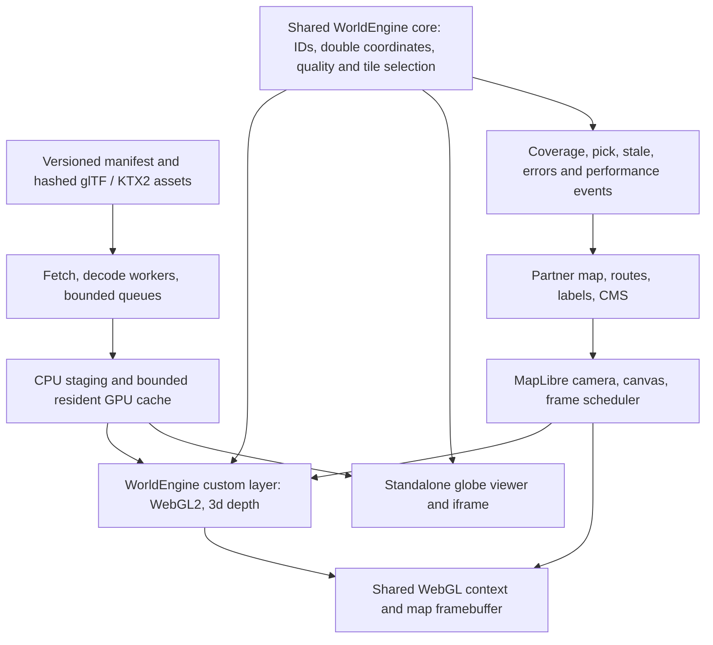

# WorldEngine web 3D world stack v1

Research snapshot: **7 October 2026**. Decision research for the three.js web viewer, partner embeds and a MapLibre SDK. Read `options.csv` for alternatives and `sources.md` for evidence IDs. **No browser/device benchmarks, package prototype, current engine-code audit, partner interviews or legal sign-off were performed.** All performance budgets, prices proposed for WorldEngine and effort estimates below are authored hypotheses to validate.

## Recommended stack

Keep **three.js WebGLRenderer + WebGL2** as the production renderer. Use one generated-content and streaming core with two adapters: a standalone/iframe viewer with its own camera and globe renderer, and a **shared-context MapLibre custom layer** where MapLibre owns camera, canvas, depth and frame scheduling. Keep partner routes, labels, CMS/editor and authoritative engineering data intact. Do not migrate to Babylon.js or build a custom renderer for v1 without a measured bottleneck that justifies the cost. [E01, E06, ML01, E12]

Ship immutable **glTF/GLB payloads with meshopt geometry and KTX2/Basis textures**, workers, bounded uploads and explicit resident-memory accounting. Start with the WorldEngine exporter’s own versioned spatial hierarchy, preserving feature IDs, material attributes and procedural look. Evaluate **3D Tiles 1.1 + 3d-tiles-renderer** as an interoperability adapter and hierarchy alternative in a small spike; glTF is a payload format, while 3D Tiles supplies spatial hierarchy/refinement semantics. Neither automatically solves WorldEngine’s feature metadata, globe placement, fallback coverage, draw batching or partner rights. [F01–F06, F13–F17, P11–P13]

Commercial surfaces: **hosted responsive iframe first**, typed ESM core/standalone viewer next, separate `@worldengine/maplibre` adapter with tested peer dependency ranges. Hosted viewer pins its own renderer dependencies; SDK applications must have an explicit ownership and single-version policy. Optional framework wrappers follow actual demand. Publish useful HTML/2D alternatives and honest coverage/staleness labels. Treat WebGPU as a later **standalone experiment**, keeping the WebGL2 adapter for MapLibre. [E05, E08, P14–P19]

## What the earlier research changes

The required `mobile-rendering-v1/` reports already describe native instancing, four LODs, batching and mostly opaque distant tree crowns. Those are existing concepts to reuse, not new optimization discoveries. Its inspected web exporter eagerly loaded chunk LOD0, prototypes and global instances in `worldengine.package/1`; bounded streaming was a proposed addition. Underlying engine code and newer schema commits were not revalidated here. Native main-view estimates exclude some shadow work and are not browser GPU counters. Its 256 MiB native content allowance and A16 native timing cannot establish a phone-browser limit. [E11, L01–L04]

The prior follow-up makes **continuous street-to-space, double-precision canonical coordinates and curvature part of the day-one design contract**. Preserve that contract in the core; a Mercator-only MapLibre pilot is a clearly scoped adapter milestone, not completion of the globe product. Keep double WGS84/ECEF coordinates, float tile-local vertices, subtract the double origin before conversion, declared vertical datums, stable source IDs and confidence/provenance. WorldGen/WorldBuild owns deterministic procedural geometry; the runtime loads its outputs rather than re-generating a different world. The older package’s `_PAINT`, `_EXTRA`, `_FEATURE` attributes require a pinned export/load compatibility test. [L02–L04]

The partner addendum identifies Terranaut, Mapme and CampusTours as prospects for an optional premium viewer, not confirmed buyers. Preserve their editors, routes, tracking and analytical models. A scenic iframe fits some deployments; integrated picking and overlays need the SDK. White-label/OEM sublicensing, private geometry and accessibility belong in the product contract. [E12, P19]

## Engines and browser support

| Choice | Decision | Why / limitation |
|---|---|---|
| three.js WebGLRenderer | Production baseline | Existing investment; accepts existing WebGL2 context and exposes state reset. App owns streaming and quality policy. |
| three.js WebGPURenderer | Later standalone spike | Documented WebGPU with WebGL2 backend fallback. Custom GLSL/material/postprocessing compatibility and loss recovery must be audited. |
| Babylon Engine/WebGPUEngine | Credible reserve | Integrated engine tools, thin instances and glTF. No measured WorldEngine speed advantage; migration redoes look, scene and integration work. |
| Custom renderer | Defer | Data-layout control, but owns shaders, loaders, picking, browser quirks and backend/loss recovery. Target isolated profiled bottlenecks first. |

three.js is MIT; Babylon is Apache-2.0; MapLibre is BSD-3-Clause. Preserve licence/NOTICE obligations and audit exact decoder binaries and transitive dependencies. Open renderer software licences do not grant data/model redistribution rights. [E09, E13, ML11, P11–P13]

| Platform/API | Verified availability as of research date | Launch implication |
|---|---|---|
| iPhone/iPad Safari WebGL2 | Safari 15 onward documented; current three WebGLRenderer requires WebGL2 (WebGL1 removed r163). | Propose tested **iOS 18+ Safari** support floor; product decision and device QA pending. Native iOS 26 floor does not set the web floor. |
| iPhone/iPad Safari WebGPU | Shipped Safari 26, September 2025; GPUWeb status updated October 2, 2026 says enabled by default. | Available for experiments; older Safari remains WebGL2 audience. |
| Android Chrome WebGPU | GPUWeb matrix: ARM/Qualcomm/Intel, Android 12+, Chrome 121+; Imagination Android 16+, Chrome 139+; Samsung Xclipse listed TBD. | Not universal Android support. Adapter/device/features/driver behavior must be probed. Never ask production users to enable unsafe flags. |
| Android Chrome WebGL2 | Major-browser support documented. | Maintained stable Chrome plus representative low/mid/high-tier devices; context creation and sustained behavior still need tests. |

Sources: [E01–E07]. A supported API is not a throughput promise. Feature-detect actual context/device creation and required formats/extensions, handle failure, and show a useful fallback. Record actual browser/OS/GPU combinations in the release matrix.

A canvas cannot be initialized with WebGL and WebGPU simultaneously. A WebGPU renderer cannot reuse MapLibre’s WebGL2 context or depth buffer; a second canvas introduces synchronization/compositing and loses shared-depth behavior. three WebGPURenderer’s backend fallback is not automatic GLSL-to-TSL/WGSL conversion or proof of WorldEngine material parity. Select a backend before resource creation; reconstruct resources when switching. [E05, E08]

## MapLibre-layer architecture

**Initial adapter scope:** Mercator, documented zoom/pitch range, one world copy, opaque stylized buildings/trees, partner-selected layer insertion below labels. Shared depth requires `renderingMode: '3d'`; suppress duplicate MapLibre building extrusions where WorldEngine replaces them. MapLibre terrain/buildings do not automatically cast or receive three.js shadows. Transparent geometry, terrain and globe are explicit gates. [ML01, ML04]

Lifecycle sketch (proposal, not runnable code):

1. `onAdd(map, gl)`: create `WebGLRenderer({canvas: map.getCanvas(), context: gl})`, set `autoClear=false`, allocate only owned resources and register resize/style/context listeners. MapLibre owns drawing-buffer size; do not call three `setSize`/`setPixelRatio` to resize the host canvas. No second animation loop.
2. `prerender(gl, args)`: optional bounded shadow/picking passes into owned targets. Validate framebuffer restoration, viewport, scissor, stencil, depth and blending against the pinned renderer. The incoming framebuffer need not be null. No global clear/postprocess that destroys map colour/depth.
3. `render(gl, args)`: select ready tiles, process limited uploads, obtain current public projection inputs, reset three state, render into the host target preserving existing colour/depth. Update only WorldEngine resources. Request another map frame only while visible effects/uploads need it.
4. `onRemove`: abort work, unregister listeners and dispose owned geometries/materials/textures/targets. Never force context loss on the partner’s canvas. Style reload re-adds the layer idempotently; context loss pauses uploads and reconstructs owned resources after restoration.

**Version trap:** current authoritative typedef/source says `render(gl, args)`, with `args.defaultProjectionData.mainMatrix`; old `render(gl, matrix)` tutorials are incompatible. The inline CustomLayerInterface sample currently conflicts with that typedef. Compile against a pinned installed package and integration fixture. Current official raycast example pins MapLibre 6.13.0, three 0.186.1 and maplibre-gl-three 3.0.0; this is an example pair, not our certified production pair. MapLibre v6 is ESM-only, requires WebGL2 and removes private `map.transform`. Support v5 only through separately tested adapters. [ML01–ML05, ML09]

For a small Mercator scene, local ENU metres map using `A = translate(anchorMercator) × scale(s, -s, s)`, where `s = anchor.meterInMercatorCoordinateUnits()`; local-to-clip is `mainMatrix × A`. Explicitly rotate glTF Y-up into the declared ENU convention. One latitude scale is a local approximation, not a whole-country transform. Rebase tile-local origins and test latitude, longitude wrap and seams. [ML06]

Putting the combined local-to-clip transform in a three camera’s projection matrix with identity view can draw a simple scene, but it is not physical camera decomposition. Stock raycasting, camera-position lighting, screen-space LOD and depth effects may be wrong. Derive/test true camera inputs from public APIs, or unproject near/far NDC points through the inverse combined transform for explicit local rays. `queryRenderedFeatures` does not intersect arbitrary WorldEngine meshes. [ML04, ML09]

Terrain requires ground elevations, exaggeration and vertical-datum agreement; sampling one anchor does not drape a road. Globe requires projection-aware transforms/shaders, horizon clipping and transition tests. Keep the standalone globe core’s double/ECEF design now, and gate MapLibre globe parity later. For street-to-space, separate near/far passes and depth ranges; one depth range from centimetres to 100,000 km is unsuitable. [ML04, ML09, L03]

**Real precedents:** official examples show [three glTF/3D Tiles/primitives](https://maplibre.org/maplibre-gl-js/docs/examples/add-3d-tiles-3d-objects-and-models-using-threejs/) and [globe/terrain raycasting](https://maplibre.org/maplibre-gl-js/docs/examples/raycast-3d-tiles-using-threejs/) using maplibre-gl-three. They establish feasibility, not phone budgets. Compare that bridge in the spike; exact v3 licence, maintenance, state interoperability and disposal behavior remain unverified. [ML08–ML12]

## Phone-browser budgets

All numbers below are **initial acceptance targets, not universal device limits or measured WorldEngine results**. The baseline is a sustained 30 fps quality tier; allow 60 fps only after measurement. Count WorldEngine main draws separately from all its shadow/picking passes, and measure the combined map/page frame. A low main-view count can hide expensive shadows, overdraw or host labels.

| Metric | Standalone / iframe baseline | Enhanced, measured faster phones | MapLibre 60 Hz interaction: WorldEngine only |
|---|---:|---:|---:|
| Target | 30 fps, 33.3 ms interval | 60 fps, 16.7 ms interval | Host-controlled; render each callback |
| World CPU / GPU work | ≤6 / ≤20 ms | ≤4 / ≤10 ms | ≤4 / ≤10 ms, plus host cost |
| Whole-page CPU / GPU target | ≤10 / ≤24 ms | ≤6 / ≤12 ms | Combined map/page must fit 16.7 ms; measure host |
| World main draws / triangles | 80 / 200k | 110 / 320k | 40 / 100k |
| World all-pass draws / triangles | 120 / 300k | 170 / 500k | 60 / 140k |
| Whole-page main draws / triangles | 100 / 250k | 140 / 400k | Partner-dependent; agree host envelope |
| Whole-page all-pass draws / triangles | 160 / 400k | 220 / 650k | Include map and every world pass |
| Drawing-buffer cap | 1 MP; effective DPR up to 1.5 | 2 MP; effective DPR up to 2 | Host owns size; negotiate, inspect actual buffer |
| World resident GPU content estimate | 128 MiB (80 geometry/instances + 48 textures) | 192 MiB | Shared ledger; start baseline or lower |
| World targets / retained CPU / staging / metadata | 32 / 64 / 24 / 8 MiB | 48 / 96 / 32 / 16 MiB | Count host targets and buffers separately |
| Accounted world + host allowance + margin | 256 + 64 + 64 = 384 MiB | 384 + 96 + 64 = 544 MiB | Proposals, not safe process/VRAM limits |
| Shared fetch / decode concurrency | 4 / 2; initial KTX worker 1 | Raise only if measured | Across all world data layers |
| Upload / decoded queue | ≤0.5 ms target, ≤2 MiB part/frame; ≤16 MiB decoded backlog | Same starting policy | Share frame time with host; one upload can still stall |
| First useful coarse-world transfer goal | ≤2 MiB, separate street-ready latency | Same initial goal | Host basemap bytes additional |

CPU and GPU work overlap; their numbers are not added as a serial frame budget. Proposed sustained acceptance: baseline average ≥29.5 fps, p95 interval ≤40 ms and p99 ≤66.7 ms; enhanced average ≥59 fps, p95 ≤20 ms and p99 ≤33.3 ms. These tolerate some drops and must be reviewed against perceived quality. All-pass totals include shadows, picking, transition duplication and near/far passes rather than adding them later. Use three `renderer.info.autoReset=false` and reset once per complete world frame; host draws need separate instrumentation. [F07–F12, E01]

Example under declared formats: 390 × 844 CSS at DPR 1.5 gives 740,610 pixels; at DPR 3 gives 2,962,440 pixels (4×). RGBA8 plus assumed 32-bit depth/stencil is approximately 5.65 versus 22.60 MiB. Four-sample attachments alone would be 22.60 versus 90.40 MiB, plus colour resolve and other buffers. Actual browser allocation varies. For standalone, cap effective DPR by both quality tier and `sqrt(pixelCap / (CSS width × CSS height))`.

Texture budgeting also uses final allocations: 1024² RGBA8 with full mips is about 5.33 MiB; 2048² is 21.33 MiB. A 4 bits/pixel compressed 1024² mip chain is about 0.667 MiB excluding block rounding. Mesh bytes include attributes, indices and instances; compressed transport is not resident allocation. These are arithmetic examples, not device measurements.

The host may render a moving map at 60 Hz. WorldEngine must draw correctly on every host callback; it cannot skip alternate callbacks while assuming shared colour/depth persists. Throttle WorldEngine-owned idle animation/repaint requests to 30 Hz, and use a lower interaction quality tier when the host runs at 60 Hz. No general MapLibre FPS cap is assumed. Standalone owns its animation schedule and drawing-buffer resolution; SDK needs a host-agreed resolution/quality policy. CSS size and device DPR are distinct; resolution cost scales with drawing-buffer pixels. [E01, ML01]

For perspective, a 1 MP RGBA8 colour buffer is roughly 4 MB before depth, multisampling, resolve buffers or map intermediate targets. Logical content bytes exclude driver/browser allocations and decoded CPU duplicates. Browser storage quota is disk/cache policy, not available RAM; an iframe cannot promise persistent offline caching from it. There is no portable browser API that reports safe GPU memory or device temperature. Use frame-time degradation, queue growth, visibility and context-loss signals to lower quality; do not invent a thermal sensor. [E01, F07, F12, L05]

Start without full-scene postprocessing or large transparent crowns. Prefer instanced prototypes, opaque stylized foliage, spatially bounded batching, coarse LODs and conservative texture dimensions. Keep direct sunlight; shadows should be optional, small and limited to the near view, with explicit extra draws/triangles/targets. Avoid CPU synchronous readbacks for routine picking. A draw count alone says little about shader cost and pixels. [E11, ML07, F07]

Validate at least a lower-memory iPhone on the proposed support floor, a recent iPhone/Safari26, midrange Android/Mali, Android/Adreno, and an unsupported-WebGPU family where available. Run 20–30 minute hot sessions, dense urban/vegetation/water scenes, repeated region travel, pinch/pan at real DPR, route overlays, weak network, orientation changes, hidden iframe/background/foreground, style reload and context recovery. Capture p50/p95 frame times, long tasks, resident content bytes, all-pass submissions, first useful coarse world and street-ready refinement separately. Promotion to 60 fps requires sustained evidence; no blanket 60 fps claim. Test devices and exact release combinations are unverified until phase 0.

## Streaming and asset format

Separate the **spatial transport hierarchy** from render batching. Prior proposed ground leaves are 200 m with 100 m building cells, larger 400/800/1600 m parents and 400 m instance cells; those are inputs to a spike, not immutable universal sizes. Avoid tile × material × species multiplying submissions. Shared prototype pools/material families plus bounded spatial instance batches preserve culling without thousands of tiny draws. [L03, L04]

Manifest fields should include schema/generator versions, coordinate/vertical datum, bounding volume, geometric error, content hashes, LOD/refinement mode, child coverage, byte estimates, stable feature-table mapping and provenance/licence references. Keep full source IDs, including nonnumeric IDs, separate from compact GPU lookup indices. Metadata migrations must preserve observed/inferred/simulated classifications and confidence. Customer overlays use explicit transforms and rights; route/engineering metadata stays authoritative.

Pipeline: visibility/horizon/frustum and screen-space error → prioritize coarse coverage/route corridor → cancellable fetch → worker meshopt decode/KTX2 transcode → bounded CPU staging → per-frame uploads → ready set → draw → budgeted eviction. Cap concurrency, decoded backlog, per-frame upload bytes/time and resident bytes; cancellation and cache keys must include version/tenant. Keep ancestors resident until full child replacement or authored coverage masks are ready. Remove a parent only when its coverage can be replaced correctly; missing child tiles must not create holes or duplicate buildings. Hard memory limits stop refinement rather than silently raising the cap. [F03–F06, L03]

KTX2 is a container/transcoding path: use supported compressed GPU formats detected at runtime; fallback texture formats may inflate memory. meshopt reduces transport and decode cost but is not a replacement for LOD. Validate alpha/normal/colour-space settings and custom glTF attributes after compression; compare visual parity, peak decode memory and first-view latency. glTF compressed bytes are not GPU resident bytes. 3D Tiles brings geospatial hierarchy, transforms and refinement; a maintained three renderer helps avoid implementing the entire standard, but globe/metadata/instancing/implicit tiling extension compatibility must be tested for the exact datasets. [F01–F06, F13–F17]

Global coarse globe/terrain is a separate coverage tier; detailed national geometry may arrive later without changing canonical coordinates. Clouds/weather/night imagery and source databases each need redistribution rights. Global scale does not mean detailed street coverage everywhere. Cache public hashed assets immutably, keep private tenant resources authorization-aware, and treat mobile disk caches as opportunistic. [L03, P19]

## Embed, SDK and commercial packaging

A minimal API covers create/destroy/resize/pause, camera get/set, time/weather, route/marker batches, feature-ID picking, and ready/coverage/stale/error/performance events. Document asset ownership, subscriptions, disposal, WGS84/origin/datum and overlay transforms. Version content schema separately from SDK semver. Keep uncontrolled raw scene mutation out of the initial public API. Partner page styles/controls remain intact. [P19]

Iframe bridge: exact `targetOrigin`, verify `event.origin` and `event.source`, versioned message schemas, handshake nonce and size/rate bounds. Set partner-specific `frame-ancestors` covering the full ancestor chain. Client tokens are observable: use short-lived tenant/scene-scoped read entitlements, rate limits, revocation and real authorization for private scenes; origin restrictions reduce abuse but do not replace authorization. No server secrets in embeds. [P14–P15]

Package workers/WASM with configurable asset URLs, CORS and a tested CSP guide. Single-thread decoding plus transferable ArrayBuffers should be the baseline; SharedArrayBuffer/COOP/COEP must not be a partner prerequisite. Test script/worker/connect policies and any needed `wasm-unsafe-eval` against pinned browsers. Use GPS only after user action and consent; cross-origin geolocation needs parent Permissions Policy delegation. Viewing a place requires no precise location. Provide iframe title, labeled controls, keyboard/focus behavior, reduced motion, text route/POIs and 2D/static fallback. WCAG 2.2 AA is a target pending audit. [P14–P18]

### Pricing patterns and proposed offer

Published USD benchmarks, before tax, negotiated terms and discounts; **different meters and data rights make these comparisons non-equivalent**. Checked 7 October 2026. [P01–P09]

| Provider/product | Published pattern | Commercial implication |
|---|---|---|
| Mapbox GL JS | 50k free monthly loads; first paid band $5/1k; marginal bands give $250/100k and $3,050/1m. | A load is map initialization. MapLibre using Mapbox tiles instead meters hosted requests; open renderer does not remove provider fees. |
| MapTiler Flex | $30/month; 25k sessions or 500k requests allowances; extra $2.50/1k map sessions or $0.15/1k requests. | Session path requires its SDK integration. GeoSplats $6/1k 3D sessions is a different product, not any custom layer. |
| Cesium ion | Commercial individual $149/month or team $524, 150 GB/month streaming allowance. | Hosted service price, not CesiumJS fee. Standard terms do not grant embedding ion in solutions commercially sold to other organizations; negotiate OEM integration rights. |
| Google Photorealistic 3D | First paid tier $6/1k after 1k free; $594/100k and $4,734/1m if root-session meter applies. | GA announcement says root billing; current generic SKU wording is ambiguous. Confirm account billing. Viewing access does not establish stylized asset-export rights. |

**WorldEngine hypotheses, not quotes or demand evidence:** defined 4–6 week pilot $3k–10k with traffic/integration cap; OEM annual credited minimum $12k–50k plus $3–8/1k successful sessions; larger SDK portfolio $25k–100k/year including a defined allowance/support. Alternative capped campus/site plans may suit seasonal use; do not add every pricing model together. Explicitly grant permitted white-label/OEM resale, portfolio scope, custom-asset ownership, traffic bursts and support. Avoid unlimited usage, per-frame or per-marker fees. [P19]

Define a successful billable session only after the usable world renders visibly. Proposal: tenant+scene+viewer session, maximum 30 minutes active visibility or 30-minute idle timeout; retries/context restoration inside a live session do not rebill. Specify reload/new-tab/new-scene behavior, exclude failed/unsupported/test/bot traffic and disclose caps/bursts. Entitlement issuance/reconciliation needs server enforcement without persistent precise-location identifiers. Internal bytes/requests remain a cost metric even when partners buy sessions.

Margin sensitivity, **all inputs unverified**: 100k sessions × 8 MB = 800 GB/month; assumed $0.05/GB egress costs $40, other infrastructure $60, support $200, data/weather $100 → $400 direct cost. Usage revenue at $5/1k is $500, only 20% gross margin. A $20k/year credited minimum gives $1,666.67/month effective revenue at that volume and 76% margin; do not add the credited minimum to usage revenue. At 50 MB/session total assumed cost becomes $610 and usage-only margin −22%. Engineering/sales/tax excluded. Validate cost per useful session and support burden before signing OEM prices. [P19]

## Risks and release gates

| Risk | Concrete mitigation / gate |
|---|---|
| Phone throughput or heat misses target | Budget all passes and host work; 20–30 minute device capture; lower resolution/LOD/shadows; 2D fallback. |
| Shared GL state/depth regression | Pinned versions, state/framebuffer tests, no canvas resizing/global clears, route/label/terrain fixtures. |
| Globe precision/terrain mistakes | Double ECEF core, local floats, datum tests, antimeridian/poles, near/far split; projection-specific adapter gates. |
| Streaming holes, duplicates or memory growth | Coverage-aware parent replacement, hard byte caps, cancellation, repeated region-tour plateau test. |
| Export look/metadata drift | Golden export scenes; custom attributes, stable IDs and provenance schema tests; generator/runtime ownership. |
| Private tenant leak or embed abuse | Server authorization, scoped observable tokens, cache isolation, exact messaging origins/CSP, quota/revocation tests. |
| Software licence confused with data resale | SBOM/notices, exact dataset licence inventory and redistribution/OEM contract review; no assumed Google-derived meshes or ion OEM grant. |
| Dependence on uncertain willingness to pay | Capped paid pilots with partner integration and margin evidence; do not present prospect lists as demand. |
| Documentation/version conflicts | Use installed public types and integration fixtures; bridge v3 licence and Google meter ambiguities unresolved. |

## Phased build plan and effort

**Authored engineering estimates:** one engineer-day is one focused working day. Assumes existing three scene/look and exporter are reusable, WebGL2 only for launch, a basic backend/CDN exists, no renderer rewrite and selected content already has usable rights. These web-only tasks do not include native work, country data preparation, sales negotiations or a new global high-resolution dataset. Ranges are incremental and avoid counting the optional alternatives in `options.csv` again.

| Phase | Work and reviewable exit | Engineer-days |
|---|---|---:|
| 0 — contracts and measurement | Audit current export/materials, choose device/version matrix, instrumentation and golden scenes; metadata/coordinate/rights contract. | 5–8 |
| 1 — shared GL proof | MapLibre Mercator adapter spike, camera/rays/depth/state/lifecycle fixture; compare bridge before adoption. | 5–10 |
| 2 — bounded content | Manifest evolution, coarse fallback, workers, meshopt/KTX2, bounded queues/cache/uploads, retained look/IDs. | 15–25 |
| 3 — standalone globe core | Double/ECEF origins, coarse globe hierarchy, horizon selection and near/far depth; street-to-space seam/precision gates. | 15–25 |
| 4 — commercial surfaces | Hosted iframe protocol/security/accessibility and ESM APIs/docs/version fixtures; server entitlements/session meter. | 15–25 |
| 5 — sustained QA and hardening | Phone/host stress captures, quality tiers, add/remove/context/style restoration, tenant/cache failures, memory plateau. | 10–18 |
| 6 — capped partner pilot | One real embed and one MapLibre integration, traffic/margin reporting, onboarding/support fixes. | 5–10 |
| **Total scoped v1** | Includes standalone globe core; initial MapLibre adapter remains Mercator. | **70–121** |

A regional prototype can be shown after phases 0–2; a bounded partner embed pilot can be sequenced before full globe completion, but that is not acceptance of the full street-to-space viewer. With two renderer/streaming engineers plus fractional backend/QA/design help, plan roughly **10–16 calendar weeks**, assuming parallel work and prompt partner access; estimates can widen after phase 0. Work spans shared architecture and device gates, so person-days do not divide perfectly by headcount. Proposed calendar range is unverified.

Separate follow-ons: MapLibre globe/terrain parity **10–20 engineer-days** after the Mercator core; standalone WebGPU spike **5–10 days**, with **15–30 more** for parity/hardening if valuable. Rich weather/cloud layers, advanced shadows/postprocessing, framework wrappers and global detailed content require separately estimated scope. Do not add Babylon/custom-renderer alternative estimates to this plan. [E options, ML options]

Acceptance: no unbounded eager world load; complete coarse fallback during child/network failure; stable feature selection through LOD; correct partner depth/labels and documented projection limits; bounded resident content after region tours; sustained target frame times on agreed phones; tested pause/dispose/recovery; authorised tenant access; documented notices/data rights; useful accessible fallback; pilot cost and partner-fit evidence. Failure at a gate reduces scope/quality or delays release, rather than turning a target into a claim.

## Unverified register

WorldEngine current code/schema and browser material parity; actual shipped dependency pair; bridge v3 licence; actual phone timings, driver memory and thermal behavior; chosen device support floor; MapLibre globe/terrain and shadow parity; exact 3D Tiles extensions/content metadata compatibility; CSP/worker packaging on partner sites; private-scene threat model and accessibility compliance; data redistribution/OEM rights for each content source; Google billing wording; provider account terms; all WorldEngine prices, delivery sizes, margins, demand and effort/calendar estimates. See source-level limitations in `sources.md`.

## File validation

17 option rows and 68 evidence IDs are included. CSV checked for unique option/source IDs, complete fields, resolved source references and exact matrix preservation; UTF-8, quoted RFC4180-style records and no formulas. Plan arithmetic is 70–121 engineer-days. These checks validate the research files, not the proposed runtime.
